# IO效率低的原因

JVM自身在I/O方面效率欠佳。操作系统与JAVA基于流的I/O模式有些不匹配。操作系统要移动的是大块数据(缓冲区)，这往往是在硬件直接存储器(DMA)的协助下完成的，而JAVA的I/O则是喜欢操作小数据-单个字节，几行文本。结果，操作系统送来整缓冲区的数据，JAVA.IO在把这些数据分为一小块一小块的，有了NIO，就可以直接操作一大块数据了

以下概念

- 缓冲区操作

- 内核空间与用户空间

- 虚拟内存

- 分页技术

- 面向文件的I/O和流I/O

- 多工I/O(就绪性选择)

  

# 缓冲区操作

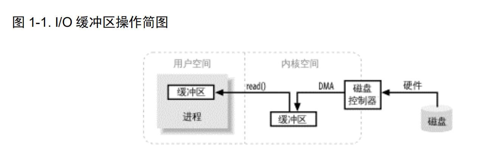

**简而言之，就是内核向磁盘控制硬件发出指令，要求磁盘读取数据，磁盘控制器将数据放入到内核缓冲区，这一步是通过DMA完成的，一旦内核缓冲区数据满后会将数据移动到进程缓冲区**

图中明显忽略了很多细节，仅显示了涉及到的基本步骤。

用户空间就是常规进程所在区域。JVM就是常规进程，驻守于用户空间。用户空间是非特权区域，在该区域不能直接访问硬件设备。内核空间是操作系统所在区域，能与设备控制器通讯，控制这用户进程的运行状态等等

所有的I/O都需要直接或者间接的通过内核空间

当程序请求I/O操作的时候，它执行一个系统调用将控制权交给内核

您可能会觉得，把数据从内核空间拷贝到用户空间似乎有些多余。为什么不直接

让磁盘控制器把数据送到用户空间的缓冲区呢？

**因为用户空间首先不支持直接与磁盘打交道**

**其次，磁盘一般是基于块存储的硬件设备操作的是固定大小的数据块，而用户进程可能请求的是任意大小的数据块，所以内核负责数据的分解和组合。**

## 发散/汇聚

许多操作系统能把组装/分解过程进行的很高效，根据发散/汇聚的概念，进程只需要一个系统调用，就能把多个缓冲区地址传递给操作系统，然后操作系统以此填满多个缓冲区数据，再将数据发散的传给进程缓冲区，写的时候再汇聚起来

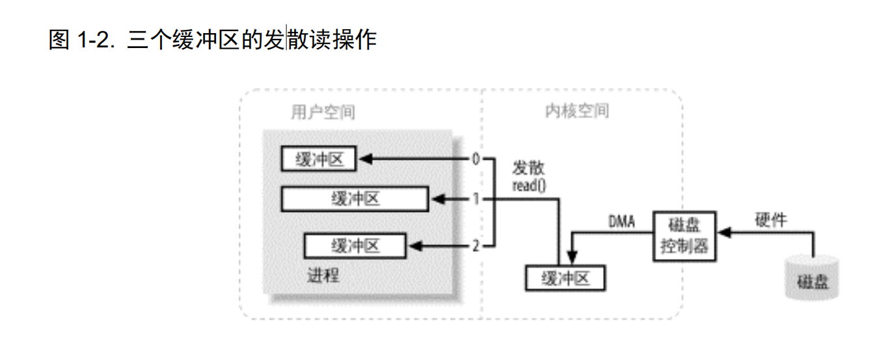

## 虚拟内存

所有现代操作系统都使用虚拟内存

- 一个以上的虚拟内存可同时指向同一个物理地址
- 虚拟内存空间可大于实际可用的硬件内存

前面虽然说磁盘控制器无法直接向用户空间传输数据，但是如果将用户空间地址和用户虚拟空间地址映射为同一个物理地址，那么就可以实现

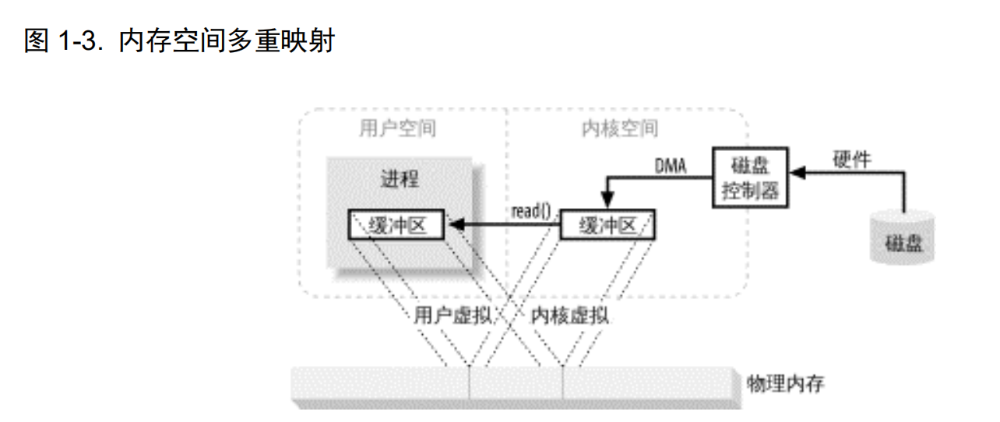

省去了内核与用户空间的来回拷贝

内核和用户缓冲区必须使用相同的页对齐，缓冲区的大小还必须是磁盘控制器大小(通常为512字节磁盘扇区)的整数倍。

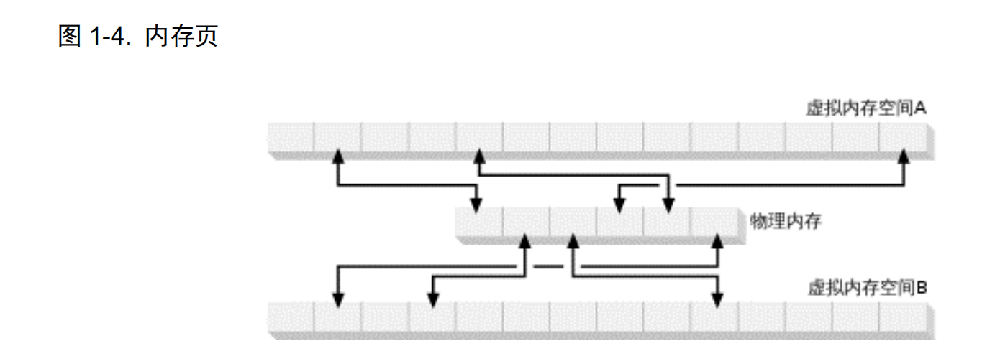

### 内存页面调度

为了支持虚拟内存的第二个特性(寻址空间大于物理内存)，就必须进行虚拟内存分页(经常称为交换)。从本质上来说，物理内存充当了分页的高速缓存；

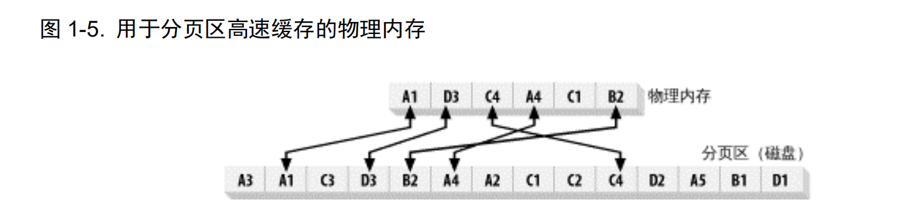

把内存页大小设定为磁盘块大小的倍数，这样内核就可直接向磁盘控制硬件发布命令，把内存页写入磁盘，在需要的时候装入。

对于采用分页的现代操作系统而言，这也是数据在磁盘与物理内存之间往来的唯一方式

**现代CPU包含一个称为内存管理单元(MMU)的系统，逻辑上位于CPU与物理内存之间，包含虚拟地址向物理地址内存转换的详细信息**

采用分页技术的操作系统执行I/O的全过程可总结为以下几步

- 确定请求的数据分布在文件系统的哪些页(磁盘扇区组)。磁盘上的文件内容和元数据可能跨越多个文件系统页，这些页可能也不连续
- 在内核空间分配足够数量的页，以容纳得到确定的文件系统页
- 在内存页与磁盘上的文件系统页之间建立映射
- 为每一个内存页产生错误
- 虚拟内存俘获页错误，安排页面调入，从磁盘上读取页内容，使页有效
- 一旦页面调入操作完成，文件系统即对原始数据进行解析，取得所需文件内容或者属性信息

#### 内存映射文件

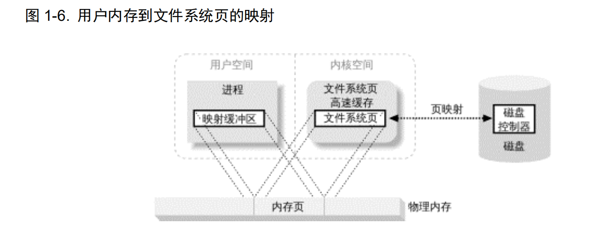

内存映射I/O使用文件系统建立从用户空间直到可用文件系统页的虚拟内存映射。好处：

- 用户进程把文件数据当作内存，所以不需要发布read()和write()系统调用
- 当用户进程触碰到映射内存空间，页错误会自动产生，从而将数据从磁盘调入内存
- 操作系统的虚拟内存子系统会对页进行智能高速缓存
- 数据总是按页对齐的，无需执行缓冲区拷贝
- 大型文件使用映射，无需耗费大量内存，即可进行数据拷贝

### 流I/O

并非所有的I/O都像前几节讲的面向块的，也有流I/O，其原理模仿了通道。I/O字节流必须顺序存取

流的传输一般比块设备慢(不是必然)，经常用于间歇性输入。多数操作系统允许把流置为非块模式，这样，进程kk而已查看流上是否有输入，即时没有也能干别的事情，有输入处理输入

比起非块模式再进一步，就是就绪性选择，与非块模式类似，但是就是把查看流是否就绪的任务交给操作系统，操作系统查看一系列流，并提醒进程哪些流已经就绪

这技术广泛应用于网络服务器领域

# 缓冲区

缓冲区的工作与通道紧密联系。通道是I/O传输时发生的入口，而缓冲区则是数据传输的来源或者目标

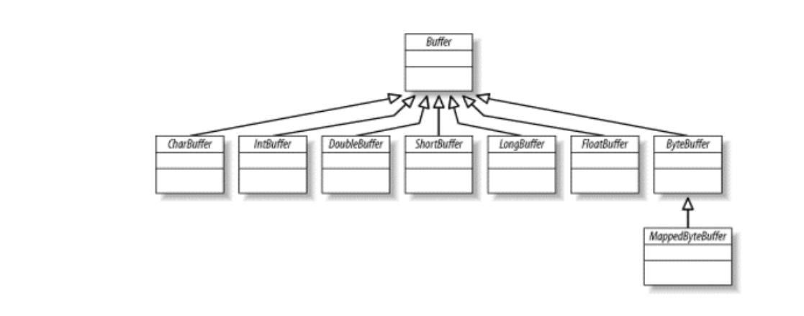

## 缓冲区基础

概念上，**缓冲区是包在一个对象内的基本数据元素数组**。对外提供处理缓冲区的API

### 属性

所有的缓冲区都具有四个属性来提供关于其所包含的数据元素的信息。它们是：

#### 容量(Capacity)

缓冲区能够容纳的数据元素的最大数量。创建的时候被改变，并且永远不能被修改

#### 上界(Limit)

缓冲区中第一个不能被读或者写的元素，或者说缓冲区中上界减去当前位置等于缓冲区中现存元素的计数

#### 位置(Position)

下一个要被读或者写的元素的索引。位置会由get()和put函数更新

#### 标记(Mark)

一个备忘位置，调用mark()来设定mark=Position，调用reset()函数设定position=mark，标记在设定前是未定义的，也就是说如果需要使用标记，就需要先设定

这四个属性之间总是遵循以下关系：

**0 <= mark <= position <= limit <= capacity**

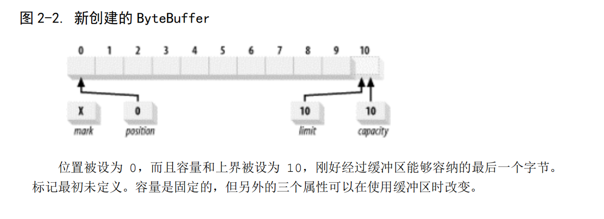

### 缓冲区API

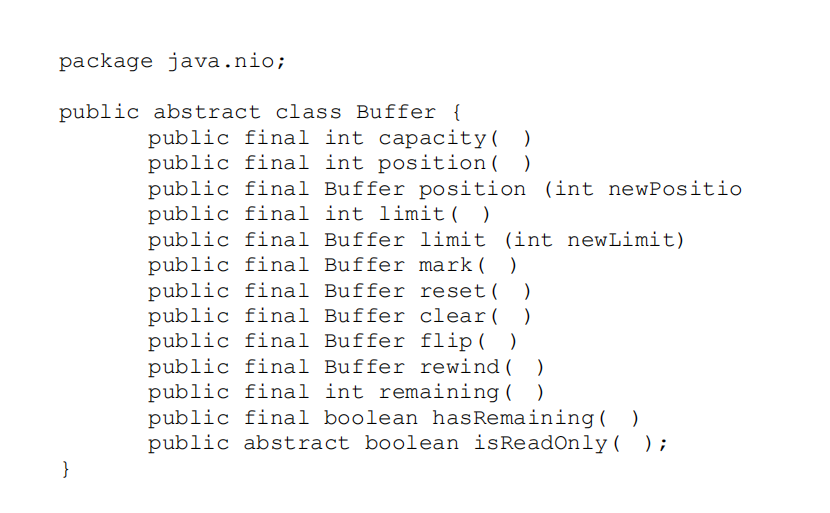

返回的Buffer对象是因为便于级联属性的调用

buffer.mark( ); 

buffer.position(5);

buffer.reset( );

被简写为：

buffer.mark().position(5).reset( );

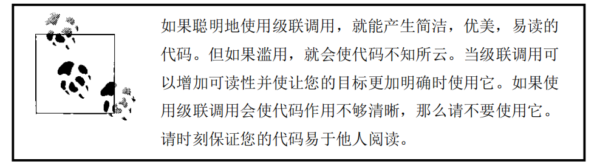

isReadOnly()查看是否有缓冲区不可写，因为所有缓冲区都是可读的，但是并不是所有缓冲区都是可写的

### 存取

```java
 extends Buffer implements Comparable 
{ 
 // This is a partial API listing 
 public abstract byte get( ); 
 public abstract byte get (int index); 
 public abstract ByteBuffer put (byte b); 
 public abstract ByteBuffer put (int index, byte b); 
}
```

如果不指定索引，默认从0开始，每get()或者put一次，索引向前进1

如果put超出上界，抛出BufferOverflowException异常

如果get位置不小于上界，也就是大于等于上界会抛出

### 填充

```java
buffer.put((byte)'H').put((byte)'e').put((byte)'l').put((byte)'l').put((byte)'o');
```

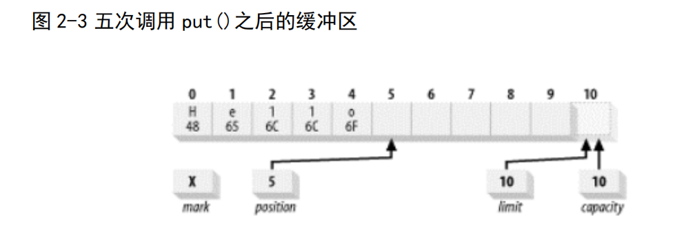

为什么需要强制转换呢？

因为在JAVA中，字符在内部都是以unicode码表示，每个unicode字符占16位，所以说需要删除高位的8位

既然我们已经在 buffer 中存放了一些数据，如果我们想在不丢失位置的情况下进行一些

更改该怎么办呢？put()的绝对方案可以达到这样的目的。假设我们想将缓冲区中的内容从

“Hello”的 ASCII 码更改为“Mellow”。我们可以这样实现：

```java
buffer.put(0,(byte)'M').put((byte)'w');
```

### 翻转

我们已经写满了缓冲区，现在我们必须准备将其清空。我们想把这个缓冲区传递给一个通

道，以使内容能被全部写出。但如果通道现在在缓冲区上执行 get()，那么它将从我们刚刚

插入的有用数据之外取出未定义数据。如果我们将位置值重新设为 0，通道就会从正确位置开

始获取，但是它是怎样知道何时到达我们所插入数据末端的呢？这就是上界属性被引入的目

的。上界属性指明了缓冲区有效内容的末端。我们需要将上界属性设置为当前位置，然后将位

置重置为 0。我们可以人工用下面的代码实现：

buffer.limit(buffer.position()).position(0); 

但这种从填充到释放状态的缓冲区翻转是 API 设计者预先设计好的，他们为我们提供了

一个非常便利的函数：

Buffer.flip(); 

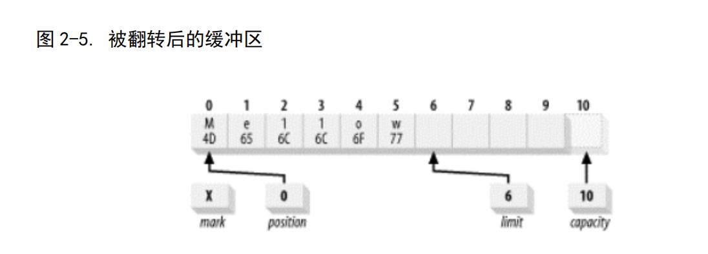

flip()翻转缓冲区，使其limit移动到写的最后一次前面，position置为0

### 释放

```java
hasRemaining()会在释放缓冲区时告诉是否已经达到缓冲区的上界
for (int i = 0; buffer.hasRemaining( ), i++) { 
 myByteArray [i] = buffer.get( ); 
}
```

还可以使用 remaining();

```java
for (int i = 0; i < count, i++) { 
 myByteArray [i] = buffer.get( ); 
}
```

这个例子更高效，但是第一个例子允许多线程并发

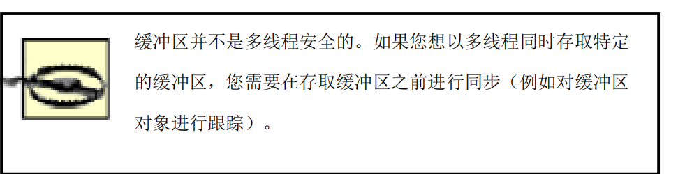

```java
//填充和释放缓冲区
package com.ronsoft.books.nio.buffers; 
import java.nio.CharBuffer; 
/** 
* Buffer fill/drain example. This code uses the simplest 
* means of filling and draining a buffer: one element at 
* a time. 
* @author Ron Hitchens (ron@ronsoft.com) 
*/ 
public class BufferFillDrain 
{ 
 public static void main (String [] argv) 
 throws Exception 
 { 
 CharBuffer buffer = CharBuffer.allocate (100); 
 while (fillBuffer (buffer)) { 
 buffer.flip( ); 
 drainBuffer (buffer); 
 buffer.clear( ); 
 } 
 } 
 private static void drainBuffer (CharBuffer buffer) 
{
while (buffer.hasRemaining( )) { 
 System.out.print (buffer.get( )); 
 } 
 System.out.println (""); 
 } 
 private static boolean fillBuffer (CharBuffer buffer) 
 { 
 if (index >= strings.length) { 
 return (false); 
 } 
 String string = strings [index++]; 
 for (int i = 0; i < string.length( ); i++) { 
 buffer.put (string.charAt (i)); 
 } 
缓冲区并不是多线程安全的。如果您想以多线程同时存取特定
的缓冲区，您需要在存取缓冲区之前进行同步（例如对缓冲区
对象进行跟踪）。
 return (true); 
 } 
 private static int index = 0; 
 private static String [] strings = { 
 "A random string value", 
 "The product of an infinite number of monkeys", 
 "Hey hey we're the Monkees", 
 "Opening act for the Monkees: Jimi Hendrix", 
 "'Scuse me while I kiss this fly", // Sorry Jimi ;-) 
 "Help Me! Help Me!", 
 }; 
}
```

### 压缩

```java
public abstract class ByteBuffer 
 extends Buffer implements Comparable 
{ 
 // This is a partial API listing 
 public abstract ByteBuffer compact( ); 
}
```

可以只释放一部分数据，而不是全部，然后重新填充。

为了实现该操作，必须使未读的数据下移，为此提供了一个compact()方法

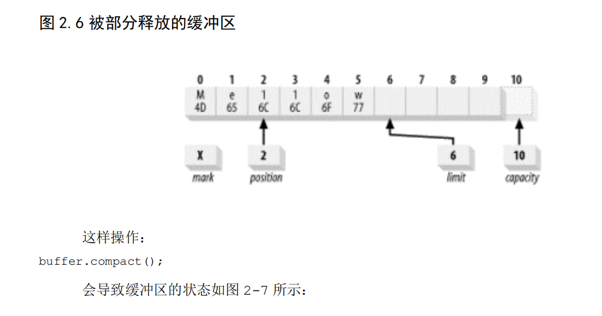

使得未读的数据下移

也就是让6C移动到0的位置，抛弃已读的位置，position指向limt-已读数据的位置

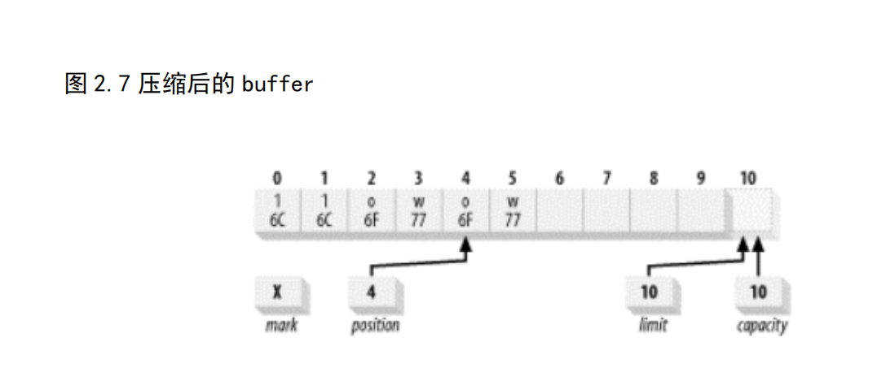

这里发生了几件事。您会看到数据元素 2-5 被复制到 0-3 位置。位置 4 和 5 不受影响，

但现在正在或已经超出了当前位置，因此是“死的”。

### 标记

mark()函数被调用之前是未定义的，reset()将位置设置为当前的标记值。

如果标记值未定义，那么调用reset()将导致异常

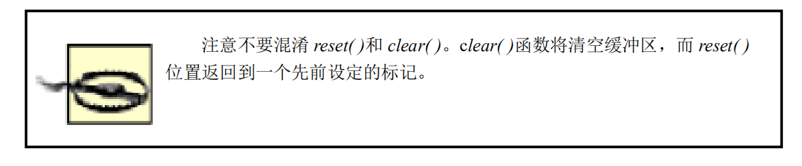

clear()清除标记

```java
buffer.position(2).mark().position(4);
```

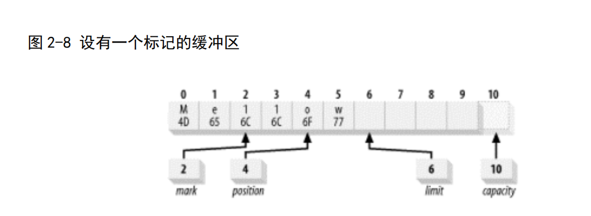

如果调用reset()，那么position会回到mark标记

### 比较

比较两个缓冲区所包含的数据是否相等

equals()函数比较两个缓冲区是否相等和compareTo()函数用以比较缓冲区

```java
public abstract class ByteBuffer 
 extends Buffer implements Comparable 
{ 
 // This is a partial API listing 
 public boolean equals (Object ob) 
 public int compareTo (Object ob) 
}
两个缓冲区可用下面的代码来测试是否相等：
if (buffer1.equals (buffer2)) { 
 doSomething( ); 
}
```

如果两个缓冲区剩余的内容相同，则返回true，否则返回false

两个缓冲区被认为相等的充要条件是：

- **两个缓冲区都剩余同样的元素，容量可以不相等，而且索引也不需要相等，只需要剩余相等的元素并且元素内容一致**
- **在每个缓冲区中应被 Get()函数返回的剩余数据元素序列必须一致**
- **两个对象类型相等，包含不同数据类型的buffer永远不会相等**

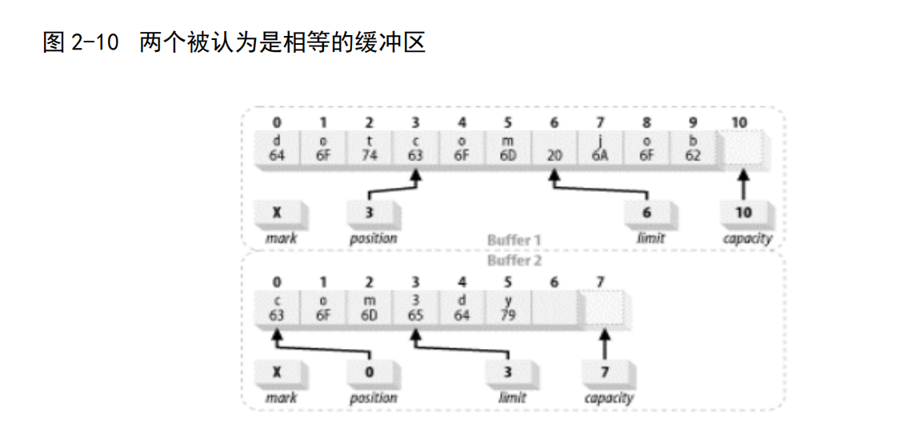

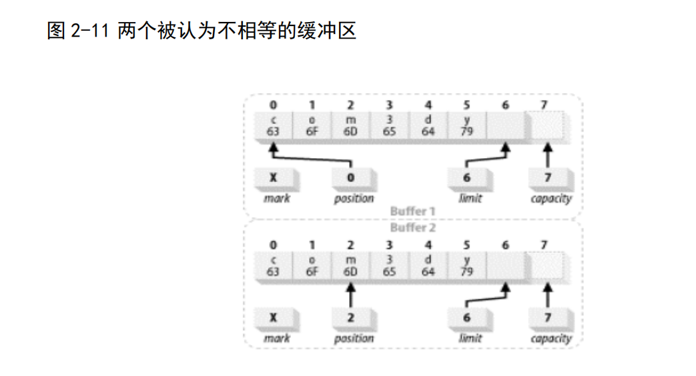

缓冲区也支持用compareTo()函数以字典顺序进行比较。

这一函数在缓冲区小于，等于，大于参数的对象实例，分别返回一个负整数，0，正整数

意味这可以使用Arrays.sort()按照它们的内容进行排序

### 批量移动

```java
public abstract class CharBuffer 
 extends Buffer implements CharSequence, Comparable 
{ 
 // This is a partial API listing 
 public CharBuffer get (char [] dst) 
 public CharBuffer get (char [] dst, int offset, int length) 
 public final CharBuffer put (char[] src) 
 public CharBuffer put (char [] src, int offset, int length) 
 public CharBuffer put (CharBuffer src) 
 public final CharBuffer put (String src) 
 public CharBuffer put (String src, int start, int end) 
}
```

**get()是指将数据传入char型数组中，如果缓冲区长度不够填满数组，则会抛出异常**

**put()是指将数据从char型数组中读入到缓冲区，如果缓冲区长度不够则会抛出异常**

offset和length指定子区间，比如offset为2长度为5，代表从偏移量2，读5个长度的数据

```java
buffer.get(myArray);
等价于：
buffer.get(myArray,0,myArray.length);
buffer.put(myArray);
等价于：
buffer.put(myArray,0,myArray.length);
String 移动与 char 数组移动相似，除了在序列上是由 start 和 end+1 下标确定（与
String.subString()类似），而不是 start 下标和 length。所以：
buffer.put(myString);
等价于：
buffer.put(myString,0,myString.length);
```

## 创建缓冲区

这类缓冲区类没有一个可以直接实例化，都是抽象类，但是都包含静态工厂方法来创建相应类的新实例

``` java
public abstract class CharBuffer 
 extends Buffer implements CharSequence, Comparable 
{ 
 // This is a partial API listing 
 public static CharBuffer allocate (int capacity) 
 public static CharBuffer wrap (char [] array) 
 public static CharBuffer wrap (char [] array, int offset, 
 int length) 
 public final boolean hasArray( )  //告诉该缓冲区是否有一个可存取的备份数组
 public final char [] array( ) //上面方法返回false，不可调用该方法否则抛出异常
 public final int arrayOffset( ) //上面方法返回false，不可调用该方法，否则抛出异常
}
```

allocate是创建一个指定大小的缓冲区，并且不可改变

wrap是将数组包装为一个缓冲区，操作数组对缓冲区可见，操作缓冲区也同时对数组可见

带有offset和length参数的创建了一个数组子集的缓冲区，offset和length只是设置初始值，可以调用clear方法来进行对整个缓冲区的读写,Since()函数可以创建一个规定的子缓冲区

arrayOffset( )返回缓冲区数据在数组中存储的开始位置的偏移量。比如说缓冲区缓存了5，6两个数据

数组中曾经切分过，可能数组之前就会存在数据，数据在数组的开始位置位于8，那么就会返回8

```java
CharBuffer charBuffer = CharBuffer.allocate (100);
//这段代码隐含地从堆空间中分配了一个 char 型数组作为备份存储器来储存 100 个 char
//变量。
CharBuffer charbuffer = CharBuffer.wrap (myArray, 12, 42);
创建了一个 position 值为 12，limit 值为 54，容量为 myArray.length 的缓冲
区
```

```java
到现在为止，这一节所进行的讨论已经针对了所有的缓冲区类型。我们用来做例子的
CharBuffer 提供了一对其它缓冲区类没有的有用的便捷的函数：
public abstract class CharBuffer 
 extends Buffer implements CharSequence, Comparable 
{ 
 public static CharBuffer wrap (CharSequence csq) 
 public static CharBuffer wrap (CharSequence csq, int start, 
 int end) 
}
```

CharSequence描述了一个可读的字符流，实现了该接口的常用类：String，StringBuilder,StringBuffer

StringBuffer加锁慢，线程安全

CharBuffer charBuffer = CharBuffer.wrap ("Hello World");

Wrap()函数创建一个只读的备份存储区

## 复制缓冲区

可以创建一个用来描述的缓冲区对象，描述的是什么呢？

是外部存储到数组中的元素，也能管理其他缓冲区的外部数据。

当一个管理其他缓冲区所包含的数据元素的缓冲器被创建时，称为视图缓冲器。

```java
public abstract class CharBuffer 
 extends Buffer implements CharSequence, Comparable 
{ 
 // This is a partial API listing 
 public abstract CharBuffer duplicate( ); 、
创建一个与原始缓冲区相似的新缓冲区，共享数据元素，拥有同样的容量,但每个缓冲区拥有各自的位置，上界和标记属性。对一个缓冲区所做的改变会反映到另外一个缓冲区上。如果原始的缓冲区为只读，或者为直接缓冲区，新的缓冲区将继承这些属性。
 public abstract CharBuffer asReadOnlyBuffer( );  创建一个只读视图缓冲器
 public abstract CharBuffer slice( ); 
}
```

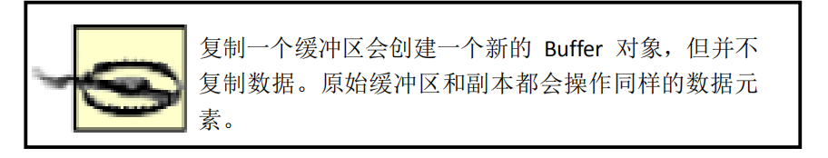

```java
CharBuffer buffer = CharBuffer.allocate (8); 
buffer.position (3).limit (6).mark( ).position (5); 
CharBuffer dupeBuffer = buffer.duplicate( ); 
buffer.clear( );
//
```

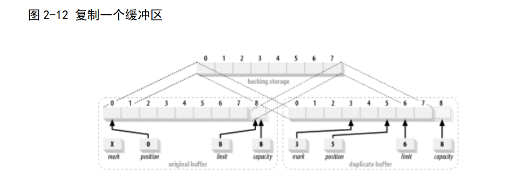

可以使用 asReadOnlyBuffer() 函数来生成一个只读的缓冲区视图。这与

duplicate()相同，除了这个新的缓冲区不允许使用 put()，并且其 isReadOnly()函数

将会返回 true 。对这一只读缓冲区的 put() 函数的调用尝试会导致抛出

ReadOnlyBufferException 异常

**Since()函数分割缓冲区**，并且其容量是原始缓冲区的剩余元素数量（limit-position）

```java
CharBuffer buffer = CharBuffer.allocate (8); 
buffer.position (3).limit (5); 
CharBuffer sliceBuffer = buffer.slice( );
```

要创建一个映射到数组位置 12-20（9 个元素）的 buffer 对象，应使用下面的代码实

现

```java
char [] myBuffer = new char [100]; 
CharBuffer cb = CharBuffer.wrap (myBuffer); 
cb.position(12).limit(21); 
CharBuffer sliced = cb.slice( );
```

## 字节缓冲区

```java
package java.nio; 
public abstract class ByteBuffer extends Buffer 
 implements Comparable 
{ 
 public static ByteBuffer allocate (int capacity) 
 public static ByteBuffer allocateDirect (int capacity) 
 public abstract boolean isDirect( ); 
 public static ByteBuffer wrap (byte[] array, int offset, int length) 
 public static ByteBuffer wrap (byte[] array) 
 public abstract ByteBuffer duplicate( ); 
40
 public abstract ByteBuffer asReadOnlyBuffer( ); 
 public abstract ByteBuffer slice( ); 
 public final boolean hasArray( ) 
 public final byte [] array( ) 
 public final int arrayOffset( ) 
 public abstract byte get( ); 
 public abstract byte get (int index); 
 public ByteBuffer get (byte[] dst, int offset, int length) 
 public ByteBuffer get (byte[] dst, int offset, int length) 
 public abstract ByteBuffer put (byte b); 
 public abstract ByteBuffer put (int index, byte b); 
 public ByteBuffer put (ByteBuffer src) 
 public ByteBuffer put (byte[] src, int offset, int length) 
 public final ByteBuffer put (byte[] src) 
 public final ByteOrder order( ) 
 public final ByteBuffer order (ByteOrder bo)
 public abstract CharBuffer asCharBuffer( ); 
 public abstract ShortBuffer asShortBuffer( ); 
 public abstract IntBuffer asIntBuffer( ); 
 public abstract LongBuffer asLongBuffer( ); 
 public abstract FloatBuffer asFloatBuffer( ); 
 public abstract DoubleBuffer asDoubleBuffer( ); 
 public abstract char getChar( ); 
 public abstract char getChar (int index); 
 public abstract ByteBuffer putChar (char value); 
 public abstract ByteBuffer putChar (int index, char value); 
 public abstract short getShort( ); 
 public abstract short getShort (int index); 
 public abstract ByteBuffer putShort (short value); 
 public abstract ByteBuffer putShort (int index, short value); 
 public abstract int getInt( ); 
 public abstract int getInt (int index); 
 public abstract ByteBuffer putInt (int value); 
 public abstract ByteBuffer putInt (int index, int value);
 public abstract long getLong( ); 
 public abstract long getLong (int index); 
 public abstract ByteBuffer putLong (long value); 
 public abstract ByteBuffer putLong (int index, long value);
public abstract float getFloat( ); 
public abstract float getFloat (int index); 
public abstract ByteBuffer putFloat (float value); 
 public abstract ByteBuffer putFloat (int index, float value); 
 
public abstract double getDouble( ); 
 public abstract double getDouble (int index); 
 public abstract ByteBuffer putDouble (double value); 
 public abstract ByteBuffer putDouble (int index, double value); 
 
public abstract ByteBuffer compact( ); 
 public boolean equals (Object ob) { 
 public int compareTo (Object ob) { 
 public String toString( ) 
 public int hashCode( )
}
```

字节不一定总是8位的，每个字节可以是 3 到 12 之间任何个数或者更多个的比特位，最常见的是

6 到 9 位。八位的字节来自于市场力量和实践的结合。它之所以实用是因为 8 位

足以表达可用的字符集（至少是英文字符），8 是 2 的三次乘方（这简化了硬件

设计），八恰好容纳两个十六进制数字，而且 8 的倍数提供了足够的组合位来存

储有效的数值。市场力量是 IBM。 可以是3-12位，最常用的是6-9，8位是因为市场和2的次方更利于硬件

### 字节顺序

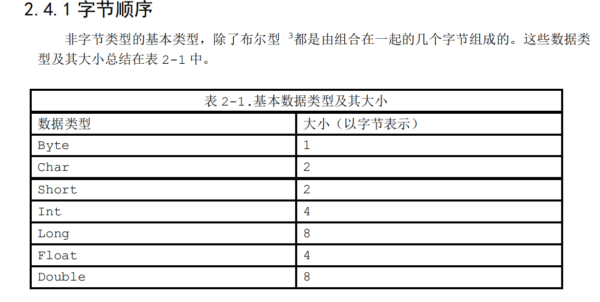

例如，

32 位的 int 值

0x037fb4c7（十进制的 58,700,999）

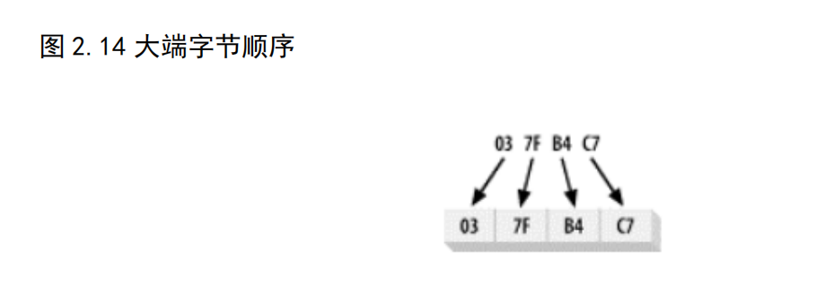

分为大端和小端顺序

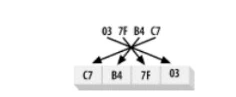

Intel处理器使用小端字节，Sun的Sparc工作站，摩托罗拉的CPU都属于大端字节顺序

```java
public final class ByteOrder 
{ 
 public static final ByteOrder BIG_ENDIAN 
 public static final ByteOrder LITTLE_ENDIAN 
 public static ByteOrder nativeOrder( ) 
 public String toString( ) 
}
```

```java
public abstract class CharBuffer extends Buffer 
 implements Comparable, CharSequence 
{ 
 // This is a partial API listing 
 public final ByteOrder order( ) 
}
```

可以使用order()方法来查看当前的字节顺序，是以什么格式存储在内存

**多字节数值被存储在内存中的方式被称为字节顺序**

如果想知道JVM运行平台的固有字节顺序，调用静态类函数nativeOrder()，然后使用toString()方法进行打印输出，目前较多平台都是**小端字节顺序**

```java
public abstract class ByteBuffer extends Buffer 
 implements Comparable 
{ 
 // This is a partial API listing 
 public final ByteOrder order( ) 
 public final ByteBuffer order (ByteOrder bo) 
}
```

可以使用顺序来改变

## 直接缓冲区

创建的该缓冲区直接在堆栈外开辟内存，直接与操作系统交互，不会经过JVM堆栈，并且还是连续字节存储，不像JVM堆会移动数据造成字节不连续性能变低，创建后的直接缓冲区通过堆里面的DirectByteBuffer来操作该内存空间。

直接字节缓冲区通常是I/O操作的最好方式，如果像通道传输一个非直接的ByteBuffer，可能会造成如下操作,会造成教多的中间直接缓冲区对象

- **创建一个临时的直接的ByteBuffer对象**
- **将非直接缓冲区的内容复制到直接缓冲区中**
- **使用临时缓冲区作为I/O操作**
- **使用完被回收**

缺点：

- 比非直接的ByteBuffer可能要花费更高的成本
- 因为绕过了标准JVM堆栈，建立和销毁缓冲区会比较

```java
public abstract class ByteBuffer 
 extends Buffer implements Comparable 
{ 
 // This is a partial API listing 
 public static ByteBuffer allocate (int capacity) 
 public static ByteBuffer allocateDirect (int capacity) 
 public abstract boolean isDirect( ); 
}
```

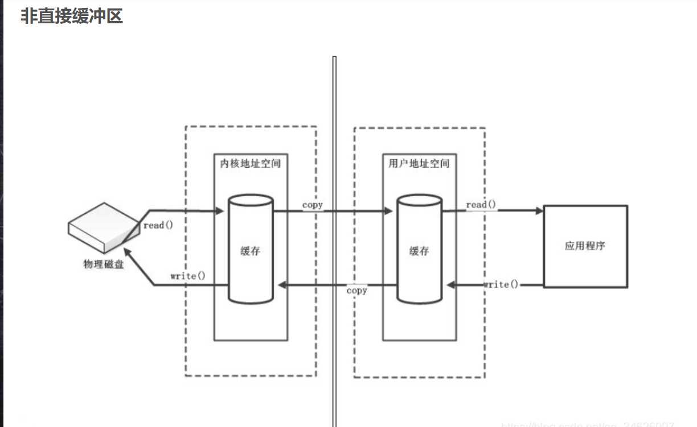

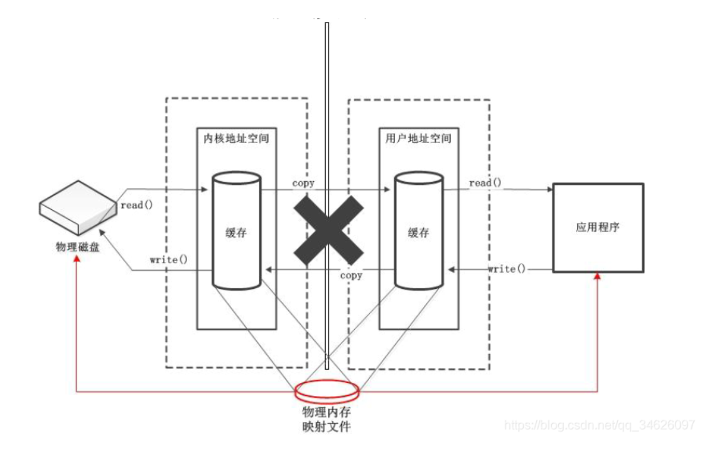

**直接缓冲区:内核地址空间和用户地址空间之间形成了一个物理内存映射文件，减少了之间的copy过程。**因为内核空间和用户空间都是逻辑上的空间，而物理空间则是实际存放的空间。而虚拟内存就是指很小的内存空间可以装很大的程序，采用了分页技术。可以使用内存映射来将内核空间和用户空间都映射到相同的物理空间，那么就不需要再进行copy数据

**不需要多次拷贝，从磁盘-》内核-》JVM用户空间**

虽然ByteBuffer是唯一可以被直接分配的类型，但如果基础缓冲区是一个直接ByteBuffer，对于非字节视图缓冲区，isDirect()可以是true

## 视图缓冲区

```java
public abstract class ByteBuffer 
extends Buffer implements Comparable 
{ 
 // This is a partial API listing
 public abstract CharBuffer asCharBuffer( ); 
 public abstract ShortBuffer asShortBuffer( ); 
 public abstract IntBuffer asIntBuffer( ); 
 public abstract LongBuffer asLongBuffer( ); 
 public abstract FloatBuffer asFloatBuffer( ); 
 public abstract DoubleBuffer asDoubleBuffer( ); 
}
```

视图缓冲区，拥有和原始缓冲区共享数据的能力。

下面的代码创建了一个 ByteBuffer 缓冲区的 CharBuffer 视图，如图 Figure 2-16

所示（Example 2-2 将这个框架用到了更大的范围）

```java
ByteBuffer byteBuffer = 

ByteBuffer.allocate (7).order (ByteOrder.BIG_ENDIAN); 

CharBuffer charBuffer = byteBuffer.asCharBuffer( );
```

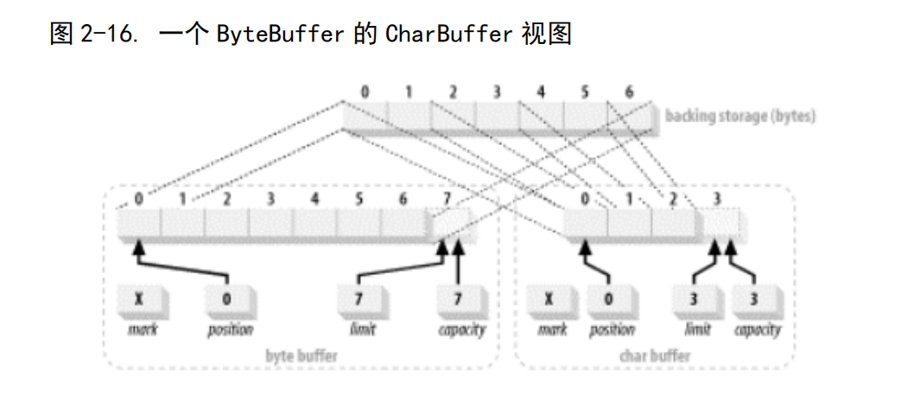

因为java中char字符以unicode码表示，16位比特2个字节一位字符

```java
package com.ronsoft.books.nio.buffers; 
import java.nio.Buffer; 
import java.nio.ByteBuffer; 
import java.nio.CharBuffer; 
import java.nio.ByteOrder; 
/** 
* Test asCharBuffer view. 
* 
* Created May 2002 
* @author Ron Hitchens (ron@ronsoft.com) 
*/ 
public class BufferCharView 
{ 
 public static void main (String [] argv) 
 throws Exception 
 { 
 ByteBuffer byteBuffer = 
 ByteBuffer.allocate (7).order (ByteOrder.BIG_ENDIAN); 
 CharBuffer charBuffer = byteBuffer.asCharBuffer( ); 
 // Load the ByteBuffer with some bytes 
 byteBuffer.put (0, (byte)0); 
 byteBuffer.put (1, (byte)'H'); 
 byteBuffer.put (2, (byte)0); 
 byteBuffer.put (3, (byte)'i'); 
 byteBuffer.put (4, (byte)0); 
 byteBuffer.put (5, (byte)'!'); 
 byteBuffer.put (6, (byte)0); 
 println (byteBuffer); 
 println (charBuffer); 
 } 
 // Print info about a buffer 
 private static void println (Buffer buffer) 
 { 
 System.out.println ("pos=" + buffer.position( ) 
 + ", limit=" + buffer.limit( ) 
 + ", capacity=" + buffer.capacity( ) 
 + ": '" + buffer.toString( ) + "'"); 
 } 
} 
pos=0, limit=7, capacity=7: 'java.nio.HeapByteBuffer[pos=0 lim=7 cap=7]' 
pos=0, limit=3, capacity=3: 'Hi!' 
运行 BufferCharView 程序的输出是：
pos=0, limit=7, capacity=7: 'java.nio.HeapByteBuffer[pos=0 lim=7 cap=7]'
pos=0, limit=3, capacity=3: 'Hi!
```

**视图缓冲区都会根据缓冲区的字节顺序包装成对应的数据类型**

可以看到基础 ByteBuffer 对象中的两个字节映射成 CharBuffer 对象中

的一个字符。

## 数据元素视图

```java
public abstract class ByteBuffer 
 extends Buffer implements Comparable 
{ 
 public abstract char getChar( ); 
 public abstract char getChar (int index); 
 public abstract short getShort( ); 
 public abstract short getShort (int index); 
 public abstract int getInt( ); 
 public abstract int getInt (int index); 
 public abstract long getLong( ); 
 public abstract long getLong (int index); 
 public abstract float getFloat( ); 
 public abstract float getFloat (int index); 
 public abstract double getDouble( ); 
 public abstract double getDouble (int index); 
 public abstract ByteBuffer putChar (char value); 
 public abstract ByteBuffer putChar (int index, char value); 
 public abstract ByteBuffer putShort (short value); 
 public abstract ByteBuffer putShort (int index, short value); 
 public abstract ByteBuffer putInt (int value); 
 public abstract ByteBuffer putInt (int index, int value); 
 public abstract ByteBuffer putLong (long value); 
 public abstract ByteBuffer putLong (int index, long value); 
 public abstract ByteBuffer putFloat (float value); 
 public abstract ByteBuffer putFloat (int index, float value); 
 public abstract ByteBuffer putDouble (double value); 
 public abstract ByteBuffer putDouble (int index, double value); 
}
```

。比如说，如果 getInt()函数被调用，从当前的位置开始的四个字节会被包装

成一个 int 类型的变量然后作为函数的返回值返回

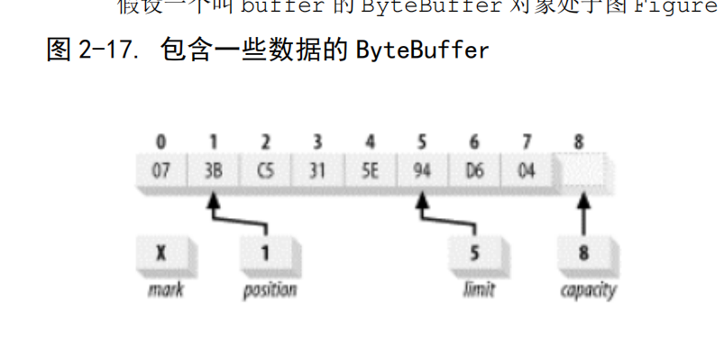

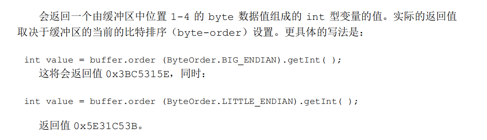

并且根据不同的顺序返回不同的字节顺序

Put 函数提供与 get 相反的操作。原始数据的值会根据字节顺序被分拆成一个个 byte

数据。如果存储这些字节数据的空间不够，会抛出 BufferOverflowException。

### 存取无符号数据

```java
import java.nio.ByteBuffer;
/**
* 向 ByteBuffer 对象中获取和存放无符号值的工具类。
* 这里所有的函数都是静态的，并且带有一个 ByteBuffer 参数。
* 由于 java 不提供无符号原始类型，每个从缓冲区中读出的无符号值被升到比它大的
* 下一个基本数据类型中。
* getUnsignedByte()返回一个 short 类型, getUnsignedShort( )
* 返回一个 int 类型，而 getUnsignedInt()返回一个 long 型。 There is no
* 由于没有基本类型来存储返回的数据，因此没有 getUnsignedLong( )。
* 如果需要，返回 BigInteger 的函数可以执行。
* 同样，存放函数要取一个大于它们所分配的类型的值。
* putUnsignedByte 取一个 short 型参数，等等。
*
* @author Ron Hitchens (ron@ronsoft.com)
*/
public class Unsigned 
{ 
 public static short getUnsignedByte (ByteBuffer bb) 
 { 
 return ((short)(bb.get( ) & 0xff)); 
 } 
 public static void putUnsignedByte (ByteBuffer bb, int value) 
 { 
 bb.put ((byte)(value & 0xff)); 
 } 
 public static short getUnsignedByte (ByteBuffer bb, int position) 
 { 
 return ((short)(bb.get (position) & (short)0xff)); 
 } 
 public static void putUnsignedByte (ByteBuffer bb, int position, 
 int value) 
 { 
 bb.put (position, (byte)(value & 0xff)); 
 } 
 // ---------------------------------------------------------------
 public static int getUnsignedShort (ByteBuffer bb) 
 { 
 return (bb.getShort( ) & 0xffff); 
 } 
 public static void putUnsignedShort (ByteBuffer bb, int value) 
 { 
 bb.putShort ((short)(value & 0xffff)); 
 }
 public static int getUnsignedShort (ByteBuffer bb, int position) 
 { 
 return (bb.getShort (position) & 0xffff); 
 } 
 public static void putUnsignedShort (ByteBuffer bb, int position, 
 int value) 
 { 
 bb.putShort (position, (short)(value & 0xffff)); 
 } 
 // ---------------------------------------------------------------
 public static long getUnsignedInt (ByteBuffer bb) 
50
 { 
 return ((long)bb.getInt( ) & 0xffffffffL); 
 } 
 
 public static void putUnsignedInt (ByteBuffer bb, long value) 
 { 
 bb.putInt ((int)(value & 0xffffffffL)); 
 } 
 public static long getUnsignedInt (ByteBuffer bb, int position) 
 { 
 return ((long)bb.getInt (position) & 0xffffffffL); 
 } 
 public static void putUnsignedInt (ByteBuffer bb, int position, 
 long value) 
 { 
 bb.putInt (position, (int)(value & 0xffffffffL)); 
 } 
}
```

byte去符号使用 & 0xff

short去符号使用 & 0xffff

int无符号使用 & 0xffffffffL

### 内存映射缓冲区

映射缓冲区是带有存储在文件，通过内存映射来存取数据元素的字节缓冲区。映射缓冲区通常就是直接存取内存的，只能通过FileChannel类来创建

# 通道

**辉煌！绝对的辉煌！**

*—— Wile E. Coyote* *（超级天才）*

Channel用于在字节缓冲区和位于通道的另一侧的实体(通常是一个文件或者套接字)之间有效的传递数据

通道可以形象地比喻为银行出纳窗口使用的气动导管。您的薪水支票就是您要传送的信息，载体（Carrier）就好比一个缓冲区。您先填充缓冲区（将您的支票放到载体上），接着将缓冲“写”到通道中（将载体丢进导管中），然后信息负载就被传递到通道另一侧的 I/O 服务（银行出纳员）。

该过程的回应是：出纳员填充缓冲区（将您的收据放到载体上），接着开始一个反方向的通道传输（将载体丢回到导管中）。载体就到了通道的您这一侧（一个填满了的缓冲区正等待您的查验），然后您就会 flip 缓冲区（打开盖子）并将它清空（移除您的收据）。现在您可以开车走了，下一个对象（银行客户）将使用同样的载体（*Buffer*）和导管（*Channel*）对象来重复上述过程

通道是一种途径,借助该途径可以用最小的总开销来访问操作系统本身的I/O服务

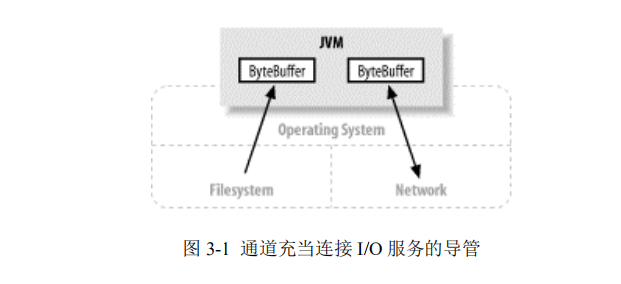

## 通道基础

Channel的顶级接口

```java
package java.nio.channels;
public interface Channel
{
public boolean isOpen( );
public void close( ) throws IOException;
}
```

InterruptiableChannel是一个标记接口 , 当被通道使用的时候表示该通道是可以中断的。如果连接可中断的通道的线程被中断，那么该通道就会以特别的方式运行

Channel接口的其他面向字节的子接口：**Writeable ByteChannel** 和 **Readable ByteChannel**。

还有AbstractInterruptibleChannel和AbstractSelectableChannel。分别为可中断的通道和可选择的通道

### 打开通道

I/O可以分为广义的两大类：File I/O 和 Stream I/O。那么相应的就有两种类型的I/O通道。文件通道和套接字通道。FileChannel 和 ServerSocketChannel，SocketChannel，DatagramChannel。

通道可以有多种方法创建，Socket通道有直接创建的方式。但是FileChannel只能通过 FileInputStream和FileOutputStream和RandomAccessFile的getChannel方法来获取FileChannel。因为是面向字节的，所以没有提供字符获取通道的API

```java
SocketChannel sc = SocketChannel.open( );
sc.connect (new InetSocketAddress ("somehost", someport));
ServerSocketChannel ssc = ServerSocketChannel.open( );
ssc.socket( ).bind (new InetSocketAddress (somelocalport));
DatagramChannel dc = DatagramChannel.open( );
RandomAccessFile raf = new RandomAccessFile ("somefile", "r");
FileChannel fc = raf.getChannel( );
```

java.net 的 socket 类也有新的 getChannel( )方法。这些方法虽然能返回一个相应的 socket 通道对象，但它们却并非新通道的来源，RandomAccessFile.getChannel( )方法才是。只有在已经有通道存在的时候，它们才返回与一个 socket 关联的通道；它们永远不会创建新通道。

### 使用通道

```java
public interface ReadableByteChannel
extends Channel
{
public int read (ByteBuffer dst) throws IOException;
56
}
public interface WritableByteChannel
extends Channel
{
public int write (ByteBuffer src) throws IOException;
}
public interface ByteChannel
extends ReadableByteChannel, WritableByteChannel
{}
```

通道可以是单向的也可以是双向的，如果实现这两个接口的单一接口，那么就是单向的，如果实现双接口那么就是双向的。

ByteChannel是没有定义方法，简化实现接口。不过通常的File和Socket通道都实现全部三个接口，意味这全部file和socket通道对象都是双向的。不过对于files是个问题，因为FileChannel只能通过FileInputStream和FileOutputStream和RandomAccessFile的getChannel方法来获取FileChannel。如果是FileInputStrem获取的通道那么只能有读的权限，如果尝试写则抛出异常。其他同理。**因为 *FileInputStream* 对象总是以 read-only 的权限打开文件。**

通道连接一个特定I/O服务且通道实例受它所连接的I/O服务限制

```java
// A ByteBuffer named buffer contains data to be written
FileInputStream input = new FileInputStream (fileName);
FileChannel channel = input.getChannel( );
// This will compile but will throw an IOException
// because the underlying file is read-only
channel.write (buffer);
```

**根据底层文件句柄的访问模式，通道实例可能不允许使用 *read()*或 *write()*方**

**法。**

ByteChannel的read()和write()方法使用ByteBuffer作为参数，返回值均为已读取/已传输的字节数

下面例子表示了如何从一个通道复制数据到另外一个通道

```java
package com.ronsoft.books.nio.channels;
import java.nio.ByteBuffer;
import java.nio.channels.ReadableByteChannel;
import java.nio.channels.WritableByteChannel;
import java.nio.channels.Channels;
import java.io.IOException;
/**
 * Test copying between channels.
 *
58
59
 * @author Ron Hitchens (ron@ronsoft.com)
 */
public class ChannelCopy
{
/**
* This code copies data from stdin to stdout. Like the 'cat'
* command, but without any useful options.
*/
public static void main (String [] argv)
throws IOException
{
ReadableByteChannel source = Channels.newChannel (System.in);
WritableByteChannel dest = Channels.newChannel (System.out);
channelCopy1 (source, dest);
// alternatively, call channelCopy2 (source, dest);
source.close( );
dest.close( );
}
/**
 * Channel copy method 1. This method copies data from the src
 * channel and writes it to the dest channel until EOF on src.
 * This implementation makes use of compact( ) on the temp buffer
 * to pack down the data if the buffer wasn't fully drained. This
 * may result in data copying, but minimizes system calls. It also
 * requires a cleanup loop to make sure all the data gets sent.
 */
private static void channelCopy1 (ReadableByteChannel src,
WritableByteChannel dest)
throws IOException
{
ByteBuffer buffer = ByteBuffer.allocateDirect (16 * 1024);
while (src.read (buffer) != -1) {
// Prepare the buffer to be drained
buffer.flip( );
// Write to the channel; may block
dest.write (buffer);
// If partial transfer, shift remainder down
// If buffer is empty, same as doing clear( )
buffer.compact( );
}
// EOF will leave buffer in fill state
buffer.flip( );
// Make sure that the buffer is fully drained
while (buffer.hasRemaining( )) {
dest.write (buffer);
} }
/**
 * Channel copy method 2. This method performs the same copy, but
 * assures the temp buffer is empty before reading more data. This
 * never requires data copying but may result in more systems calls.
 * No post-loop cleanup is needed because the buffer will be empty
 * when the loop is exited.
 */
private static void channelCopy2 (ReadableByteChannel src,
WritableByteChannel dest)
throws IOException
{
ByteBuffer buffer = ByteBuffer.allocateDirect (16 * 1024);
while (src.read (buffer) != -1) {
// Prepare the buffer to be drained
buffer.flip( );
// Make sure that the buffer was fully drained
while (buffer.hasRemaining( )) {
dest.write (buffer);
}
// Make the buffer empty, ready for filling
buffer.clear( );
} } }
```

通道可以使用阻塞或者非阻塞模式运行。只有面向流的通道，才能使用非阻塞模式如 sockets 和 pipes 才能使用非阻塞模式

socket 通道类从 *SelectableChannel* 引申而来。从 *SelectableChannel* 引申而来的类可以和支持有条件的选择（readiness selectio）的选择器（Selectors）一起使用。将非阻塞I/O 和选择器组合起来可以使您的程序利用多路复用 I/O（multiplexed I/O）。选择和多路复用将在第四章中予以讨论。关于怎样将 sockets 置于非阻塞模式的细节会在 3.5 节中涉及。

### 关闭通道

```java
package java.nio.channels;
public interface Channel
{
public boolean isOpen( );
public void close( ) throws IOException;
}
```

调用通道的close()方法时，可能会导致通道关闭底层I/O服务的过程中阻塞，哪怕通道处于非阻塞模式。因为底层I/O服务真正的决定权是取决于操作系统的

如果第一个线程调用close()方法阻塞，那么其他线程调用也会等待第一个线程关闭

可以通过isOpen()来判断通道是否打开如果返回 true 值，那么该通道可以使用。如果返回 false 值，那么该通道已关闭，不能再被使用。尝试进行任何需要通道处于开放状态作为前提的操作，如读、写等都会导致 *ClosedChannelException* 异常。

并且通道引入了一些与关闭和中断有关的新行为：**如果一个通道实现InterruptibaleChannel接口，那么如果一个线程在一个通道上并阻塞并且同时被中断(其他线程调用该线程的interrupt方法)，那么会导致该通道关闭。阻塞的线程也会抛出*ClosedByInterruptException*异常**

**此外，如果一个线程的interrupt status被设置，并且该线程视图访问一个通道，那么通道也会关闭。同时将抛出相同的 *ClosedByInterruptException* 异常**

可以通过isinterrupt()来测试某个线程当前的interrupt status

当前线程的 interrupt status 可以通过调用静态的 *Thread.interrupted( )*方法清除。		

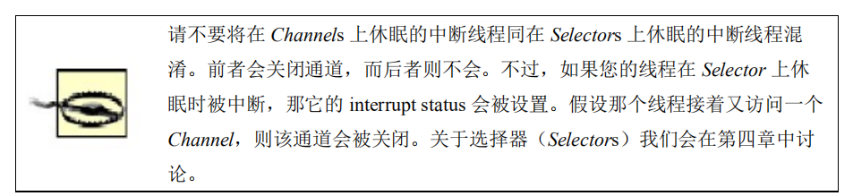

## Scatter/Gather

通道提供了一个被称为Scatter/Gather的新重要功能(有时候称为矢量I/O)

是指多个缓冲区实现一个I/O操作而言，对于一个Write操作来说，数据从多个缓冲区按顺序存取(Gather)收集，然后写入通道。对于一个Read操作来说，将数据分散(Scatter)的写入到多个缓冲区，大大的提高了性能。Gather就好比将所有缓冲区连起来，形成一个大的缓冲区。

当在一个通道上请求一个Scatter/Gatter，该请求会被适当的翻译为来直接填充或者抽取缓冲区，性能高

```java

public interface ScatteringByteChannel
extends ReadableByteChannel
{
public long read (ByteBuffer [] dsts)
throws IOException;
public long read (ByteBuffer [] dsts, int offset, int length)
throws IOException;
}
public interface GatheringByteChannel
extends WritableByteChannel
{
public long write(ByteBuffer[] srcs)
throws IOException;
public long write(ByteBuffer[] srcs, int offset, int length)
throws IOException;
}
```

offset是指从第几个数组，Lengh是存/取几个长度的数组

```java
ByteBuffer header = ByteBuffer.allocateDirect (10);
ByteBuffer body = ByteBuffer.allocateDirect (80);
ByteBuffer [] buffers = { header, body };
int bytesRead = channel.read (buffers);
```

```java

body.clear( );
body.put("FOO".getBytes()).flip( ); // "FOO" as bytes
header.clear( );
header.putShort (TYPE_FILE).putLong (body.limit()).flip( );
long bytesWritten = channel.write (buffers);
```

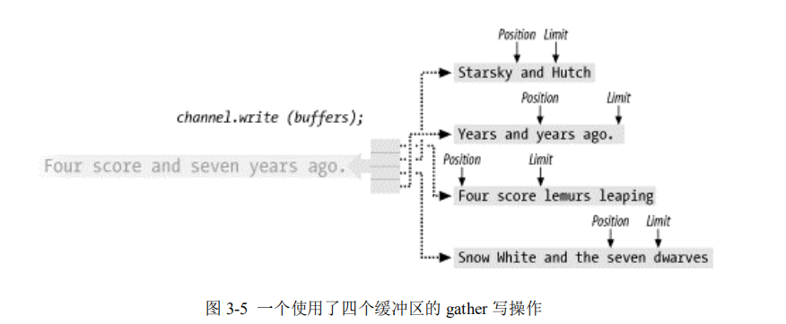

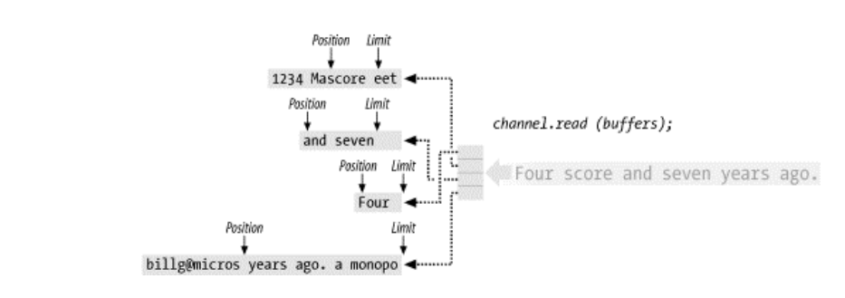

带 offset 和 length 参数版本的 *read( )* 和 *write( )*方法使得我们可以使用缓冲区阵列的子集缓冲区。这里的 offset 值指哪个缓冲区将开始被使用，而不是指数据的 offset。这里的 length 参数指示要使用的缓冲区数量。举个例子，假设我们有一个五元素的 fiveBuffers 阵列，它已经被初始化并引用了五个缓冲区，下面的代码将会写第二个、第三个和第四个缓冲区的内容：

int bytesRead = channel.write (fiveBuffers, 1, 3);

```java

package com.ronsoft.books.nio.channels;
import java.nio.ByteBuffer;
import java.nio.channels.GatheringByteChannel;
import java.io.FileOutputStream;
import java.util.Random;
import java.util.List;
import java.util.LinkedList;
/**
 * Demonstrate gathering write using many buffers.
 *
 * @author Ron Hitchens (ron@ronsoft.com)
 */
public class Marketing
{
private static final String DEMOGRAPHIC = "blahblah.txt";
// "Leverage frictionless methodologies"
public static void main (String [] argv)
throws Exception
{
int reps = 10;
if (argv.length > 0) {
reps = Integer.parseInt (argv [0]);
}
FileOutputStream fos = new FileOutputStream (DEMOGRAPHIC);
GatheringByteChannel gatherChannel = fos.getChannel( );
// Generate some brilliant marcom, er, repurposed content
ByteBuffer [] bs = utterBS (reps);
// Deliver the message to the waiting market
while (gatherChannel.write (bs) > 0) {
// Empty body
// Loop until write( ) returns zero
}
System.out.println ("Mindshare paradigms synergized to "
+ DEMOGRAPHIC);
66
fos.close( );
}
// ------------------------------------------------
// These are just representative; add your own
private static String [] col1 = {
"Aggregate", "Enable", "Leverage",
"Facilitate", "Synergize", "Repurpose",
"Strategize", "Reinvent", "Harness"
};
private static String [] col2 = {
"cross-platform", "best-of-breed", "frictionless",
"ubiquitous", "extensible", "compelling",
"mission-critical", "collaborative", "integrated"
};
private static String [] col3 = {
"methodologies", "infomediaries", "platforms",
"schemas", "mindshare", "paradigms",
"functionalities", "web services", "infrastructures"
};
private static String newline = System.getProperty ("line.separator");
// The Marcom-atic 9000
private static ByteBuffer [] utterBS (int howMany)
throws Exception
{
List list = new LinkedList( );
for (int i = 0; i < howMany; i++) {
list.add (pickRandom (col1, " "));
list.add (pickRandom (col2, " "));
list.add (pickRandom (col3, newline));
}
ByteBuffer [] bufs = new ByteBuffer [list.size( )];
list.toArray (bufs);
return (bufs);
}
// The communications director
private static Random rand = new Random( );
// Pick one, make a buffer to hold it and the suffix, load it with
// the byte equivalent of the strings (will not work properly for
67
// non-Latin characters), then flip the loaded buffer so it's ready
// to be drained
private static ByteBuffer pickRandom (String [] strings, String suffix)
throws Exception
{
String string = strings [rand.nextInt (strings.length)];
int total = string.length() + suffix.length( );
ByteBuffer buf = ByteBuffer.allocate (total);
buf.put (string.getBytes ("US-ASCII"));
buf.put (suffix.getBytes ("US-ASCII"));
buf.flip( );
return (buf);
} }
```

下面是实现 Marketing 类的输出。虽然这种输出没什么意义，但是 gather 写操作却能让我们

非常高效地把它生成出来。

```java
Aggregate compelling methodologies

Harness collaborative platforms

Aggregate integrated schemas

Aggregate frictionless platforms

Enable integrated platforms

Leverage cross-platform functionalities

Harness extensible paradigms

Synergize compelling infomediaries

Repurpose cross-platform mindshare

Facilitate cross-platform infomediaries
```

## 文件通道

文件通道总是阻塞式的，对于文件I/O，最强大之处在于异步I/O

```java
package java.nio.channels;
public abstract class FileChannel
extends AbstractChannel
implements ByteChannel, GatheringByteChannel, ScatteringByteChannel
{
// This is a partial API listing
// All methods listed here can throw java.io.IOException
public abstract int read (ByteBuffer dst, long position)
public abstract int write (ByteBuffer src, long position)
public abstract long size( )
public abstract long position( ) //当前位置
public abstract void position (long newPosition) //设置指针索引
public abstract void truncate (long size) //截断
public abstract void force (boolean metaData) //不适用缓存，同步磁盘
public final FileLock lock( )//获取文件锁，阻塞的
public abstract FileLock lock (long position, long size,
boolean shared) //获取某个部位锁，并且指定是否是共享锁
public final FileLock tryLock( ) //获取锁，非阻塞的，没获取到立刻返回
public abstract FileLock tryLock (long position, long size,
boolean shared) //
public abstract MappedByteBuffer map (MapMode mode, long position, //内存映射文件，速度快
long size)
//获取锁可以干什么?  可以
public static class MapMode
{
public static final MapMode READ_ONLY
public static final MapMode READ_WRITE
public static final MapMode PRIVATE
}
public abstract long transferTo (long position, long count,
WritableByteChannel target) //直接传输数据，少了数据拷贝
public abstract long transferFrom (ReadableByteChannel src,
long position, long count) 直接读取数据，少了拷贝
}
```

FileChannel对象是线程安全的。影响通道位置和文件大小的操作都是单线程的，其他线程必须先等待

FileChannel类保证在JAVA虚拟机上的所有实例对象看到的某个文件视图时一致的

### 访问文件

每个FileChannel对象都同一个文件描述符有一对一的关系。

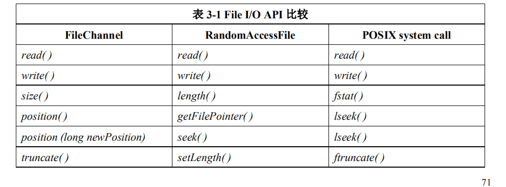

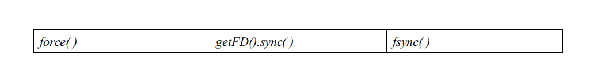

```java
让我们来进一步看下基本的文件访问方法（请记住这些方法都可以抛出 java.io.IOException 异
常）：
public abstract class FileChannel
extends AbstractChannel
implements ByteChannel, GatheringByteChannel, ScatteringByteChannel
{
// This is a partial API listing
public abstract long position( )
public abstract void position (long newPosition)
public abstract int read (ByteBuffer dst)
public abstract int read (ByteBuffer dst, long position)
public abstract int write (ByteBuffer src)
public abstract int write (ByteBuffer src, long position)
public abstract long size( )
public abstract void truncate (long size)
public abstract void force (boolean metaData)
}
```

如果尝试将position设置为一个负值，则会抛出异常，如果read方法读超过文件大小的会返回一个文件尾条件，write方法的话写超过文件大小会造成文件增长，并且如果直接通过有参的position写入到很远，那么可能会造成文件空洞

**文件空洞究竟是什么？**

当磁盘上一个文件的分配空间小于它的文件大小时会出现“文件空洞”。对于内容稀疏的文件，大多数现代文件系统只为实际写入的数据分配磁盘空间（更准确地说，只为那些写入数据的文件系统页分配空间）。假如数据被写入到文件中非连续的位置上，这将导致文件出现在逻辑上不包含数据的区域（即“空洞”）。例如，下面的代码可能产生一个如图 3-8 所示的文件：相当于中间有部分的值为NULL，无意义

```java
package com.ronsoft.books.nio.channels;
import java.nio.ByteBuffer;
import java.nio.channels.FileChannel;
import java.io.File;
import java.io.RandomAccessFile;
import java.io.IOException;
/**
 * Create a file with holes in it
 *
 * @author Ron Hitchens (ron@ronsoft.com)
 */
public class FileHole
{
 public static void main (String [] argv)
 throws IOException
 {
 // Create a temp file, open for writing, and get
 // a FileChannel
 File temp = File.createTempFile ("holy", null);
 RandomAccessFile file = new RandomAccessFile (temp, "rw");
 FileChannel channel = file.getChannel( );
 // Create a working buffer
 ByteBuffer byteBuffer = ByteBuffer.allocateDirect (100);
 putData (0, byteBuffer, channel);
 putData (5000000, byteBuffer, channel);
 putData (50000, byteBuffer, channel);
 // Size will report the largest position written, but
 // there are two holes in this file. This file will
 // not consume 5 MB on disk (unless the filesystem is
73
 // extremely brain-damaged)
 System.out.println ("Wrote temp file '" + temp.getPath( )
 + "', size=" + channel.size( ));
 channel.close( );
 file.close( );
 }
 private static void putData (int position, ByteBuffer buffer,
 FileChannel channel)
 throws IOException
 {
 String string = "*<-- location " + position;
 buffer.clear( );
 buffer.put (string.getBytes ("US-ASCII"));
 buffer.flip( );
 channel.position (position);
 channel.write (buffer);
 } }
```

FileChannel位置时从底层的文件描述符获得的，这意味这一个对象对该文件的position的值更新会被另外一个对象看到

```java
RandomAccessFile randomAccessFile = new RandomAccessFile ("filename", "r");
// Set the file position
randomAccessFile.seek (1000);
// Create a channel from the file
FileChannel fileChannel = randomAccessFile.getChannel( );
// This will print "1000"
System.out.println ("file pos: " + fileChannel.position( ));
// Change the position using the RandomAccessFile object
randomAccessFile.seek (500);
74
// This will print "500"
System.out.println ("file pos: " + fileChannel.position( ));
// Change the position using the FileChannel object
fileChannel.position (200);
// This will print "200"
System.out.println ("file pos: " + randomAccessFile.getFilePointer( ));
```

带有参数的read()和write()不会改变当前文件的position值，并且多个线程并发访问同一个文件而不会产生干扰。

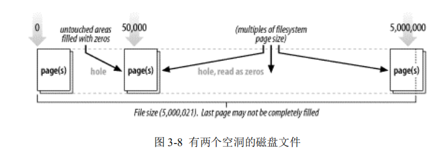

truncate()方法会去掉size之外的所有数据，如果当前size大于新size，数据被丢弃

如果小于新size，那么不会修改。该方法的弊端就是position的值会被设置为新size

```java
public abstract class FileChannel
extends AbstractChannel
75
implements ByteChannel, GatheringByteChannel, ScatteringByteChannel
{
// This is a partial API listing
public abstract void truncate (long size)
public abstract void force (boolean metaData) //参数为true时，同时将元数据，也就是文件更改时间，更改人，等等信息也同步到磁盘，一般为了性能都选择为false
}
```

上面列出的最后一个 API 是 *force( )*。该方法告诉通道强制将全部待定的修改都应用到磁盘的文件上。所有的现代文件系统都会缓存数据和延迟磁盘文件更新以提高性能。调用 *force( )*方法要求文件的所有待定修改立即同步到磁盘。

如果文件位于一个本地文件系统，那么一旦 *force( )*方法返回，即可保证从通道被创建（或上次调用 *force( )*）时起的对文件所做的全部修改已经被写入到磁盘。对于关键操作如事务（transaction）处理来说，这一点是非常重要的，可以保证数据完整性和可靠的恢复。

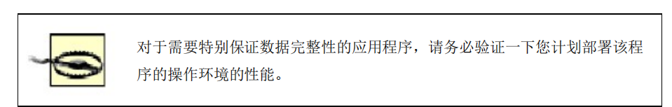

### 文件锁定

有关FileChannel实现的文件锁定模型语义：锁的对象是文件而不是通道或线程

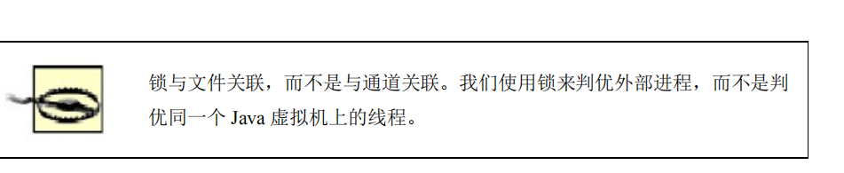

操作系统判断是在进程级别的，而不是线程

如果一个程序一个线程请求文件独占锁，第二个线程也请求，那么第二个线程回背批准。如果两个程序，那么第二个线程会被阻塞

```java
public abstract class FileChannel
extends AbstractChannel
implements ByteChannel, GatheringByteChannel, ScatteringByteChannel
{
// This is a partial API listing
77
public final FileLock lock( )
public abstract FileLock lock (long position, long size,
boolean shared)
public final FileLock tryLock( )
public abstract FileLock tryLock (long position, long size,
boolean shared)
}
```

锁的范围不一定要限制在文件size以内，可以设置到以外，当文件增长的时候，怎张到指定position处，那么文件锁就可以锁定该区域

不带参数的Lock相当于：

fileChannel.lock (0L, Long.MAX_VALUE, false)

```java
public abstract class FileLock
{
78
public final FileChannel channel( )
public final long position( )
public final long size( )
public final boolean isShared( )
public final boolean overlaps (long position, long size)
public abstract boolean isValid( );
public abstract void release( ) throws IOException;
}
```

一个FileLock对象创建之后有效，直到它的release()方法被调用或者它关联的通道或者JAVA虚拟机关闭才有效。可以通过isValid()方法判断是否有效，锁的有效性会变，其他参数——位置（position）、范围大小（size）和独占性（exclusivity）——在创建时即被确定，不会随着时间而改变。

overlaps()方法判断是否与指定的位置有交叉

推荐使用方式

```java

FileLock lock = fileChannel.lock( )
try {
<perform read/write/whatever on channel>
} catch (IOException) [
<handle unexpected exception>
79
} finally {
lock.release( )
}
```

```java
package com.ronsoft.books.nio.channels;
import java.nio.ByteBuffer;
import java.nio.IntBuffer;
import java.nio.channels.FileChannel;
import java.nio.channels.FileLock;
import java.io.RandomAccessFile;
import java.util.Random;
/**
* Test locking with FileChannel.
* Run one copy of this code with arguments "-w /tmp/locktest.dat"
* and one or more copies with "-r /tmp/locktest.dat" to see the
* interactions of exclusive and shared locks. Note how too many
* readers can starve out the writer.
* Note: The filename you provide will be overwritten. Substitute
* an appropriate temp filename for your favorite OS.
*
* Created April, 2002
* @author Ron Hitchens (ron@ronsoft.com)
*/
public class LockTest
{
private static final int SIZEOF_INT = 4;
private static final int INDEX_START = 0;
private static final int INDEX_COUNT = 10;
private static final int INDEX_SIZE = INDEX_COUNT * SIZEOF_INT;
private ByteBuffer buffer = ByteBuffer.allocate (INDEX_SIZE);
private IntBuffer indexBuffer = buffer.asIntBuffer( );
private Random rand = new Random( );
public static void main (String [] argv)
throws Exception
80
{
boolean writer = false;
String filename;
if (argv.length != 2) {
System.out.println ("Usage: [ -r | -w ] filename");
return;
}
writer = argv [0].equals ("-w");
filename = argv [1];
RandomAccessFile raf = new RandomAccessFile (filename,
(writer) ? "rw" : "r");
FileChannel fc = raf.getChannel( );
LockTest lockTest = new LockTest( );
if (writer) {
lockTest.doUpdates (fc);
} else {
lockTest.doQueries (fc);
} }
// ----------------------------------------------------------------
// Simulate a series of read-only queries while
// holding a shared lock on the index area
void doQueries (FileChannel fc)
throws Exception
{
while (true) {
println ("trying for shared lock...");
FileLock lock = fc.lock (INDEX_START, INDEX_SIZE, true);
int reps = rand.nextInt (60) + 20;
for (int i = 0; i < reps; i++) {
int n = rand.nextInt (INDEX_COUNT);
int position = INDEX_START + (n * SIZEOF_INT);
buffer.clear( );
fc.read (buffer, position);
int value = indexBuffer.get (n);
println ("Index entry " + n + "=" + value);
// Pretend to be doing some work
Thread.sleep (100);
81
}
lock.release( );
println ("<sleeping>");
Thread.sleep (rand.nextInt (3000) + 500);
} }
// Simulate a series of updates to the index area
// while holding an exclusive lock
void doUpdates (FileChannel fc)
throws Exception
{
while (true) {
println ("trying for exclusive lock...");
FileLock lock = fc.lock (INDEX_START,
INDEX_SIZE, false);
updateIndex (fc);
lock.release( );
println ("<sleeping>");
Thread.sleep (rand.nextInt (2000) + 500);
} }
// Write new values to the index slots
private int idxval = 1;
private void updateIndex (FileChannel fc)
throws Exception
{
// "indexBuffer" is an int view of "buffer"
indexBuffer.clear( );
for (int i = 0; i < INDEX_COUNT; i++) {
idxval++;
println ("Updating index " + i + "=" + idxval);
indexBuffer.put (idxval);
// Pretend that this is really hard work
Thread.sleep (500);
}
// leaves position and limit correct for whole buffer
buffer.clear( );
fc.write (buffer, INDEX_START);
82
}
// ----------------------------------------------------------------
private int lastLineLen = 0;
// Specialized println that repaints the current line
private void println (String msg)
{
System.out.print ("\r ");
System.out.print (msg);
for (int i = msg.length( ); i < lastLineLen; i++) {
System.out.print (" ");
}
System.out.print ("\r");
System.out.flush( );
lastLineLen = msg.length( );
} }
```

## 内存映射文件

在FileChannl上调用map()方法会创建一个由磁盘文件支持的虚拟内存映射，并在虚拟内存空间外部封装一个MappedByteBuffer对象

该对象的行为在多数方面类似一个基于内存的缓冲区。只不过该对象的数据元素存储在磁盘上的一个文件。

**内存映射文件是由一个文件到一块内存的映射，使进程虚拟空间的某个区域与磁盘某个文件的部分或者全部内容进行映射。**

**建立映射后，通过该区域可以直接对被映射的磁盘文件进行访问，而不需要I/O操作也无需对文件内容进行缓冲处理，相当于被加载到内存一样**


read需要两次拷贝，磁盘到内核缓冲区，内核缓冲区到用户缓冲区

而内存映射，直接将磁盘拷贝到用户缓冲区

```java
public abstract class FileChannel
extends AbstractChannel
implements ByteChannel, GatheringByteChannel, ScatteringByteChannel
{
// This is a partial API listing
public abstract MappedByteBuffer map (MapMode mode, long position,long size)
public static class MapMode
{
public static final MapMode READ_ONLY
public static final MapMode READ_WRITE
public static final MapMode PRIVATE
} }
```

我们可以创建一个 *MappedByteBuffer* 来代表一个文件中字节的某个子范围。例如，要映射 100 到 299（包含 299）位置的字节，可以使用下面的代码：

**buffer = fileChannel.map (FileChannel.MapMode.READ_ONLY, 100, 200);**

200代表200个长度，100为起始位置

如果要映射整个文件则使用：

**buffer = fileChannel.map(FileChannel.MapMode.READ_ONLY, 0, fileChannel.size());**

PRIVATE表示想要一个写时拷贝的映射。put()方法的任何修改，都会导致产生的一个私有的数据，并且只有MappedByteBuffer可以看到，但是还可以看到文件其他位置的修改，除非修改的文件位置和put()的位置产生冲突，那么将会看不到。内存和文件系统都被划分为了页，当写时拷贝的缓冲区调用put()函数，受影响的页会被拷贝。然后修改的数据会被存放在拷贝页中

并且关闭FileChannel不会破坏映射，为了安全。只有丢弃该对象本身

```java
public abstract class MappedByteBuffer
extends ByteBuffer
{
// This is a partial API listing
public final MappedByteBuffer load( ) //加载整个文件以使他常驻内存，因为虚拟内存读取页也需要时间，不过不推荐，因为它会导致大量的页调入
public final boolean isLoaded( )//判断是否页常驻内存了
public final MappedByteBuffer force( ) //也是同步到磁盘	
}
```

```java
package com.ronsoft.books.nio.channels;
import java.nio.ByteBuffer;
import java.nio.MappedByteBuffer;
import java.nio.channels.FileChannel;
import java.nio.channels.FileChannel.MapMode;
import java.nio.channels.GatheringByteChannel;
import java.io.FileInputStream;
import java.io.FileOutputStream;
import java.io.IOException;
import java.net.URLConnection;
/**
* Dummy HTTP server using MappedByteBuffers.
* Given a filename on the command line, pretend to be
* a web server and generate an HTTP response containing
* the file content preceded by appropriate headers. The
* data is sent with a gathering write.
*
* @author Ron Hitchens (ron@ronsoft.com)
*/
public class MappedHttp
{
private static final String OUTPUT_FILE = "MappedHttp.out";
private static final String LINE_SEP = "\r\n";
private static final String SERVER_ID = "Server: Ronsoft Dummy Server";
private static final String HTTP_HDR =
"HTTP/1.0 200 OK" + LINE_SEP + SERVER_ID + LINE_SEP;
private static final String HTTP_404_HDR =
"HTTP/1.0 404 Not Found" + LINE_SEP + SERVER_ID + LINE_SEP;
private static final String MSG_404 = "Could not open file: ";
public static void main (String [] argv)
throws Exception
{
if (argv.length < 1) {
88
System.err.println ("Usage: filename");
return;
}
String file = argv [0];
ByteBuffer header = ByteBuffer.wrap (bytes (HTTP_HDR));
ByteBuffer dynhdrs = ByteBuffer.allocate (128);
ByteBuffer [] gather = { header, dynhdrs, null };
String contentType = "unknown/unknown";
long contentLength = -1;
try {
FileInputStream fis = new FileInputStream (file);
FileChannel fc = fis.getChannel( );
MappedByteBuffer filedata =
fc.map (MapMode.READ_ONLY, 0, fc.size( ));
gather [2] = filedata;
contentLength = fc.size( );
contentType = URLConnection.guessContentTypeFromName (file);
} catch (IOException e) {
// file could not be opened; report problem
ByteBuffer buf = ByteBuffer.allocate (128);
String msg = MSG_404 + e + LINE_SEP;
buf.put (bytes (msg));
buf.flip( );
// Use the HTTP error response
gather [0] = ByteBuffer.wrap (bytes (HTTP_404_HDR));
gather [2] = buf;
contentLength = msg.length( );
contentType = "text/plain";
}
StringBuffer sb = new StringBuffer( );
sb.append ("Content-Length: " + contentLength);
sb.append (LINE_SEP);
sb.append ("Content-Type: ").append (contentType);
sb.append (LINE_SEP).append (LINE_SEP);
dynhdrs.put (bytes (sb.toString( )));
dynhdrs.flip( );
FileOutputStream fos = new FileOutputStream (OUTPUT_FILE);
FileChannel out = fos.getChannel( );
89
// All the buffers have been prepared; write 'em out
while (out.write (gather) > 0) {
// Empty body; loop until all buffers are empty
}
out.close( );
System.out.println ("output written to " + OUTPUT_FILE);
}
// Convert a string to its constituent bytes
// from the ASCII character set
private static byte [] bytes (String string)
throws Exception
{
return (string.getBytes ("US-ASCII"));
} }
```

```java

package com.ronsoft.books.nio.channels;
import java.nio.ByteBuffer;
import java.nio.MappedByteBuffer;
import java.nio.channels.FileChannel;
import java.io.File;
import java.io.RandomAccessFile;
/**
* Test behavior of Memory mapped buffer types. Create a file, write
* some data to it, then create three different types of mappings
* to it. Observe the effects of changes through the buffer APIs
* and updating the file directly. The data spans page boundaries
* to illustrate the page-oriented nature of Copy-On-Write mappings.
*
* @author Ron Hitchens (ron@ronsoft.com)
*/
90
public class MapFile
{
public static void main (String [] argv)
throws Exception
{
// Create a temp file and get a channel connected to it
File tempFile = File.createTempFile ("mmaptest", null);
RandomAccessFile file = new RandomAccessFile (tempFile, "rw");
FileChannel channel = file.getChannel( );
ByteBuffer temp = ByteBuffer.allocate (100);
// Put something in the file, starting at location 0
temp.put ("This is the file content".getBytes( ));
temp.flip( );
channel.write (temp, 0);
// Put something else in the file, starting at location 8192.
// 8192 is 8 KB, almost certainly a different memory/FS page.
// This may cause a file hole, depending on the
// filesystem page size.
temp.clear( );
temp.put ("This is more file content".getBytes( ));
temp.flip( );
channel.write (temp, 8192);
// Create three types of mappings to the same file
MappedByteBuffer ro = channel.map (
FileChannel.MapMode.READ_ONLY, 0, channel.size( ));
MappedByteBuffer rw = channel.map (
FileChannel.MapMode.READ_WRITE, 0, channel.size( ));
MappedByteBuffer cow = channel.map (
FileChannel.MapMode.PRIVATE, 0, channel.size( ));
// the buffer states before any modifications
System.out.println ("Begin");
showBuffers (ro, rw, cow);
// Modify the copy-on-write buffer
cow.position (8);
cow.put ("COW".getBytes( ));
System.out.println ("Change to COW buffer");
showBuffers (ro, rw, cow);
// Modify the read/write buffer
91
rw.position (9);
rw.put (" R/W ".getBytes( ));
rw.position (8194);
rw.put (" R/W ".getBytes( ));
rw.force( );
System.out.println ("Change to R/W buffer");
showBuffers (ro, rw, cow);
// Write to the file through the channel; hit both pages
temp.clear( );
temp.put ("Channel write ".getBytes( ));
temp.flip( );
channel.write (temp, 0);
temp.rewind( );
channel.write (temp, 8202);
System.out.println ("Write on channel");
showBuffers (ro, rw, cow);
// Modify the copy-on-write buffer again
cow.position (8207);
cow.put (" COW2 ".getBytes( ));
System.out.println ("Second change to COW buffer");
showBuffers (ro, rw, cow);
// Modify the read/write buffer
rw.position (0);
rw.put (" R/W2 ".getBytes( ));
rw.position (8210);
rw.put (" R/W2 ".getBytes( ));
rw.force( );
System.out.println ("Second change to R/W buffer");
showBuffers (ro, rw, cow);
// cleanup
channel.close( );
file.close( );
tempFile.delete( );
}
// Show the current content of the three buffers
public static void showBuffers (ByteBuffer ro, ByteBuffer rw,
ByteBuffer cow)
throws Exception
92
{
dumpBuffer ("R/O", ro);
dumpBuffer ("R/W", rw);
dumpBuffer ("COW", cow);
System.out.println ("");
}
// Dump buffer content, counting and skipping nulls
public static void dumpBuffer (String prefix, ByteBuffer buffer)
throws Exception
{
System.out.print (prefix + ": '");
int nulls = 0;
int limit = buffer.limit( );
for (int i = 0; i < limit; i++) {
char c = (char) buffer.get (i);
if (c == '\u0000') {
nulls++;
continue;
}
if (nulls != 0) {
System.out.print ("|[" + nulls
+ " nulls]|");
nulls = 0;
}
System.out.print (c);
}
System.out.println ("'");
} }
```

以下是运行上面程序的输出：

Begin

R/O: 'This is the file content|[8168 nulls]|This is more file content'

R/W: 'This is the file content|[8168 nulls]|This is more file content'

COW: 'This is the file content|[8168 nulls]|This is more file content'

93Change to COW buffer

R/O: 'This is the file content|[8168 nulls]|This is more file content'

R/W: 'This is the file content|[8168 nulls]|This is more file content'

COW: 'This is COW file content|[8168 nulls]|This is more file content'

Change to R/W buffer

R/O: 'This is t R/W le content|[8168 nulls]|Th R/W more file content'

R/W: 'This is t R/W le content|[8168 nulls]|Th R/W more file content'

COW: 'This is COW file content|[8168 nulls]|Th R/W more file content'

Write on channel

R/O: 'Channel write le content|[8168 nulls]|Th R/W moChannel write t'

R/W: 'Channel write le content|[8168 nulls]|Th R/W moChannel write t'

COW: 'This is COW file content|[8168 nulls]|Th R/W moChannel write t'

Second change to COW buffer

R/O: 'Channel write le content|[8168 nulls]|Th R/W moChannel write t'

R/W: 'Channel write le content|[8168 nulls]|Th R/W moChannel write t'

COW: 'This is COW file content|[8168 nulls]|Th R/W moChann COW2 te t'

Second change to R/W buffer

R/O: ' R/W2 l write le content|[8168 nulls]|Th R/W moChannel R/W2 t'

R/W: ' R/W2 l write le content|[8168 nulls]|Th R/W moChannel R/W2 t'

COW: 'This is COW file content|[8168 nulls]|Th R/W moChann COW2 te t'

### Channel-to-Channel传输

```java
public abstract class FileChannel
extends AbstractChannel
implements ByteChannel, GatheringByteChannel, ScatteringByteChannel
{
// This is a partial API listing
public abstract long transferTo (long position, long count,
WritableByteChannel target)
public abstract long transferFrom (ReadableByteChannel src,
94
long position, long count)
}
```

方法允许两个通道不需要经过缓冲区来传递数据。只有FileChannel类有这个方法，因此传输之一必须是FileChannel。并且直接传输也不会更新FileChannel的position值

此外，请记住：如果传输过程中出现问题，这些方法也可能抛出 *java.io.IOException* 异常。

```java
package com.ronsoft.books.nio.channels;
import java.nio.channels.FileChannel;
import java.nio.channels.WritableByteChannel;
import java.nio.channels.Channels;
import java.io.FileInputStream;
/**
* Test channel transfer. This is a very simplistic concatenation
* program. It takes a list of file names as arguments, opens each
* in turn and transfers (copies) their content to the given
* WritableByteChannel (in this case, stdout).
*
95
* Created April 2002
* @author Ron Hitchens (ron@ronsoft.com)
*/
public class ChannelTransfer
{
public static void main (String [] argv)
throws Exception
{
if (argv.length == 0) {
System.err.println ("Usage: filename ...");
return;
}
catFiles (Channels.newChannel (System.out), argv);
}
// Concatenate the content of each of the named files to
// the given channel. A very dumb version of 'cat'.
private static void catFiles (WritableByteChannel target,
String [] files)
throws Exception
{
for (int i = 0; i < files.length; i++) {
FileInputStream fis = new FileInputStream (files [i]);
FileChannel channel = fis.getChannel( );
channel.transferTo (0, channel.size( ), target);
channel.close( );
fis.close( );
} } }	
```

# Socket通道

全部socket通道类类（*DatagramChannel*、*SocketChannel* 和 *ServerSocketChannel*）在被实例化时都会创建一个对等 socket 对象。每个实例化通道都会创建一个对等的Socket对象

对等 socket 可以通过调用 *socket( )*方法从一个

通道上获取。此外，这三个 java.net 类现在都有 *getChannel( )*方法。

## 非阻塞式模式

```java
public abstract class SelectableChannel
extends AbstractChannel
implements Channel
{
// This is a partial API listing
public abstract void configureBlocking (boolean block) //设置通道的阻塞状态，如果为false,为非阻塞模式
throws IOException;
public abstract boolean isBlocking( );
98
public abstract Object blockingLock( );
}
```

```java
SocketChannel sc = SocketChannel.open( );
sc.configureBlocking (false); // nonblocking
...
if ( ! sc.isBlocking( )) {
doSomething (cs);
}
```

服务端会经常使用非阻塞模式

blockingLock()可以获取对象，然后使用锁住该通向可以修改该通道的阻塞模式

```java
Socket socket = null;
Object lockObj = serverChannel.blockingLock( );
// have a handle to the lock object, but haven't locked it yet
// may block here until lock is acquired
synchronize (lockObj)
{
// This thread now owns the lock; mode can't be changed
boolean prevState = serverChannel.isBlocking( );
99
serverChannel.configureBlocking (false);
socket = serverChannel.accept( );
serverChannel.configureBlocking (prevState);
}
// lock is now released, mode is allowed to change
if (socket != null) {
doSomethingWithTheSocket (socket);
}
```

## ServerSocketChannel


```java
public abstract class ServerSocketChannel
extends AbstractSelectableChannel
{
public static ServerSocketChannel open( ) throws IOException
public abstract ServerSocket socket( );
public abstract ServerSocket accept( ) throws IOException;
public final int validOps( )
}
```

与ServerSocket执行基本相同的任务，增加了通道语义，可以运行在非阻塞模式下

```java
ServerSocketChannel ssc = ServerSocketChannel.open( );
ServerSocket serverSocket = ssc.socket( );
// Listen on port 1234
100
serverSocket.bind (new InetSocketAddress (1234));
```

```java
package com.ronsoft.books.nio.channels;
import java.nio.ByteBuffer;
import java.nio.channels.ServerSocketChannel;
import java.nio.channels.SocketChannel;
import java.net.InetSocketAddress;
/**
* Test nonblocking accept( ) using ServerSocketChannel.
* Start this program, then "telnet localhost 1234" to
* connect to it.
*
* @author Ron Hitchens (ron@ronsoft.com)
*/
public class ChannelAccept
{
public static final String GREETING = "Hello I must be going.\r\n";
public static void main (String [] argv)
throws Exception
{
int port = 1234; // default
if (argv.length > 0) {
port = Integer.parseInt (argv [0]);
}
ByteBuffer buffer = ByteBuffer.wrap (GREETING.getBytes( ));
ServerSocketChannel ssc = ServerSocketChannel.open( );
101
ssc.socket( ).bind (new InetSocketAddress (port));
ssc.configureBlocking (false);
while (true) {
System.out.println ("Waiting for connections");
SocketChannel sc = ssc.accept( );
if (sc == null) {
// no connections, snooze a while
Thread.sleep (2000);
} else {
System.out.println ("Incoming connection from: "
+ sc.socket().getRemoteSocketAddress( ));
buffer.rewind( );
sc.write (buffer);
sc.close( );
} } } }
```

## SocketChannel

```java
public abstract class SocketChannel
extends AbstractSelectableChannel
implements ByteChannel, ScatteringByteChannel, GatheringByteChannel
{
// This is a partial API listing
public static SocketChannel open( ) throws IOException
public static SocketChannel open (InetSocketAddress remote)
throws IOException
public abstract Socket socket( );
public abstract boolean connect (SocketAddress remote)
throws IOException;
102
public abstract boolean isConnectionPending( );
public abstract boolean finishConnect( ) throws IOException;
public abstract boolean isConnected( );
public final int validOps( )
}
```

每个SocketChannel对象创建时都是同一个对象的Socket对象串联的

**虽然每个 *SocketChannel* 对象都会创建一个对等的 *Socket* 对象，反过来却不成**

**立。直接创建的 *Socket* 对象不会关联 *SocketChannel* 对象，它们的**

***getChannel( )*方法只返回 null。**

```java
SocketChannel socketChannel =
SocketChannel.open (new InetSocketAddress ("somehost", somePort));
等价于下面这段代码：
SocketChannel socketChannel = SocketChannel.open( );
socketChannel.connect (new InetSocketAddress ("somehost", somePort));
```

如果使用SocketChannel获取的socket进行connect连接，那么默认是阻塞的，如果使用非阻塞模式下的SocketChannel去connect，那么就是非阻塞的。

如果某个SocketChannel上有并发连接，*isConnectPending*()函数返回true值

调用finshConnect()方法来完成连接建立过程

```java
 selector = Selector.open();
            client = SocketChannel.open();
            client.configureBlocking(false);
            client.register(selector, SelectionKey.OP_READ);
            client.connect(new InetSocketAddress("localhost", 8888));
            while (!client.finishConnect()) {

            }
            System.out.println("连接成功");
```

可以使用isConnect()或者finshConnect()方法来测试是否连接成功

```java
InetSocketAddress addr = new InetSocketAddress (host, port);
SocketChannel sc = SocketChannel.open( );
sc.configureBlocking (false);
sc.connect (addr);
while ( ! sc.finishConnect( )) {
doSomethingElse( );
}
doSomethingWithChannel (sc);
sc.close( );
```

```java

package com.ronsoft.books.nio.channels;
import java.nio.channels.SocketChannel;
import java.net.InetSocketAddress;
/**
* Demonstrate asynchronous connection of a SocketChannel.
* @author Ron Hitchens (ron@ronsoft.com)
*/
public class ConnectAsync
{
public static void main (String [] argv) throws Exception
{
String host = "localhost";
int port = 80;
if (argv.length == 2) {
host = argv [0];
port = Integer.parseInt (argv [1]);
}
InetSocketAddress addr = new InetSocketAddress (host, port);
SocketChannel sc = SocketChannel.open( );
sc.configureBlocking (false);
System.out.println ("initiating connection");
sc.connect (addr);
while ( ! sc.finishConnect( )) {
doSomethingUseful( );
}
System.out.println ("connection established");
// Do something with the connected socket
// The SocketChannel is still nonblocking
sc.close( );
}
private static void doSomethingUseful( )
{
System.out.println ("doing something useless");
}}
```

## DatagramChannel


SocketChannel模拟的是连接TCP/IP的流，而DatagramChannel则是模拟包导向的无连接协议UDP

```java
public abstract class DatagramChannel
extends AbstractSelectableChannel
implements ByteChannel, ScatteringByteChannel, GatheringByteChannel
{
// This is a partial API listing
public static DatagramChannel open( ) throws IOException
public abstract DatagramSocket socket( );
public abstract DatagramChannel connect (SocketAddress remote)
throws IOException;
public abstract boolean isConnected( );
public abstract DatagramChannel disconnect( ) throws IOException;
public abstract SocketAddress receive (ByteBuffer dst)
throws IOException;
106
public abstract int send (ByteBuffer src, SocketAddress target)
public abstract int read (ByteBuffer dst) throws IOException;
public abstract long read (ByteBuffer [] dsts) throws IOException;
public abstract long read (ByteBuffer [] dsts, int offset,
int length)
throws IOException;
public abstract int write (ByteBuffer src) throws IOException;
public abstract long write(ByteBuffer[] srcs) throws IOException;
public abstract long write(ByteBuffer[] srcs, int offset,
int length)
throws IOException;
}
```

```java
DatagramChannel channel = DatagramChannel.open( );
DatagramSocket socket = channel.socket( );
socket.bind (new InetSocketAddress (portNumber));
```

是无连接的，可以发送给任意不同的目的地址，也可以接受任意目的的地址。一个未绑定的*DatagramChannel*也能接受数据包，因为在创建*DatagramChannel*的时候，默认会创建一个socket，并且也生成了端口被分配。已绑定的通道接受和发送给绑定的端口。使用send()和receive()方法来实现

```java
public abstract class DatagramChannel
extends AbstractSelectableChannel
107
implements ByteChannel, ScatteringByteChannel, GatheringByteChannel
{
// This is a partial API listing
public abstract SocketAddress receive (ByteBuffer dst)
throws IOException;
public abstract int send (ByteBuffer src, SocketAddress target)
}
```

```java

public abstract class DatagramChannel
extends AbstractSelectableChannel
implements ByteChannel, ScatteringByteChannel, GatheringByteChannel
108
{
// This is a partial API listing
public abstract DatagramChannel connect (SocketAddress remote)
throws IOException;
public abstract boolean isConnected( );
public abstract DatagramChannel disconnect( ) throws IOException;
}
```

虽然模拟无连接的，但是也有连接的方法，对数据包socket的连接语义和流的socket语义不同。可以置为已连接的状态可以使除了所连接的地址和端口之外的数据都过滤掉，避免了使用代码来接受，检查然后丢弃不用的包的麻烦

```java
public abstract class DatagramChannel
extends AbstractSelectableChannel
implements ByteChannel, ScatteringByteChannel, GatheringByteChannel
{
// This is a partial API listing
public abstract int read (ByteBuffer dst) throws IOException;
public abstract long read (ByteBuffer [] dsts) throws IOException;
public abstract long read (ByteBuffer [] dsts, int offset,
int length)
throws IOException;
public abstract int write (ByteBuffer src) throws IOException;
public abstract long write(ByteBuffer[] srcs) throws IOException;
public abstract long write(ByteBuffer[] srcs, int offset,
int length)
throws IOException;
}
```

read和write的前提是必须先连接，才可以使用

下面列出了一些选择数据报 socket 而非流 socket 的理由：

 **您的程序可以承受数据丢失或无序的数据。**

** 您希望“发射后不管”（fire and forget）而不需要知道您发送的包是否已接收。**

** 数据吞吐量比可靠性更重要。**

** 您需要同时发送数据给多个接受者（多播或者广播）。**

** 包隐喻比流隐喻更适合手边的任务**

总结就是更看重UDP更看重数据的吞吐量，对安全性，数据的敏感性低

```java
package com.ronsoft.books.nio.channels;
import java.nio.ByteBuffer;
import java.nio.ByteOrder;
import java.nio.channels.DatagramChannel;
import java.net.InetSocketAddress;
import java.util.Date;
import java.util.List;
import java.util.LinkedList;
import java.util.Iterator;
/**
* Request time service, per RFC 868. RFC 868
* (http://www.ietf.org/rfc/rfc0868.txt) is a very simple time protocol
* whereby one system can request the current time from another system.
* Most Linux, BSD and Solaris systems provide RFC 868 time service
* on port 37. This simple program will inter-operate with those.
* The National Institute of Standards and Technology (NIST) operates
* a public time server at time.nist.gov.
*
* The RFC 868 protocol specifies a 32 bit unsigned value be sent,
* representing the number of seconds since Jan 1, 1900. The Java
* epoch begins on Jan 1, 1970 (same as unix) so an adjustment is
* made by adding or subtracting 2,208,988,800 as appropriate. To
* avoid shifting and masking, a four-byte slice of an
* eight-byte buffer is used to send/recieve. But getLong( )
* is done on the full eight bytes to get a long value.
*
* When run, this program will issue time requests to each hostname
* given on the command line, then enter a loop to receive packets.
* Note that some requests or replies may be lost, which means
* this code could block forever.
*
* @author Ron Hitchens (ron@ronsoft.com)
111
*/
public class TimeClient
{
private static final int DEFAULT_TIME_PORT = 37;
private static final long DIFF_1900 = 2208988800L;
protected int port = DEFAULT_TIME_PORT;
protected List remoteHosts;
protected DatagramChannel channel;
public TimeClient (String [] argv) throws Exception
{
if (argv.length == 0) {
throw new Exception ("Usage: [ -p port ] host ...");
}
parseArgs (argv);
this.channel = DatagramChannel.open( );
}
protected InetSocketAddress receivePacket (DatagramChannel channel,
ByteBuffer buffer)
throws Exception
{
buffer.clear( );
// Receive an unsigned 32-bit, big-endian value
return ((InetSocketAddress) channel.receive (buffer));
}
// Send time requests to all the supplied hosts
protected void sendRequests( )
throws Exception
{
ByteBuffer buffer = ByteBuffer.allocate (1);
Iterator it = remoteHosts.iterator( );
while (it.hasNext( )) {
InetSocketAddress sa = (InetSocketAddress) it.next( );
System.out.println ("Requesting time from "
+ sa.getHostName() + ":" + sa.getPort( ));
// Make it empty (see RFC868)
buffer.clear().flip( );
// Fire and forget
channel.send (buffer, sa);
112
} }
// Receive any replies that arrive
public void getReplies( ) throws Exception
{
// Allocate a buffer to hold a long value
ByteBuffer longBuffer = ByteBuffer.allocate (8);
// Assure big-endian (network) byte order
longBuffer.order (ByteOrder.BIG_ENDIAN);
// Zero the whole buffer to be sure
longBuffer.putLong (0, 0);
// Position to first byte of the low-order 32 bits
longBuffer.position (4);
// Slice the buffer; gives view of the low-order 32 bits
ByteBuffer buffer = longBuffer.slice( );
int expect = remoteHosts.size( );
int replies = 0;
System.out.println ("");
System.out.println ("Waiting for replies...");
while (true) {
InetSocketAddress sa;
sa = receivePacket (channel, buffer);
buffer.flip( );
replies++;
printTime (longBuffer.getLong (0), sa);
if (replies == expect) {
System.out.println ("All packets answered");
break;
}
// Some replies haven't shown up yet
System.out.println ("Received " + replies
+ " of " + expect + " replies");
} }
// Print info about a received time reply
protected void printTime (long remote1900, InetSocketAddress sa)
{
// local time as seconds since Jan 1, 1970
113
long local = System.currentTimeMillis( ) / 1000;
// remote time as seconds since Jan 1, 1970
long remote = remote1900 - DIFF_1900;
Date remoteDate = new Date (remote * 1000);
Date localDate = new Date (local * 1000);
long skew = remote - local;
System.out.println ("Reply from "
+ sa.getHostName() + ":" + sa.getPort( ));
System.out.println (" there: " + remoteDate);
System.out.println (" here: " + localDate);
System.out.print (" skew: ");
if (skew == 0) {
System.out.println ("none");
} else if (skew > 0) {
System.out.println (skew + " seconds ahead");
} else {
System.out.println ((-skew) + " seconds behind");
} }
protected void parseArgs (String [] argv)
{
remoteHosts = new LinkedList( );
for (int i = 0; i < argv.length; i++) {
String arg = argv [i];
// Send client requests to the given port
if (arg.equals ("-p")) {
i++;
this.port = Integer.parseInt (argv [i]);
continue;
}
// Create an address object for the hostname
InetSocketAddress sa = new InetSocketAddress (arg, port);
// Validate that it has an address
if (sa.getAddress( ) == null) {
System.out.println ("Cannot resolve address: "
+ arg);
continue;
}
114
remoteHosts.add (sa);
} }
// --------------------------------------------------------------
public static void main (String [] argv)
throws Exception
{
TimeClient client = new TimeClient (argv);
client.sendRequests( );
client.getReplies( );
} }
```

```java

package com.ronsoft.books.nio.channels;
import java.nio.ByteBuffer;
import java.nio.ByteOrder;
import java.nio.channels.DatagramChannel;
import java.net.SocketAddress;
import java.net.InetSocketAddress;
import java.net.SocketException;
/**
* Provide RFC 868 time service (http://www.ietf.org/rfc/rfc0868.txt).
* This code implements an RFC 868 listener to provide time
* service. The defined port for time service is 37. On most
* unix systems, root privilege is required to bind to ports
* below 1024. You can either run this code as root or
* provide another port number on the command line. Use
* "-p port#" with TimeClient if you choose an alternate port.
*
* Note: The familiar rdate command on unix will probably not work
* with this server. Most versions of rdate use TCP rather than UDP
* to request the time.
115
*
* @author Ron Hitchens (ron@ronsoft.com)
*/
public class TimeServer
{
private static final int DEFAULT_TIME_PORT = 37;
private static final long DIFF_1900 = 2208988800L;
protected DatagramChannel channel;
public TimeServer (int port)
throws Exception
{
this.channel = DatagramChannel.open( );
this.channel.socket( ).bind (new InetSocketAddress (port));
System.out.println ("Listening on port " + port
+ " for time requests");
}
public void listen( ) throws Exception
{
// Allocate a buffer to hold a long value
ByteBuffer longBuffer = ByteBuffer.allocate (8);
// Assure big-endian (network) byte order
longBuffer.order (ByteOrder.BIG_ENDIAN);
// Zero the whole buffer to be sure
longBuffer.putLong (0, 0);
// Position to first byte of the low-order 32 bits
longBuffer.position (4);
// Slice the buffer; gives view of the low-order 32 bits
ByteBuffer buffer = longBuffer.slice( );
while (true) {
buffer.clear( );
SocketAddress sa = this.channel.receive (buffer);
if (sa == null) {
continue; // defensive programming
}
// Ignore content of received datagram per RFC 868
System.out.println ("Time request from " + sa);
buffer.clear( ); // sets pos/limit correctly
// Set 64-bit value; slice buffer sees low 32 bits
116
longBuffer.putLong (0,
(System.currentTimeMillis( ) / 1000) + DIFF_1900);
this.channel.send (buffer, sa);
} }
// --------------------------------------------------------------
public static void main (String [] argv)
throws Exception
{
int port = DEFAULT_TIME_PORT;
if (argv.length > 0) {
port = Integer.parseInt (argv [0]);
}
try {
TimeServer server = new TimeServer (port);
server.listen( );
} catch (SocketException e) {
System.out.println ("Can't bind to port " + port
+ ", try a different one");
} } }
```

## 管道

Unix中，管道是用来连接一个进程的输入和另外一个进程的输出的。

```java
package java.nio.channels;
public abstract class Pipe
{
public static Pipe open( ) throws IOException
public abstract SourceChannel source( );
public abstract SinkChannel sink( );
118
public static abstract class SourceChannel
extends AbstractSelectableChannel
implements ReadableByteChannel, ScatteringByteChannel
public static abstract class SinkChannel
extends AbstractSelectableChannel
implements WritableByteChannel, GatheringByteChannel
}
```

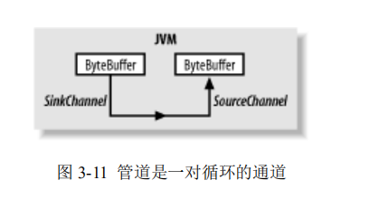

可以将数据写入SinkChannel，然后使用SourceChannel输出数据来检查数据的正确性

**根据给定的通道类型，相同的代码可以被用来写数据到一个文件、socket 或管道。选择器可以被用来检查管道上的数据可用性，如同在 socket 通道上使用那样地简单**。

*Pipes* 的另一个有用之处是可以用来辅助测试。一个单元测试框架可以将某个待测试的类连接到管道的“写”端并检查管道的“读”端出来的数据。它也可以将被测试的类置于通道的“读”端并将受控的测试数据写进其中。两种场景对于回归测试都是很有帮助的。

```java
package com.ronsoft.books.nio.channels;
import java.nio.ByteBuffer;
import java.nio.channels.ReadableByteChannel;
import java.nio.channels.WritableByteChannel;
import java.nio.channels.Pipe;
import java.nio.channels.Channels;
import java.util.Random;
/**
* Test Pipe objects using a worker thread. *
* Created April, 2002
* @author Ron Hitchens (ron@ronsoft.com)
*/
public class PipeTest
{
public static void main (String [] argv)
throws Exception
{
// Wrap a channel around stdout
WritableByteChannel out = Channels.newChannel (System.out);
// Start worker and get read end of channel
ReadableByteChannel workerChannel = startWorker (10);
ByteBuffer buffer = ByteBuffer.allocate (100);
while (workerChannel.read (buffer) >= 0) {
buffer.flip( );
out.write (buffer);
buffer.clear( );
} }
// This method could return a SocketChannel or
// FileChannel instance just as easily
private static ReadableByteChannel startWorker (int reps)
throws Exception
{
Pipe pipe = Pipe.open( );
Worker worker = new Worker (pipe.sink( ), reps);
worker.start( );
return (pipe.source( ));
120
}
// -----------------------------------------------------------------
/**
* A worker thread object which writes data down a channel.
* Note: this object knows nothing about Pipe, uses only a
* generic WritableByteChannel.
*/
private static class Worker extends Thread
{
WritableByteChannel channel;
private int reps;
Worker (WritableByteChannel channel, int reps)
{
this.channel = channel;
this.reps = reps;
}
// Thread execution begins here
public void run( )
{
ByteBuffer buffer = ByteBuffer.allocate (100);
try {
for (int i = 0; i < this.reps; i++) {
doSomeWork (buffer);
// channel may not take it all at once
while (channel.write (buffer) > 0) {
// empty
} }
this.channel.close( );
} catch (Exception e) {
// easy way out; this is demo code
e.printStackTrace( );
} }
private String [] products = {
"No good deed goes unpunished",
"To be, or what?",
"No matter where you go, there you are",
121
122
"Just say \"Yo\"",
"My karma ran over my dogma"
};
private Random rand = new Random( );
private void doSomeWork (ByteBuffer buffer)
{
int product = rand.nextInt (products.length);
buffer.clear( );
buffer.put (products [product].getBytes( ));
buffer.put ("\r\n".getBytes( ));
buffer.flip( );
} } }
```

## 通道工具类

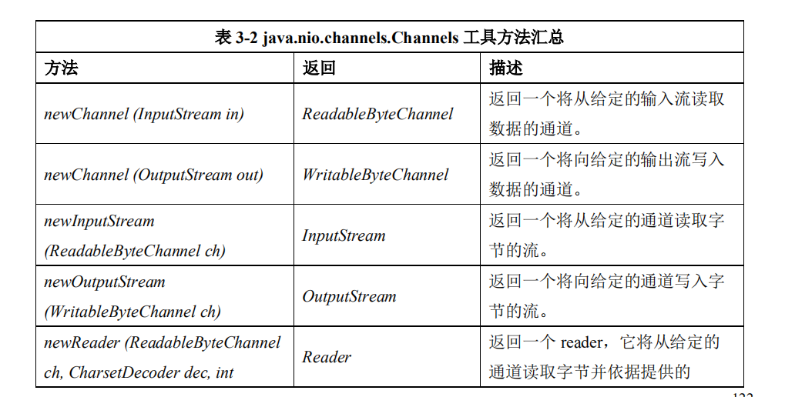

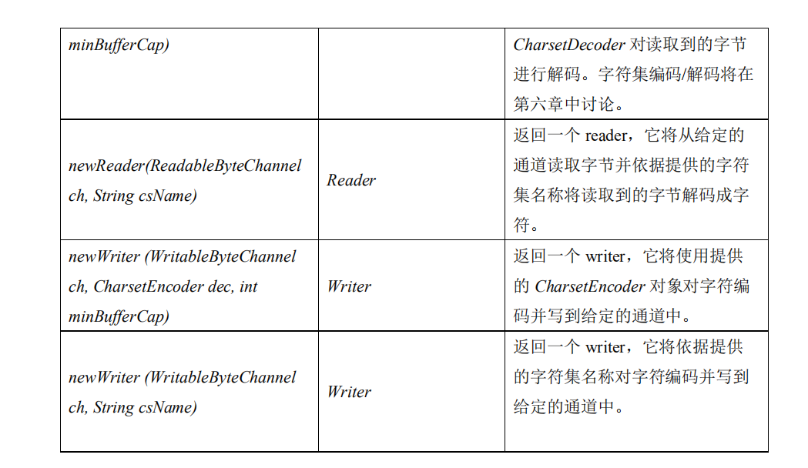

# 选择器

想象一下，一个

有三个传送通道的银行。在传统的（非选择器）的场景里，想象一下每个银行的传送通道都有一个气动导管，传送到银行里它对应的出纳员的窗口，并且每一个窗口与其他窗口是用墙壁分隔开的。这意味着每个导管(通道)需要一个专门的出纳员(工作线程)。这种方式不易于扩展，而且也是十分浪费的。对于每个新增加的导管（通道），都需要一个新的出纳员，以及其他相关的经费，如表格、椅子、纸张的夹子（内存、CPU 周期、上下文切换）等等。并且当事情变慢下来时，这些资源（以及相关的花费）大多数时候是闲置的。

这个时候可以改变一下，每个通道与一个出纳员的窗口连接。这个窗口可以容纳三个槽，也就是三个通道。是不是效率会大许多

## 选择器基础

### 选择器，可选择通道，选择键类

```java
public abstract class SelectableChannel //是所有支持就绪检查的父类
extends AbstractChannel
implements Channel
{
// This is a partial API listing
public abstract SelectionKey register (Selector sel, int ops)
throws ClosedChannelException;
public abstract SelectionKey register (Selector sel, int ops,
Object att)
throws ClosedChannelException;
public abstract boolean isRegistered( );
128
public abstract SelectionKey keyFor (Selector sel);
public abstract int validOps( );
public abstract void configureBlocking (boolean block)
throws IOException;
public abstract boolean isBlocking( );
public abstract Object blockingLock( );
}

```

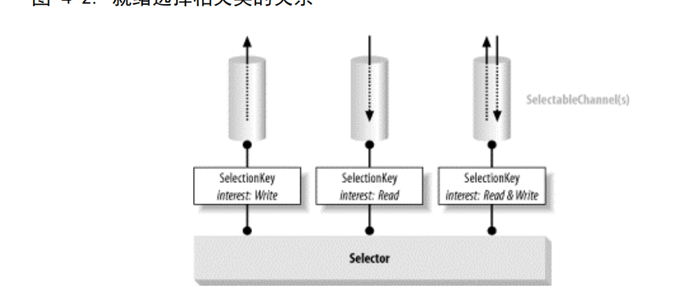

每个通道就绪选择一个Selector都会对应一个唯一的SelectionKey，通过该key也可以获取对应的Selector和Channel。并且不能向选择器注册一个阻塞的通道，否则会出现异常。

```java
public abstract class Selector
{
public static Selector open( ) throws IOException
public abstract boolean isOpen( );
public abstract void close( ) throws IOException;
public abstract SelectionProvider provider( );
public abstract int select( ) throws IOException;
public abstract int select (long timeout) throws IOException;
public abstract int selectNow( ) throws IOException;
public abstract void wakeup( );
public abstract Set keys( );
public abstract Set selectedKeys( );
}
```

```java
public abstract class SelectionKey
{
public static final int OP_READ
public static final int OP_WRITE
public static final int OP_CONNECT
public static final int OP_ACCEPT
public abstract SelectableChannel channel( );
public abstract Selector selector( );
public abstract void cancel( );
public abstract boolean isValid( );
public abstract int interestOps( );
public abstract void interestOps (int ops);
public abstract int readyOps( );
public final boolean isReadable( )
public final boolean isWritable( )
public final boolean isConnectable( )
public final boolean isAcceptable( )
public final Object attach (Object ob)
public final Object attachment( )
}
```

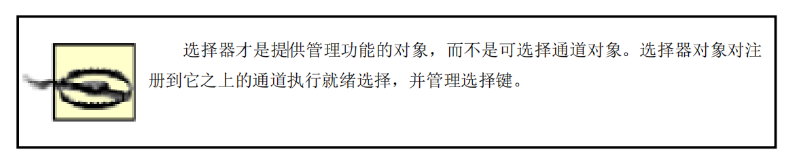

### 建立选择器

```java
Selector selector = Selector.open( );
channel1.register (selector, SelectionKey.OP_READ);
130
channel2.register (selector, SelectionKey.OP_WRITE);
channel3.register (selector, SelectionKey.OP_READ | SelectionKey.OP_WRITE);
// Wait up to 10 seconds for a channel to become ready
readyCount = selector.select (10000);
```

```java
public abstract class Selector
{
// This is a partial API listing
public static Selector open( ) throws IOException
public abstract boolean isOpen( );
public abstract void close( ) throws IOException;
public abstract SelectionProvider provider( );
}
```

都是通过静态工厂方法open()来进行实例化的。

看看SelectableChannel的API简化版本

```java
public abstract class SelectableChannel
extends AbstractChannel
implements Channel
{
// This is a partial API listing
public abstract SelectionKey register (Selector sel, int ops)
throws ClosedChannelException;
public abstract SelectionKey register (Selector sel, int ops,
Object att)
throws ClosedChannelException;
public abstract boolean isRegistered( );
public abstract SelectionKey keyFor (Selector sel);
public abstract int validOps( );
}
```

**JDK1.4以后，SelectionKey有四种选择操作：读(read)，写(write)，连接(connect)和接受(accept)。**

**并且每个int值都为2的次方，为什么为二的次方呢？**

**因为他要判断当前通道是否对某个操作已经准备就绪好**

**那么2的次方的二进制表示为 0001，0010，0100，1000**

**如果当前操作是可读的操作，那么ready的值就为1那么和上面四个状态进行&操作，只有0001&之后不等于0，那么就代表当前操作是读操作，如果对多个操作感兴趣可以进行 | 操作。**

## 使用选择键

```java
package java.nio.channels;
public abstract class SelectionKey
{
public static final int OP_READ
132
public static final int OP_WRITE
public static final int OP_CONNECT
public static final int OP_ACCEPT
public abstract SelectableChannel channel( );
public abstract Selector selector( );
public abstract void cancel( );
public abstract boolean isValid( );//查看当前键值是否还是有效的
public abstract int interestOps( );//感兴趣的操作，如果多个则类加值
public abstract void interestOps (int ops); 
public abstract int readyOps( );//准备已就绪的操作
public final boolean isReadable( )
public final boolean isWritable( )
public final boolean isConnectable( )
public final boolean isAcceptable( )
public final Object attach (Object ob)
public final Object attachment( )
}
```

```java
if ((key.readyOps( ) & SelectionKey.OP_READ) != 0)
{
myBuffer.clear( );
key.channel( ).read (myBuffer);
doSomethingWithBuffer (myBuffer.flip( ));
}
```

```java
if (key.isWritable( ))
等价于：
if ((key.readyOps( ) & SelectionKey.OP_WRITE) != 0)
```

SelectionKey的API中剩下的两个方法：

```java
public abstract class SelectionKey
{
// This is a partial API listing
public final Object attach (Object ob)
public final Object attachment( )
}
```

attach可以绑定一个附件，并且在后面获取它，这是一种允许您将任意与键关联的方法。可以上面绑定业务对象，会话句柄等，使得可以获取相关的上下文

attachment获取相应绑定的对象

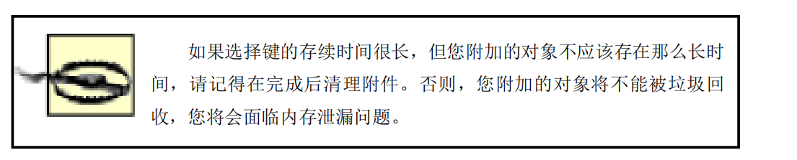

```java
SelectionKey key =
channel.register (selector, SelectionKey.OP_READ, myObject);
等价于：
SelectionKey key = channel.register (selector, SelectionKey.OP_READ);
key.attach (myObject);
```

## 使用选择器

每一个Selector对象维护这三个键的集合

### 选择过程

**已注册的键的集合(*Registered key set*)**

可以使用interestOps()方法来查找已注册的键感兴趣的操作

与选择器关联的已经注册的键的集合。

**已选择的键的集合(*(Selected key set*)**

已选择键的集合是已注册键的集合的子集。包含于已准好的键

不要把已选择的键的集合与ready集合弄混了。这是一个键的集合，表明选择了多少个通道，而ready集合是一个通道哪些操作已经准备就绪好了

***已取消的键的集合(Cancelled key set)***

这个键的集合包含了cancel()方法。(这个键已经无效了，但是还没有被取消)

选择操作当三种形式的select()方法的任意一种被调用的时候，由选择器执行的。

1.已取消的键的集合将会被检查。如果该集合是非空的，每个已取消的键的集合中的键都将从另外两个集合中移除，并且通道被注销

2.已注册的键的集合中的键的interest集合将被检查。

a .对那些已经准备好interest集合中的通道如果没有处于已选择的集合中，那么它们的ready集合将会被清空，然后加入到已选择的集合中并且ready集合被重新设置

b. 否则，也就是键在已选择的键的集合中，那么ready集合不会被清除，只会被更新，更新的话是通过 | 操作来更新的。比如 0001 | 0010 那么就是 0011,此时代表已经就绪了两个操作.

select操作返回的值是ready集合在步骤2中被修改的键的数量,而不是已选择的键的集合中的通道总数

select()会阻塞,select(long time)会阻塞指定的时间,如果指定时间选择的键的集合没有被修改或者添加,那么就返回0.

selectNow()不会阻塞,如果没有立刻返回0,这种可以提高伸缩性

### 停止选择过程

Selector的API中最后一个方法,wakeUp()，提供了使得线程从select()方法中优雅退出的能力

```java
public abstract class Selector
{
// This is a partial API listing
public abstract void wakeup( );
}
```

有三种方式可以唤醒在select()方法中睡眠的线程；

调用**wakeUp()**方法将使得选择器上还没有返回的选择操作立刻返回。注意，仅仅是第一次选择操作，如果调用了多次select，那么可能只会返回第一次的操作。

并且如果当前没有调用一次select()操作的话，如果进行wakeUp()，那么下一次的select()的操作将会立刻返回。

**调用close()方法**，如果该方法被调用，那么任何一个选择操作中阻塞的线程都会被唤醒，与选择器相关的通道都会被注销，并且键也会被注销

调用**interrupt()**，如果睡眠中的线程的interrupt()被调用，它的返回状态被设置。如果该线程被唤醒后试图在通道上执行I/O操作，通道将立刻关闭。

### 管理选择键

手写简单服务器与客户端通信

```java
package file;
import java.io.BufferedWriter;
import java.io.Writer;
import java.nio.ByteBuffer;
import java.nio.channels.ServerSocketChannel;
import java.nio.channels.SocketChannel;
import java.nio.channels.Selector;
import java.nio.channels.SelectionKey;
import java.nio.channels.SelectableChannel;
import java.net.Socket;
import java.net.ServerSocket;
import java.net.InetSocketAddress;
import java.util.Iterator;
/**
 * Simple echo-back server which listens for incoming stream connections and
 * echoes back whatever it reads. A single Selector object is used to listen to
 * the server socket (to accept new connections) and all the active socket
 * channels.
 *  服务器代码
 * @author Ron Hitchens (ron@ronsoft.com)
 */
public class SelectSockets {
    public static int PORT_NUMBER = 8888;
    public static void main(String[] argv) throws Exception {
        new SelectSockets().go(argv);
    }
    public void go(String[] argv) throws Exception {
        int port = PORT_NUMBER;
        System.out.println("Listening on port " + port);
// Allocate an unbound server socket channel
        ServerSocketChannel serverChannel = ServerSocketChannel.open();
// Get the associated ServerSocket to bind it with
        ServerSocket serverSocket = serverChannel.socket();
// Create a new Selector for use below
        Selector selector = Selector.open();
// Set the port the server channel will listen to
        serverSocket.bind(new InetSocketAddress(port));
// Set nonblocking mode for the listening socket
        serverChannel.configureBlocking(false);
// Register the ServerSocketChannel with the Selector
        serverChannel.register(selector, SelectionKey.OP_ACCEPT);
        while (true) {
// This may block for a long time. Upon returning, the
// selected set contains keys of the ready channels.
            int n = selector.select();
            if (n == 0) {
                continue; // nothing to do
            }
// Get an iterator over the set of selected keys
            Iterator it = selector.selectedKeys().iterator();
// Look at each key in the selected set
            while (it.hasNext()) {
                SelectionKey key = (SelectionKey) it.next();
// Is a new connection coming in?
                if (key.isAcceptable()) {
                    ServerSocketChannel server =
                            (ServerSocketChannel) key.channel();
                    SocketChannel channel = server.accept();
                    int interst = SelectionKey.OP_READ | SelectionKey.OP_WRITE;
                    registerChannel(selector, channel,
                            interst);
                    sayHello(channel);
                }
// Is there data to read on this channel?
                if (key.isReadable()) {
                    readDataFromSocket(key);
                }
// Remove key from selected set; it's been handled
                it.remove();
            } } }
// ----------------------------------------------------------
    /**
     * Register the given channel with the given selector for the given
     * operations of interest
     */
    protected void registerChannel(Selector selector,
                                   SelectableChannel channel, int ops) throws Exception {
        if (channel == null) {
            return; // could happen
        }
// Set the new channel nonblocking
        channel.configureBlocking(false);
// Register it with the selector
        channel.register(selector, ops);
    }
    // ----------------------------------------------------------
// Use the same byte buffer for all channels. A single thread is
// servicing all the channels, so no danger of concurrent acccess.
    private ByteBuffer buffer = ByteBuffer.allocateDirect(1024);
    /**
     * Sample data handler method for a channel with data ready to read.
     *
     * @param key
     * A SelectionKey object associated with a channel determined by
     * the selector to be ready for reading. If the channel returns
    142
     * an EOF condition, it is closed here, which automatically
     * invalidates the associated key. The selector will then
     * de-register the channel on the next select call.
     */
    protected void readDataFromSocket(SelectionKey key) throws Exception {
        SocketChannel socketChannel = (SocketChannel) key.channel();
        int count;

        buffer.clear(); // Empty buffer
// Loop while data is available; channel is nonblocking
        while ((count = socketChannel.read(buffer)) > 0) {
            buffer.flip(); // Make buffer readable
// Send the data; don't assume it goes all  atonce
            byte[] bytes = new byte[buffer.remaining()];
            buffer.get(bytes);
            System.out.println(new String(bytes));
            buffer.flip();
            socketChannel.write(buffer);

// WARNING: the above loop is evil. Because
// it's writing back to the same nonblocking
// channel it read the data from, this code can
// potentially spin in a busy loop. In real life
// you'd do something more useful than this.
            buffer.clear(); // Empty buffer
        }
        if (count < 0) {
// Close channel on EOF, invalidates the key
            socketChannel.close();
        } }
// ----------------------------------------------------------
    /**
     * Spew a greeting to the incoming client connection.
     *
     * @param channel
     * The newly connected SocketChannel to say hello to.
     */
    private void sayHello(SocketChannel channel) throws Exception {
        buffer.clear();
        buffer.put("Hi there!\r\n".getBytes());
        buffer.flip();
        channel.write(buffer);
    } }
```

```java
package file;

import java.io.IOException;
import java.net.InetSocketAddress;
import java.nio.ByteBuffer;
import java.nio.channels.SelectableChannel;
import java.nio.channels.SelectionKey;
import java.nio.channels.Selector;
import java.nio.channels.SocketChannel;
import java.util.Iterator;
import java.util.Scanner;
import java.util.Set;

/**
 * @program: dataStructure
 * @description: 客户端
 * @author: Mr.Feng
 * @create: 2021-03-14 14:27
 **/
public class Test3 {

    private static Selector selector;

    private static SocketChannel client;

    static {
        try {
            selector = Selector.open();
            client = SocketChannel.open();
            client.configureBlocking(false);
            client.register(selector, SelectionKey.OP_READ);
            client.connect(new InetSocketAddress("localhost", 8888));
            while (!client.finishConnect()) {

            }
            System.out.println("连接成功");
        } catch (Exception e) {
            e.printStackTrace();
        }
    }

    public static void main(String[] args) throws IOException {
        ByteBuffer byteBuffer = ByteBuffer.allocate(1024 * 16);
        new Avca(selector, client).start();
        while (true) {
            Scanner scanner = new Scanner(System.in);
            String word = scanner.next();
            byteBuffer.put(word.getBytes());
            byteBuffer.flip();
            client.write(byteBuffer);
            byteBuffer.clear();
        }


    }

    static class Avca extends Thread {
        private Selector selector;
        private SocketChannel socketChannel;

        Avca(Selector selector, SocketChannel socketChannel) {
            this.selector = selector;
            this.socketChannel = socketChannel;
        }

        @lombok.SneakyThrows
        @Override
        public void run() {
                while (true){
                selector.select();
                Set<SelectionKey> selectionKeys = selector.selectedKeys(); //不是注册好的通道数，而是哪些通道已经准备就绪的数
                Iterator<SelectionKey> iterator = selectionKeys.iterator();
                ByteBuffer byteBuffer = ByteBuffer.allocate(1024 * 16);
                while (iterator.hasNext()){
                    SelectionKey key = iterator.next(); //拿到每一个
                    if (key.isReadable()){
                        SocketChannel channel = (SocketChannel)key.channel();
                        channel.read(byteBuffer);
                        byteBuffer.flip();
                        byte[] bytes = new byte[byteBuffer.remaining()];
                        byteBuffer.get(bytes);
                        String s = new String(bytes);
                        System.out.println(s);
                        byteBuffer.clear();
                    }
                    iterator.remove();
                }


            }


        }
    }
}

```


### 并发性

Selector类的close()方法与select()方法的同步方式是一样的，因此也有一直阻塞的可能性。在选择过程还在进行的过程中，所有对close()的调用都会被阻塞，直到选择过程结束。

## 选择过程的可扩展性

相当于不选择多Selector，而是选择I/O多路复用+多Reactor模式。

单个线程来接受Accept事件和注册读事件。

线程池去执行真正业务和读事件。

```java
package file;

import file.SelectSockets;

import java.nio.ByteBuffer;
import java.nio.channels.SocketChannel;
import java.nio.channels.SelectionKey;
import java.util.List;
import java.util.LinkedList;
import java.io.IOException;

/**
 * Specialization of the SelectSockets class which uses a thread pool to service
 * channels. The thread pool is an ad-hoc implementation quicky lashed togther
 * in a few hours for demonstration purposes. It's definitely not production
 * quality.
 *
 * @author Ron Hitchens (ron@ronsoft.com)
 */
public class SelectSocketsThreadPool extends SelectSockets {
    private static final int MAX_THREADS = 5;
    private ThreadPool pool = new ThreadPool(MAX_THREADS);

    // -------------------------------------------------------------
    public static void main(String[] argv) throws Exception {
        new SelectSocketsThreadPool().go(argv);
    }
// -------------------------------------------------------------

    /**
     * Sample data handler method for a channel with data ready to read. This
     * method is invoked from the go( ) method in the parent class. This handler
     * delegates to a worker thread in a thread pool to service the channel,
     * then returns immediately.
     *
     * @param key A SelectionKey object representing a channel determined by the
     *            selector to be ready for reading. If the channel returns an
     *            EOF condition, it is closed here, which automatically
     *            invalidates the associated key. The selector will then
     *            de-register the channel on the next select call.
     */
    protected void readDataFromSocket(SelectionKey key) throws Exception {
        WorkerThread worker = pool.getWorker();
        if (worker == null) {
// No threads available. Do nothing. The selection
// loop will keep calling this method until a
// thread becomes available. This design could
// be improved.
            return;
        }
// Invoking this wakes up the worker thread, then returns
        worker.serviceChannel(key);
    }
// ---------------------------------------------------------------

    /**
     * A very simple thread pool class. The pool size is set at construction
     * time and remains fixed. Threads are cycled through a FIFO idle queue.
     */
    private class ThreadPool {
        List idle = new LinkedList();

        ThreadPool(int poolSize) {
// Fill up the pool with worker threads
            for (int i = 0; i < poolSize; i++) {
                WorkerThread thread = new WorkerThread(this);
// Set thread name for debugging. Start it.
                thread.setName("Worker" + (i + 1));
                thread.start();
                idle.add(thread);
            }
        }

        /**
         * Find an idle worker thread, if any. Could return null.
         */
        WorkerThread getWorker() {
            WorkerThread worker = null;
            synchronized (idle) {
                if (idle.size() > 0) {
                    worker = (WorkerThread) idle.remove(0);
                }
            }
            return (worker);
        }

        /**
         * Called by the worker thread to return itself to the idle pool.
         */
        void returnWorker(WorkerThread worker) {
            synchronized (idle) {
                idle.add(worker);
            }
        }
    }

    /**
     * A worker thread class which can drain channels and echo-back the input.
     * Each instance is constructed with a reference to the owning thread pool
     * object. When started, the thread loops forever waiting to be awakened to
     * service the channel associated with a SelectionKey object. The worker is
     * tasked by calling its serviceChannel( ) method with a SelectionKey
     * object. The serviceChannel( ) method stores the key reference in the
     * thread object then calls notify( ) to wake it up. When the channel has
     * 147
     * been drained, the worker thread returns itself to its parent pool.
     */
    private class WorkerThread extends Thread {
        private ByteBuffer buffer = ByteBuffer.allocate(1024);
        private ThreadPool pool;
        private SelectionKey key;

        WorkerThread(ThreadPool pool) {
            this.pool = pool;
        }

        // Loop forever waiting for work to do
        public synchronized void run() {
            System.out.println(this.getName() + " is ready");
            while (true) {
                try {
// Sleep and release object lock
                    this.wait();
                } catch (InterruptedException e) {
                    e.printStackTrace();
// Clear interrupt status
                    this.interrupted();
                }
                if (key == null) {
                    continue; // just in case
                }
                System.out.println(this.getName() + " has been awakened");
                try {
                    drainChannel(key);
                } catch (Exception e) {
                    System.out.println("Caught '" + e
                            + "' closing channel");
// Close channel and nudge selector
                    try {
                        key.channel().close();
                    } catch (IOException ex) {
                        ex.printStackTrace();
                    }
                    key.selector().wakeup();
                }
                key = null;
// Done. Ready for more. Return to pool
                this.pool.returnWorker(this);
            }
        }

        /**
         * Called to initiate a unit of work by this worker thread on the
         * provided SelectionKey object. This method is synchronized, as is the
         * run( ) method, so only one key can be serviced at a given time.
         * Before waking the worker thread, and before returning to the main
         * selection loop, this key's interest set is updated to remove OP_READ.
         * This will cause the selector to ignore read-readiness for this
         * channel while the worker thread is servicing it.
         */
        synchronized void serviceChannel(SelectionKey key) {
            this.key = key;
            key.interestOps(key.interestOps() & (~SelectionKey.OP_READ));
            this.notify(); // Awaken the thread
        }

        /**
         * 148
         * The actual code which drains the channel associated with the given
         * key. This method assumes the key has been modified prior to
         * invocation to turn off selection interest in OP_READ. When this
         * method completes it re-enables OP_READ and calls wakeup( ) on the
         * selector so the selector will resume watching this channel.
         */
        void drainChannel(SelectionKey key) throws Exception {
            SocketChannel channel = (SocketChannel) key.channel();
            int count;
            buffer.clear(); // Empty buffer
// Loop while data is available; channel is nonblocking
            while ((count = channel.read(buffer)) > 0) {
                buffer.flip(); // make buffer readable
// Send the data; may not go all at once
                while (buffer.hasRemaining()) {
                    channel.write(buffer);
                }
// WARNING: the above loop is evil.
// See comments in superclass.
                buffer.clear(); // Empty buffer
            }
            if (count < 0) {
// Close channel on EOF; invalidates the key
                channel.close();
                return;
            }
// Resume interest in OP_READ
            key.interestOps(key.interestOps() | SelectionKey.OP_READ);
// Cycle the selector so this key is active again
            key.selector().wakeup();
        }
    }}
```


