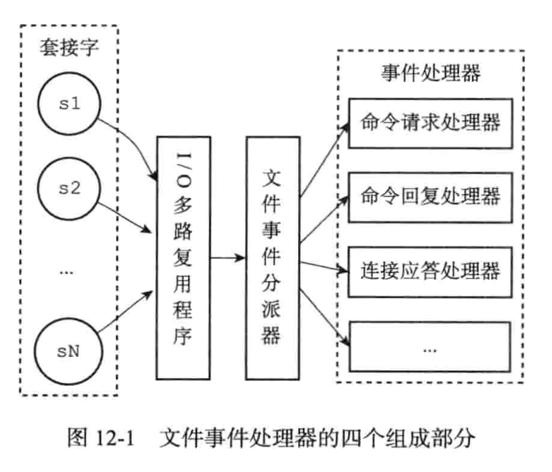

# Redis设计与实现

# 数据结构与对象

## 简单动态字符串

redis没有直接使用C语言传统的字符串表示，而是自己构建了一个名字为简单动态字符串的抽象类型(simple dynamic string , SDS) ，并将SDS用作Redis的默认字符串表示。

在Redis里面，C字符串只会被用作一些无须对字符串值进行修改的地方，比如打印日志

思考？为什么不用C字符串用作Redis的默认实现呢？

- 二进制不安全的
- 缓冲区可能会溢出
- 没有预分配和惰性删除特性
- O(n)获取字符串长度

等等

```bash
set msg "hello world"
```

那么Redis会在数据库中创建一个新的键值对，键是保存着字符串msg的SDS，值也是SDS

``` bash
RPUSH fruits "apple" "banana" "cherry"
```

那么Redis会在数据库创建一个新的键值对，其中：

键值对的键是一个字符串对象，SDS

值是一个列表对象，列表对象包含三个字符串对象，分别都是SDS

除了用来保存数据中的字符串值之外，SDS还被用作缓冲区，AOF模块中的缓冲区，以及客户端状态中的输入缓冲区，都是由SDS实现的。

每个sds.h/sdshdr结构表示一个SDS值：

```c
struct sdshdr{
  //记录buf数组中已经使用字节的数量
  int len;
  //记录buf数组中位使用字节的数量
  int free;
  //保存真正的内容
  char buf[];
}
```

SDS遵循C字符串以空字符结尾的惯例，保存空字符的1字节不计算在SDS的len属性里面，并且为空字符额外分配的1字节空间，以及添加空字符到字符串末尾等操作都是由SDS函数自动完成的。通过这一惯例，SDS可以直接重用一部分C字符串函数库里面的函数。

我们可以直接使用<stdio.h>/printf函数，执行以下语句

```c
printf("%s",s->buf);
```

### SDS与C字符串的区别

- **常数复杂度获取字符串长度(直接通过len属性获取O(1)，而C字符串需要O(n))**

- **杜绝缓冲区溢出**

  C语言容易造成缓冲区溢出，<string.h>/stract函数可以将src字符串内容拼接到dest字符串的末尾

  ```c
  char *strct(char *dest,const char *src);
  ```

  

执行s1拼接命令的时候却忘记申请内存空间，导致s1的数据溢出到s2所在的空间中，导致s2的内容被修改，肯定是不允许的

与C字符串不同，SDS首先会通过free字段来判断是否需要扩容，如果需要则申请空间，否则直接覆盖值

- **减少修改字符串时带来的内存重分配次数**

  比如C每次增长或者缩短一个字符串，都需要对C字符串的数组进行一次内存重新分配操作

  - 如果是执行增长字符串的操作，那么需要内存重分配来扩展字符串的大小，如果忘记该步骤，会导致缓冲区溢出
  - 如果是执行的字符串截取操着，那么需要内存重分配来释放不再使用的空间，如果忘记该步骤，会导致内存泄漏

并且内存重分配操作涉及复杂的算法，需要执行系统调用，所以通常是一个比较耗时的操作。

SDS为了避免C语言原生的字符串问题，通过len和free属性实现了空间预分配和惰性空间释放两种优化策略。

1. **空间预分配**

   是按照什么逻辑来实现空间预分配的呢？

   - 如果对SDS进行修改以后，SDS的len属性小于1mb，那么程序就会分配和len属性相同大小的未使用空间
   - 如果对SDS进行修改以后，SDS的len属性大于1mb，那么程序就会分配，那么就会分配1mb的未使用空间

2. **惰性空间释放**

   指的是比如将长字符串设置为短的字符串的时候，不会去进行内存重新分配，而是直接覆盖buf内容和修改len和free属性，只有当满足某种条件的时候才会进行惰性空间释放。那么是满足某种条件呢？

   SDS提供了相应的api，让我们可以真正的释放SDS的未使用空间

   

- 二进制安全

  可以保存文本数据、图片、音频、视频等这样的二进制数据，因为C字符串读取到‘\0’就会被认为是数组的结尾，可能会导致数据丢水，所以是二进制不安全的，但是SDS通过len属性，就可以实现二进制安全，通过len属性来辨别是否是数组结尾

- 兼容部分C字符串函数

  由于SDS也是遵循空字符串结尾，那么可以直接重用某些部分的C语言<string.h>下的某些函数

## 链表

连标在Redis中的应用非常广泛，比如列表键的底层实现之一就是链表。当一个链表键包含了数量比较多的元素，又或者列表键的元素都是比较长的字符串的时候，Redis就会使用链表来作为列表键的底层实现

除了列表键之外，发布与订阅、慢查询、监视器等功能也用到了链表，还用链表保存多个客户端的状态信息，以及使用链表来构建客户端输出缓冲区。

每个链表节点使用一个adlist.h/listNode结构来表示

```c
typedef struct listNode{
  //前置节点
  struct listNode *prev;
  struct listNode *next;
  //节点的值
  void *value;
} listNode;
```

多个listNode结构就可以组成链表，使用adlist.h/list来整体持有链表

```c
typedef struct list{
  //表头节点
  listNode *head;
  listNode *tail;
  
 //链表所包含的节点数量
  unsigned long len;
  //节点复制函数
  void *(*dup)(void *ptr);
  
  //节点值释放函数
  void (*free)(void *ptr);
  
  //节点值对比函数
  int (*match)(void *ptr,void *key);
}list;
```


Redis的链表实现的特性可以总结如下：

- 双端链表，获取某个节点的前置和后置复杂度都是O(1)
- 无环：对链表的访问以null为终点
- 带表头指针和表尾指针
- 带链表长度计数器
- 多态

## 字典

### 字典的实现

字典中，一个键可以和一个值来进行关联

Redis字典的底层实现是依靠hashtable来实现的，也就是哈希表来实现的。

具有两个哈希表,另外一个用于rehash的时候，将需要扩容的hash表的数据迁移到另外一个表中，并且rehash的过程是渐进式的，不是一次性的，一次性会影响效率

一个哈希表里面有多个哈希表节点，而每个哈希表节点就保存了一个字典中的键值对。

什么时候会用字典？

Hash的底层实现之一就是字典，当哈希键包含的键值对比较多的时候，或者键值对中的元素都是比较长的时候，Redis就用使用字典作为哈希键的底层实现。Redis的数据库也是使用字典来作为底层实现的，对数据库的增删查改操作也是建立在对字典的操作之上的。

#### 哈希表

Redis字典所使用的哈希表由dict.h/dictht结构定义：

```c
typedef struct dictht{
  //哈希表数组
  dictEntry **table;
  //哈希表大小
  unsigned long size;
  //用于计算索引值，总是size-1
  unsigned long sizemask;
  //该哈希表已有的节点数量
  unsigned long used;
}dictht;
```

#### 哈希表节点

table属性是一个数组，数组中的每一个元素都指向dictEntry。每个dictEntry保存着一个键值对

```c
typedef struct dictEntry{
  void *key;
  //值
  union{
    void *val;
    uint64_tu64;
    int64_ts64;
  }v;
  struct dictEntry *next;
}dictEntry;
```


#### 字典

```c
typedef struct dict{
  //类型特定函数
  dictType *type;
  //私有数据
  void *privdata;
  //哈希表
  dictht ht[2];
  //当rehash不在进行时，值为-1，resh索引
  int rehashidx;
}dict;
```

- Type属性是一个指向dictType结构的指针

  ```c
  typedef struct dictType{
    //计算哈希值的函数
    unsigned int (*hashFunction)(const void *key);
    //复制键的函数
    void *(*keyDup)(void *privdata,const void *key);
     //复制值的函数
    void *(*valDup)(void *privdata,const void *obj);
    //对比键的函数
    int (*keyCompare)(void *privdata,const void *key1,const void *key2);
    //销毁键的函数
    void (*keyDestructor)(void *privdata,void *key);
    //销毁值的函数
    void (*valDestructor)(void *privdata,void *obj)
    
     
    
  }
  ```

  ht属性是一个包含两个项的数组，数组中的每一个项都是一个哈希表。

  字典默认只需要h[0]哈希表，h[1]只会在对h[0]哈希表进行rehash的时候会使用。

### 哈希算法

当要将一个新的键值对添加到字典里面，程序需要先根据键值对的键计算出哈希值和索引值，然后再根据索引值，将新的哈希表节点放入到指定的索引上。

hash = dict(字典) ->type ->hashFunction(key);

index = hash & dict.h[0].sizemask;

当字典被用作数据库的底层实现的时候，或者是哈希键的底层实现的时候，Redis使用MurmurHash2算法来计算键的哈希值，算法有很好的随机分布性

### 解决键冲突

链地址法来解决键冲突。每个哈希表节点都有一个next指针。 多个哈希表节点可以用next指针构成一个单项链表

### rehash

随着操作的不断执行，哈希表保存的键值对会逐渐的增多或者减少。为了让哈希表的负载因子维持在一个合理的范围内，哈希表保存的键值对数量太多或者太少的时候，需要对哈希表进行扩展或者收缩

负载因子 load factor计算公式 ：used/ size; 已使用的数量占总数量的比例，如果为1代表使用已经满了。如果大于1，代表哈希表已经出现冲突

rehash(重新散列)操作来完成扩容和收缩，Redis字典对哈希表执行rehash的步骤如下：

(1) 为字典的h[1]哈希表分配空间，这个哈希表的空间大小取决于要执行的操作，以及ht[0]当前包含的键值对数量(也就是ht[0].used属性的值);

- 如果要执行的是扩展操作，那么就会为h[1]的大小设置为 ht[0].used * 2然后最近的一个2的n次方，比如说 used * 2 = 10，那么就会将h[1]哈希表的大小设置为16，2的4次方。
- 如果要执行的是收缩操作，那么就会为h[1]的大小设置为ht[0].used，然后最近的一个2的n次方，比如说used = 5，那么h[1]哈希表的大小设置为8；2的3次方。

(2) 将保存在h[0]的数据rehash到h[1]上，rehash是指重新计算索引值和哈希，然后将键值对放置到ht[1]哈希表的指定位置上 

(3) 将h[1]设置为h[0]，h[0]设置为h[1]。并且释放h[1]空间，创建一个空白哈希表，为下一次rehash做准备

#### 哈希表的扩展与收缩

当以下任意一个条件被满足的时候，会触发扩容

1. 服务器没有在执行BGSAVE或者BGREWRITEAOF命令的时候，并且负载因子大于1，那么会进行扩容
2. 服务器在执行BGSAVE或者BGREWRITEAOF命令的时候，并且负载因子大于5，也会触发扩容。

因为BGSAVE会fork一个子进程，并且一般操作系统都会采用写时复制技术来优化子进程，如果此时再进行扩容，那么可能降低性能。

### 渐进式rehash

上一节说过，扩容和收缩哈希表需要将h[0]里面的所有键值对rehash到h[1]里面，但是这个操作不是一次性，集中式的完成的，而是多次，渐进式的完成。

具体是怎么渐进式的呢？

首先假设插入操作需要进行扩容，那么首先会将rehashidx设置为0，然后计算出一个索引值，然后将索引值对应的链表所有数据rehash到h[1]表。rehash完后，将rehashidx加1，直到rehashIdx == h[0].size;那么就代表一次完整的rehash结束。

并且在该过程中，插入会插入到rehash的表，保证h[0]表的数据只减少不增加，删除同理，查找的时候先查h[0],再查h[1];

## 跳跃表

跳跃表是一种有序数据结构，它通过每个节点中维持执行其他节点的指针，从而达到快速访问节点的目的。

节点查找速度平均O(logN)、最坏O(N)复杂度的节点查找，还可以通过顺序性操作来批量处理节点。

Redis只在两个地方用到了跳跃表，一个是实现有序集合键，另一个是在集群节点中用作内部数据结构

### 跳跃表的实现

Redis的跳跃表由redis.h/zskiplistNode和redis.h/zskiplist两个结构定义。

zskiplistNode表示跳跃表节点，zkiplist结构管理整个跳跃表和保存一些信息。

 

图片最左边的是zskiplist结构

- Header：指向跳跃表的头节点
- Tail：指向跳跃表的尾节点
- Level：记录目前跳跃表内，索引层数最大的那个节点的索引层数
- Length：记录跳跃表的长度。

zskiplistNode该结果包含以下属性：

- 层：节点中用L1、L2、L3等字样标记节点的层，每个层都有两个属性：前进指针和前进跨度
- 后退指针
- 分值
- 成员对象

#### 跳跃表节点

Redis.h/zskiplistNode：

```c
typedef struct zskiplistNode{
  struct zskiplistLevel{
    //前进指针
    struct zskiplistNode *forward;
    //跨度
    unsigned int span;
  }
  //后退指针
  struct zskiplistNode *backward;
  
  //分值
  double score
  //成员对象
  robj *obj;  
} zskiplistNode;
```

1. **层**

   跳跃表节点的level数组可以包含元素，每个元素都包含一个指向其他节点的指针，程序可以通过这些层数来加快查找速度。

   根据幂次定律(越大的数出现的概率越小)随机生成一个介于1和32之间的值作为level数组的大小，这个大小就是层的高度

2. **前进指针**

   用于访问同level的其他节点

3.  **跨度**

   用于记录两个节点之间的距离，跨度其实就是计算排位的，在查找某个节点将沿途访问过的层跨度累计起来，得到就是目标节点在跳跃表中的排位

4. **后退指针**

   用于从表尾向表头访问节点

5. **分值和成员**

   各个成员必须唯一，分值可以相同，分值相同的按照成员对象在字典序的大小来进行排序。

#### 跳跃表

使用zskiplist结构来持有这些节点，程序可以更方便的对整个跳跃表进行处理

比如快速访问跳跃表的表头和表尾节点，或者快速获取跳跃表节点数量信息

```c
typedef struct zskiplist{
    struct zkskiplistNode *head;
    struct zkskiplistNode *tail;
    //表示节点的数量
    unsigned long length;
    //表示层数最大的节点的层数
    unsigned int level;
} zskiplist;
```

## 整数集合

整数集合是集合键的底层实现之一，当一个集合只包含整数值元素的时候，并且这个集合的元素数量不多的时候，Redis就会使用整数键作为集合键的底层实现。

集合键的底层实现之一，要求是整数，并且集合数量不多。

### 整数集合的实现

整数集合是Redis用于保存整数值的集合抽象数据结构表示，它可以保存类型为int_16t、int32_t或者int64_t的整数值，并且保证集合中不会出现重复元素。

```c
typedef struct intset{
  //编码方式
  uint32_t encoding;
  //集合包含的元素数量
  uint32_t length;
  int8_t contents[];
}intset;
```

虽然intset结构将contents属性声明为int8_t类型的数组，但是实际上contents数组并不保存任何int8_t的值，contents数组的真正类型取决于encoding属性的值。

- 如果encoding属性的值为int16_t,那么contents就是一个int16_t的数组，(32768和-32768)
- 如果encoding属性的值为int32_t，那么contents就是一个int32_t的数组，大小区间(2147483648和-2147483648)
- 如果encoding属性的值为int64_t，那么contents就是一个int64_t的数组，大小区间(9223372036854775808,-9223372036854775808)

如果当集合中的数据没有大于或者小于int16_t的值时候，那么就是使用int16_t

当向集合中插入大于int16_t的值时，会进行类型升级，首先将数组里面的所有数据空间扩大为int32_t，也就是4个字节，并且将类型转换后的元素放置到正确的位置上。 

当向集合中插入大于int32_t的值时，也会进行类型升级，首先将数组里面的所有的元素扩大为int64_t，也就是8个字节，并且将类型转换后的元素放置到正确的位置上。

#### 升级的好处

提升灵活性和节约内存

我们可以随意将三种类型的整数添加到集合中，而不必担心类型错误。

因为需要数组同时存放long、int、short三种类型，那么最简单的做法就是直接创建一个long类型数组，但是会导致浪费内存，所以出现了类型升级。

#### 降级

整数数组不支持降级操作，一旦对数组进行了降级，编码就会一直保持升级后的状态。

## 压缩列表

压缩列表是列表键和哈希键的底层实现之一，当列表键只包含少量列表项，并且每个列表的项那么就是小整数值，要么就是比较短的字符串，那么Redis就会使用压缩列表来作为实现。

- zlbytes : 记录整个压缩列表占用的内存字节数 4字节
- zltail：记录压缩列表表尾节点距离压缩列表的起始地址有多少字节。4字节。
- zllen：2字节大小。记录了压缩列表的节点数量，当这个数量小于65535的时候，这个属性的值就是压缩列表包含的节点的数量。当这个值大于等于65536的时候，需要遍历整个压缩列表才能计算得出。
- entry：压缩列表的各个节点、节点的长度由节点保存的内容决定。
- zlend：1字节。特殊值oxff(十进制255)，用于标记压缩列表的末端

表示压缩列表字节数量为十进制的80。

表尾节点距离压缩列表的起始位置有60。

如果此时有一个指向压缩列表起始地址的指针p，那么只要用指针p加上偏移量60，就可以计算出表尾节点的起始地址。

### 压缩列表节点的构成

#### previous_entry_length

节点的previous_entry_length属性以字节为单位，记录了压缩列表中前一个结点的长度，previous_entry_length的长度可以是1字节或者是5字节。

- 如果前一节点的值小于254字节，1字节8位，2的8次方256，所以那么就直接可以用1字节来表示前一个结点的长度。单位是字节
- 如果前一节点的值大于等于254字节，那么就将previous_entry_length设置为5个字节，第一个字节设置为0xfE,剩下的4个字节代表的是前一节点的实际长度

#### encoding

节点的encoding属性记录了节点的content属性所保存数据的类型以及长度。

- 一字节、两字节或者五字节，值的最高位为00，01，或者10的是字节数组编码。
- 一字节长，值的最高位是以11开头的是整数编码，代表存放的是整数类型

压缩列表可以存放字节数组和整数类型

#### 连锁更新

如果当压缩列表删除节点或者插入节点，并且该节点大小很大的的话，造成后续的节点的previous_entry_length属性需要扩充4个字节，那么问题来了。如果后续的节点大小在250字节大小到253大小之间，那么就会造成后续的节点继续扩充，后续的后续节点依次类推。

因为连锁更新在最坏情况下需要对压缩列表执行N次空间重新分配，而每次空间重新分配的最坏复杂度都是O(N)，需要移动内存中每个节点的位置，那么就需要O(N)

但是其实连锁更新造成的性能降低几率时很低的

- 首先压缩列表必须要有多个连续的，大小恰好在250字节到253字节之间的节点，连锁更新才有可能被触发，在实际中，这种情况并不多见
- 其次，即时出现连锁更新，但是只要被更新的节点数量不多，就不会对性能造成任何影响。


## 对象

Redis的对象系统实现了基于引用计数技术的内存回收机制，当程序不再使用某个对象的时候，这个对象所占用的内存会被自动释放。还通过引用技术实现了共享机制。

## 对象的类型与编码

Redis使用对象来表示数据库中的键和值，每次当我们在Redis的数据库中新创建一个键值对的时候，我们至少会创建两个对象，一个用作键值对的键对象，另外一个用作键值对的值对象，Redis的每个对象都由一个redisObject表示，和保存数据有关的三个属性分别是type属性,encoding属性和ptr属性

```c
typedef struct redisObeject{
  //类型
  unsigned type:4;
  
  unsigned encoding:4;
  //指向底层真正数据结构的指针
  void *ptr; 
} robj;
```

type记录了对象的类型，键总是一个字符串对象，值可以是字符串，列表，哈希、集合、或者有序集合对象


### 编码和底层实现

对象的ptr指针指向对象的底层数据结构，而这些数据结构由对象的encoding属性决定。

encoding属性记录了对象所使用的编码，也即是说这个对象使用了什么数据结构作为对象的底层实现

Redis的字符串对象类型可以有三种不同的编码实现，整数值实现的字符串对象，embstr的简单动态字符串，和简单动态字符串

Redis的列表对象可以有2种不同的编码实现，双端列表和压缩列表

Redis的集合对象可以有2种不同的编码实现，整数集合和字典

Redis的有序集合对象可以有2种不同的编码实现，压缩列表和 跳跃表+字典

Redis的哈希对象可以有两种不同的编码实现，压缩列表+字典

#### 字符串对象

```bash
>redis set msg "hello world";
OBJECT ENCODING msg
“embstr”
```


根据编码类型实现了一个字符串对象三种不同的格式，多态。

#### 列表对象

列表对象的编码可以是ziplist或者linkedlist

节点都保存了一个字符串对象，而每个字符串都是一个列表元素

编码转换

当列表对象可以同时满足两个条件的时候，列表对象使用ziplist编码

- 列表对象保存的所有字符串元素的长度都小于64字节
- 列表对象保存的元素小于512个

#### 哈希对象

哈希对象的编码可以是ziplist或者hashtable

ziplist的一个节点是哈希的key，另外一个节点是哈希的value，两个节点紧挨在一起。

key和value都是一个字符串对象在哈希表中

当哈希对象同时满足以下两个条件，使用ziplsit

- 哈希对象保存的key和value的字符串长度都小于64字节
- 哈希对象保存的键值对数量小于512个

思考：Redis为什么压缩列表节省内存呢？

#### 集合对象

集合对象的编码可以是整数集合或者字典


当满足两个条件，对象使用整数集合编码

- 集合的对象都是整数
- 集合的对象保存的元素不超过512个

#### 有序集合对象

有序集合的对象可以是ziplist或者skiplist

每个集合元素使用两个紧挨在一起的压缩列表节点来保存，第一个节点是元素的成员，第二个保存元素的分值

zset结构同时使用了跳跃表和字典来保存有序集合元素，但是通过指针指向共享元素

为什么同时使用两种数据结构来实现有序集合？

首先字典可以去在O(1)复杂度去查询某个值，而跳跃表则查询某个节点和分值效率较低，但是如果查询范围比如ZRANGE命令，那么就使用跳跃表来提高查询性能。否则的话，如果只使用字典，那么就需要对字典所有的元素进行排序。如果只使用跳跃表，那么根据成员查找元素的复杂度从O(1)上升到O(logn)


注意，上图字典和跳跃表重复展示了元素，但是实际中是共享元素的。

- 有序集合保存的元素数量小于128个使用ziplist
- 有序集合保存的所有元素长度都小于64字节

#### 类型检查与命令多态

在客户端发送命令多时候，会首先进行类型检查，判断该key是否可以执行当前类型的命令

怎么判断呢？首先是一个大大哈希表，定位到key，然后判断类型是否一致

#### 内存回收

Redis在自己的对象系统中构建了一个引用计数技术实现的内存回收机制

由redisObject结构的refcount属性记录

```c
typedef struct redisObject{
  int refcount;
}
```

#### 对象共享

对象的引用计数属性还带对象共享的作用，不用去创建重复对象。

如果键A创建了一个包含整数值100的字符串作为值对象，此时键B也要创建一个值为100的字符串作为值对象，那么服务器有两种做法

- 让键B新创建一个
- 让键A和键B共享

#### 对象的空转时长

redisObject还包含了一个属性为lru的属性，记录了对象最后一次被命令程序访问的时间

和内存回收算法有关系，volatile-lru或者allkeys-lru

# 单机数据库的实现

## 数据库

### 服务中的数据库

在初始化服务器的时候，服务会根据指定的数据库数量来决定创建多少个数据库，默认是16

### 切换数据库

每一个连接的客户端的db都指向了一个正在使用的数据库指针。

切换数据库的时候相当于切换到一个数组索引，指向新的指针。

### 数据库键空间

redis是一个键值对数据库服务器，每一个数据库都是一个字典

当使用redis命令对数据库进行读写的时候，会有一些额外的维护操作，其中包括：

- 在读取一个键后，服务器会根据键是否存在来更新服务器的键空间命中次数或者不命中次数。
- 读取一个键后，会更新这个键的最后一次LRU使用时间
- 如果服务器在发现这个键已经过期，那么会删除该键
- 在使用redis事务watch命令监听了某个键，那么这个键会被标记为脏
- 服务器每次修改一个键的时候，都会将键的值增加1，触发开启服务器的持久化操作

### 设置键的生存时间或者过期时间

通过expire(秒)或者pexpire(毫秒)命令。

expireat命令或者pexpireat命令，以秒或者毫秒来为某个键设置过期时间。

不管是如何设置，最后都会为转为毫秒级别的unix时间戳，然后增加一个过期字典，存设置了过期时间的key，value是过期时间。

每次读取key的数据的时候，先去过期字典判断是否存在，如果存在则判断当前时间是否大于value，如果大于说明已经过期，然后进行删除键

并且key其实都指向一个对象，引用计数法，所以不会出现内存浪费。

### 移除过期键

其实就是移除过期字典中的key

### 过期键删除策略

- 定时删除
- 惰性删除
- 定期删除

#### 定时删除

占用cpu，速度较慢。是对内存最友好的，如果有大量的请求进来，此时redis需要做的是执行命令，而不是检查过期键是否过期。

并且创建一个定时器需要用到redis的时间事件，而时间事件的实现方式为无序列表，O(n)的时间复杂度。

#### 惰性删除

对cpu是最友好的，但是对内存不友好，可能存在了大量的过期键而不移除。甚至可以看作是一种内存泄漏

用户只有在取出键的时候进行检查一下是否过期

#### 定期删除

结合了上面两者，惰性删除+每隔一段时间进行删除一次过期键

该策略的难点是，如果删除操作太频繁，则会导致cpu性能下降

如果删除操作太少，那么导致浪费内存的情况。

#### 定期删除策略的实现

每当服务器执行serverCron函数的时候，定期删除策略的代码就会被调用，它在规定的时间内去分多次便利服务器中的各个数据库。

在指定的时间里面可能只能扫描一半的数据库比如是8，那么剩下的8个数据库在下一次执行的时候会紧跟着扫描。如果达到16，则重置为0重新开始

### AOF、RDB和复制功能对过期键的处理

#### 生成rdb文件

在执行save或者bgsave命令创建一个新的rdb文件的时候，会同时记录所有的过期时间，下次服务重启读取的时候会判断是否过期，如果已经过期则删除

#### AOF文件写入

如果未过期直接写入文件，当过期的时候再写入反操作的命令

比如 set key1 v1,然后过期后再写入aof文件的时候就是del key1

#### 主从复制

当主服务器删除一个过期键的时候，必须显式的向所有从服务器发送一个del命令，告知从服务器删除这个过期键

其他时刻从机不会去删除过期键，哪怕过期了也会照样返回给客户端

## RDB持久化

有两个命令生成rdb文件，一个是save，另外一个是bgsave。

save会阻塞客户端的所有命令，效率较低。直到rdb文件创建完，才可以处理客户端的请求，否则一直阻塞。

bgsave会fork一个子进程，然后子进行会创建rdb文件，主进程继续处理命令请求

但是会有一个问题，要是在rdb文件生成的过程中，主进程又修改了数据库状态怎么办？

redis的做法是创建一个rdb缓冲区，在bgsave的过程中，将数据同时也写入到rdb缓冲区，然后直到写完rdb文件，主进程再同步到将该rdb缓冲区写入rdb文件中。

 如果服务器开启了AOF文件，那么会优先使用AOF文件来还原数据库状态。

最后BGREWRITEAOF和BGSAVE两个命令不能同时执行。

可以进行配置bgsave触发的时间。

save 900 1 表示如果900秒内执行了一次写入操作那么我就在900秒到时候进行持久化

sava 300 10 

save 60 10000

实现是将这些条件都抽象为3个结构体，

结构体的属性有struct{

​    time 时间 = 900

   次数 count = 1;

   }

redis还有两个属性，就是计数器，保存着距离上一次bgsave或者save修改了多少次，还有一个unix时间戳，代表上一次执行bgsave或者save的时间

每次写入数据的时候都会进行判断，

判断次数是否达标，如果代表用当前时间减去上一次执行的时间，判断是否到时间，如果都满足则进行执行bgsave命令，否则就跳到下一个条件继续判断

并且redis到周期函数serverCron每次隔100ms就会执行一次，它的其中一项工作就是会进行检查条件是否满足

### RDB文件结构

rdb文件主要存放是开始标志，redis，然后每个数据库存放，比如0-15，然后结束符号，然后校验和

每个database都是一个结构体，里面有三个属性

selectDB,db_number,key_value_pairs

selectDB长度为特殊的一个字节，读到这个数据的时候代表接下来要读的是一个数据库号码，之后就会进行更改到指定的数据库，然后将数据写到当前服务器的字典中

并且保存了所有键值对的也是一个结构体，type,key,value

type表示是一个什么的数据结构，比如value是一个list，或者set或者zset等等。

过期数据的话，会expire_ms,ms,type,key,value


#### 不同value类型下的结构体存储

##### 字符串

长度,contents

##### list

Length,item,item.....

Item = 长度，contents

##### set

Set_size,elem1,elem2,elem2,elem3

##### hash对象

Size, key,v,k,v,k,v

##### 有序集合对象

Size, element1,element2......

element1= score, member

## AOF持久化

aof保存的是命令，而rdb保存的是二进制文件。

### AOF持久化的实现

aof持久化功能的实现可以分为命令追加、文件写入、文件同步三个步骤

#### 命令追加

首先会将命令写入到aof缓冲区中，然后会根据配置文件的判断来决定是否写入到文件，一般可配置项always，也就是每写入一次就写入并且同步到aof文件，速度慢安全性高。

还有一种是每次隔1秒写入一次，每次写入到aof文件，达到或者超过1秒钟，那么对文件再次进行同步，并且这个任务是由一个线程专门来执行的

还有一种是只写入到aof文件，不同步，何时同时交给操作系统，默认为每秒同步一次

文件的写入和同步，因为如今的操作系统在文件的写入后，通常会放入到一个内存缓冲区里面，等待缓冲区空间被填满，才真正的同步到磁盘。

always最多也会丢失一个事件循环到数据

#### AOF文件的载入与数据还原

由于redis命令只能在客户端下执行，那么redis在进行还原数据库状态的时候，会创建一个不带网络连接的伪客户端，然后从aof文件读取每个命令进行执行。

### AOF重写

如果一直在写入aof文件，那么会造成aof文件特别的大，并且有许多冗余的命令，比如期间可能增加和删除多个相同的命令，但是aof还原数据的时候还会执行这些命令一次，性能低。

redis的做法就是进行aof重写。 

在文件达到一定大小的时候，会fork一个子进程会进行生成一个新的aof文件，然后开始读取当前数据库的状态进行写入到文件，然后写入完成之后在覆盖掉旧的aof文件。完成aof的重写。 

但是这个过程会有问题，比如在生成aof文件后，如果有新的请求来修改数据库状态怎么办，写入到aof缓冲区并且同时同时写入到aof重写缓冲区，然后重写覆盖完以后redis主进程再将aof重写缓冲区的内容同步到将命令写入到aof文件。

当子进程aof重写工作完成以后，会向父进程发送一个写完毕的信号。

然后父进程完成新的aof文件改命替换旧的aof文件，并且将aof重写缓冲区的数据写入到aof文件

## 事件

redis服务器是一个事件驱动程序，服务器需要处理以下两类事件

- 文件事件
- 时间事件

### 文件事件

文件事件处理器使用io多路服用程序来监听多个套接字。

文件事件处理器以单线程，但是io多路复用是非常高性能的。

#### 文件事件处理器的构成



客户端连接生成一个套接字，然后会触发一系列的比如连接事件，读取时间，写入事件，关闭事件等等

所以可能并发的出现，但是redis将这些事件都放入到一个队列里面，串行化将事件发送到文件事件派发器，然后文件派发器判断到底是什么事件，然后发送给相应的事件处理程序。然后处理完了以后通过命令回复处理器写入给客户端

时间的类型：**连接应答处理器，命令请求处理器，命令回复处理器**。

### 时间事件

时间事件大概分为两类

- 定时事件：让程序在指定的时间之后执行一次，比如让x任务在30ms后执行
- 周期性事件：每隔一段时间就执行一次。

id：服务器为时间事件创建的全局唯一id，id从小到大顺序递增

When: 毫秒精度的unix时间，记录了时间事件到达时间

TimeProc：时间处理函数，当时间事件到达的时候，会调用相应的处理器来处理事件

根据返回值来判断是周期类型还是定时类型

#### 实现

将所有时间事件保存在一个链表，并且当时间执行器运行的时候，它就便利整个链表，查找所有已经到达的时间事件，然后执行相应的时间处理器。

每次插入时间事件会插入到表头。


至于执行时机，redis服务器里面会一直循环判断时间是否达到，并且每一个时间事件都会添加到无序链表上，遍历链表的复杂度为ON

> serverCron函数
>
> 持续运行的Redis服务器需要定期对自身的资源和状态进行检查和调整，都是通过该函数阿里执行的
>
> 清理数据库的过期键
>
> 关闭和清理失效的客户端
>
> 尝试进行AOF和RDB持久化操作
>
> 主从同步

Redis服务器是一个事件驱动程序，服务器处理的事件氛围时间事件和文件事件两类

## 客户端

每个与服务器进行连接到客户端，服务器都为这些客户端创建了相应的结构redisClient

- 客户端的套接字描述符
- 客户端的名字
- 客户端的标记值
- 客户端当前要执行的命令、命令的参数、命令参数的个数等等
- 客户端的输入缓冲区和输出缓冲区
- 等等

并且多个客户端结构通过链表连接起来


### 套接字描述符

根据客户端类型的不同，fd属性的值可以是-1或者是大于-1的整数。

-1为伪客户端，伪客户端处理的命令请求来源于AOF文件或者LUA脚本，而不是网络。

普通客户端的fd属性的值为大于-1的整数。

### 输入缓冲区

客户端的状态的输入缓冲区用于保存客户端发送的命令请求


### 命令与命令参数

在服务器将客户端发送的命令请求保存到客户端状态的querybuf属性之后，服务器将对命令请求的内容进行解析，并且得出想要的命令参数以及命令的个数保存到客户端结构的属性里面


### 命令的实现函数

服务器从协议内容解析并且得出属性和参数后，根据参数第一个值，如果是set key value，那么会拿到该set值，去对应的命令表中查询对应的处理函数，其实就是一个字典，根据key，找到对应关于该命令的处理函数


然后调用该函数，将参数和内容传入，完成调用。

### 输出缓冲区

当处理完函数的调用以后，需要向客户端响应，数据将会写入到输出缓冲区里面用于写出。

## 客户端的创建与关闭

### 创建普通客户端


用一个链表来维护所有的客户端

### 关闭普通客户端

- 客户端进程退出或者被杀死，那么客户端与服务器之间的网络连接将会被关闭
- 如果客户端发送了带有不符合协议格式的命令请求，那么这个客户端也会被服务器关闭。
- 如果客户端发送的命令请求的大小超过了输入缓冲区的限制大小，默认为1G。那么这个客户端会被服务器关闭
- 如果要发送给客户端的命令回复的大小超过了输出缓冲区的限制大小，那么也会被关闭。

### 伪客户端

AOF文件的伪客户端和lua脚本的伪客户端。服务器自动关闭

### 重点回顾

- 服务器状态结构使用clients链表连接起多个客户端状态，新添加的客户端状态被放到链表的末尾。
- 客户端状态的flags属性使用不同标志来表示客户端的角色，以及客户端当前所处的状态
- 输入缓冲区记录了客户端发送的命令请求，这个缓冲区的大小不能超过1G
- 命令的参数和参数个数会被记录在客户端状态的argv和argc属性里面，而cmd属性则记录了客户端要执行命令的实现函数，根据字典快速获取。
- 客户端有固定大小缓冲区和可变大小缓冲区两种缓冲区可用，其中固定大小缓冲区的最大大小被16kb，而可变大小的缓冲区最大大小不能超过服务器设置的硬性规定
- 会有一些情况会导致客户端被关闭，比如输出和输入缓冲区内容超出大小限制，网络连接关闭。

## 服务器


### 读取命令请求

当客户端与服务器之间的连接套接字因为客户端的写入变得可读的时候，服务器将调用命令处理器来执行以下操作：

1. 读取套接字中的协议格式的命令请求，并且将其保存到客户端状态的输入缓冲区里面。

2. 对输入缓冲区中的命令进行分析，将参数提取保存到客户端的argv属性和argc属性。

   

然后分析程序对输入缓冲区中的协议进行分析：


根据客户端的argv[0]参数，在命令表查找参数对应的处理函数，然后进行解析。是一个redisCommand结构


sflags属性可以使用的标识值。


- set命令的名字为"set"，实现函数为setCommand；命令的参数个数为-3，表示接受三个或者以上数量的参数；命令的标识为“wm”，表示set是一个写入命令，并且在执行这个命令之前，服务器应该对占用内存状况进行检查，因为这个命令可能会占用大量内存。


将redisCommand赋值给redisClient的cmd属性，然后进行修改数值。

然后调用函数，将参数传入进行执行就可以了。


执行完之后，会产生相应的命令回复。这些回复会保存在客户端状态的输出缓冲区里面。之后实现函数还会为客户度的套接字关联命令回复处理器，这个处理器负责将命令回复返回给客户端。


### serverCron函数

redis中该函数默认每隔100毫秒执行一次，用于保证reids服务器的良好运转。

对该函数执行的操作进行完整的介绍，并介绍redisServer结构和serverCron函数有关的属性。

#### 更新服务器时间缓存

redis不少功能需要获取系统的当前时间。而每次获取系统的当前时间都需用执行一次系统调用，为了减少系统调用的次数，服务器状态的unixtime属性和mstime属性被用作当前时间的缓存，用于一些对时间准确度要求不高的场景，比如日志。

每隔redis对象都有一个lru属性，这个lru属性保存了对象最后一次被命令访问的时间

#### 更新服务器内存峰值记录

每次会与服务器当前使用的内容数量，并且与statpeak_memory保存的数值进行比较，如果大，则更新。

#### 执行被延迟的BGREWRITEAOF

在服务器执行BGSAVE命令的期间，如果服务端向服务器发来BGREWRITEAOF，会被延迟到BGSAVE命令完成之后执行。

### 初始化服务器

#### 初始化服务器状态结构


initServerConfig函数的主要工作：

1. 设置服务器的运行id
2. 设置服务器的默认运行频率
3. 设置服务器的默认配置文件路径
4. 设置服务器的运行架构
5. 设置服务球的默认端口号
6. 设置服务器的默认RDF持久化条件和AOF持久化条件
7. 创建命令表

#### 载入配置选项

读取配置文件，载入相应的配置，如果没有则设置默认值。

#### 初始化服务器数据结构

比如：

1. server.clients链表。保存客户端的链表
2. server.db数组，数组中包含了服务器的所有数据库。

#### 还原数据库状态

载入rdb文件或者aof文件，并且根据文件内容来还原服务器的数据库状态，优先会使用aof文件来还原数据库状态

# 多机数据库的实现

## 复制

在redis中，用户可以通过执行SLAVEOF命令或者设置slave选项，让一个服务器去复制另外一个服务器，我们称呼被复制的服务器为主服务器，而正在进行复制的服务器被称为从服务器。

复制功能分为旧版复制功能和新版复制功能。

### 旧版复制功能的实现

分为同步和命令传播。

- 同步操作用于将从服务器的数据库状态更新至为主服务器当前所处的数据库状态
- 命令传播操作则用于在主服务器的数据库状态被修改，导致主从服务器的数据库状态出现不一致的时候，让主从服务器重新回到一致状态。

#### 同步

1. 从服务器向主服务器发送SYNC命令

2. 收到SYNC命令的主服务器执行BGSAVE命令，在后台生成一个RDB文件，并使用一个缓冲区记录从现在开始执行的所有写命令。

3. 当主服务器的BGSAVE命令执行完毕后，主服务器会将BGSAVE命令生成的RDB文件发送给从服务器，从服务器接受并且载入这个RDB文件，将自己的数据库状态更新至主服务球执行BGSAVE命令时候的数据库状态。

4. 主服务器将记录在缓冲区里面所有的写命令发送给从服务器，从服务器执行这些写命令，更新为一致的状态

   

#### 命令传播

在同步操作执行完毕以后，主从服务器两者的数据库将达到一致的状态，但这种状态并不是一成不变的，每当主服务器执行客户端发送的写命令的时候，主服务器的数据库就有可能被修改，并且导致主从服务器状态不再一致。

**所有说每当主服务器执行一条写命令的时候，会同时向所有的从机也发送相同的一条写命令。**

### 旧版复制功能的缺陷

在Redis中，从服务器对主服务器的复制可以分为以下两种情况：

- 初次复制：从服务器以前没有复制过任何主服务器，或者从服务器当前要复制的和上一次复制的主服务器不同。
- 断线后重新复制：处于命令传播阶段的主从服务器因为网络原因而中断了复制，当从服务器通过自动重连重新连接上了主服务器，并且继续进行复制。

对于旧版断线后重新复制，哪怕是重新连接也需要进行初次复制的完整操作。


### 新版复制功能的实现

为了解决旧版复制断线重新连接带来的问题，Redis从2.8以后使用PSYNC命令代替SYNC命令来执行复制时的同步操作。

PSYNC命令具有两种完整重同步和部分重同步两种模式：

- 其中完整重同步用于初次复制情况，和SYNC命令的执行步骤基本一样
- 部分重同步则用于断线后重新复制情况。


### 部分重同步的实现

部分重同步功能由以下三个部分构成：

- 服务器的运行id
- 主服务器的复制偏移量和从服务器的复制偏移量
- 复制积压缓冲区

#### 复制偏移量

执行复制的双方——主服务器和从服务器会分别维护一个复制偏移量

- 主服务器每次向从服务器传播N个字节的数据的时候，就将自己的复制偏移量加上N
- 从服务器每次收到主服务器传播来的N个字节的数据的时候，就将自己的复制偏移量加上N


通过对比主从服务器的复制偏移量，程序可以很轻松的知道主从服务器是否处于一致的状态；

- 如果主从服务器处于一致状态，那么主从服务器两者的偏移量总是相同的。
- 相反，如果主从服务器两者的偏移量不相同，那么说明主从服务器并且未处于一致状态。

#### 复制积压缓冲区

由主服务器维护的一个固定长度先进先出的队列，默认大小为1MB。

当主服务器进行命令传播的时候，不仅会将写命令发送给所有的从服务器，还会将写命令写入到复制积压缓冲区里面。


当从服务器重新连接上主服务器的时候，从服务器会通过PSYNC命令将自己的复制偏移量offset发送给主服务器，主服务器根据这个复制偏移量来决定对从服务器主席i功能何种同步操作。

- 如果offset偏移量之后的数据，也就是offset+1开始的数据处于复制积压缓冲区中，那么会进行部分重同步。
- 否则会进行完整重同步。

如何正确设置复制积压缓冲区的大小？

最小大小可以根据公式：second * write_size_per_second

- second为从服务器断线后到重新连接主服务器所需要的平均时间(秒为单位)

- write_size_per_second 主服务器每秒产生的写命令的数据量。为了安全起见设置为公式的2倍比较合理。

  

#### 服务器运行ID

- 每个Redis服务器，不论主服务器还是从服务器，都会有自己的运行ID。
- 运行ID在服务器启动的时候自动生成

当从服务器对主服务器进行初次复制的时候，主服务器会告诉从服务器自己的服务器ID。

下次从服务器需要带上主服务器的ID用于判断，如果是则可以执行部分重同步，如果不是则说明是一个新的，需要完整重同步。

### PSYNC命令的实现

PSYNC命令的调用方法有两种：

- 如果从服务器以前没有复制过任何主服务器，那么从服务器会开始一次新的复制并且向从服务器发送PSYNC ？ -1 命令，主动请求主服务器进行完整重同步。
- 相反的，那么从服务器开始一次新的复制的时候，都会发送PSYNC<runid><offset>命令，其中runId是上一次复制的主服务器id，offset是当前复制的偏移量。
- 如果主服务器返回+FUllRESYNC<runid><offset>回复，那么代表主服务器将会将这个ID保存起来，用于下一次部门重同步
- 如果返回+CONTINUE回复，那么表示主服务器将与从服务器执行部分重同步操作，从服务器等待主服务器自己缺失的数据发送过来。


### 复制的实现


#### 设置主服务器的地址和端口

当客户端向从服务器发送以下命令的时候：

**SLAVE IP PORT**

保存到服务器，然后建立套接字连接。

然后执行PING PONG命令用于测试双方服务器的读写功能是否正常。

### 重点回顾

1. Redis2.8以前的复制功能不能高效的处理断线后重新连接的情况。
2. 部分重同步通过服务器id，复制偏移量，复制积压缓冲区来完成
3. 在复制操作刚实现的时候，从服务器会成为主服务器的客户端，后期，主从服务器会互相成为对方的客户端
4. 主服务器通过向从服务器传播命令来更新自己的服务器的状态，保持主从服务器一致，而从服务器则通过向主服务器发送命令来进行心跳检测，以及命令丢失检测。

## Sentinel

Sentinel(哨岗、哨兵)是Redis的高可用性解决方案；由一个或者多个Sentinel实例组成的Sentinel系统；可以监视任意多个主服务器，并且在主服务器进入下线状态后，自动将主服务器下的某个从服务器升级为新的服务器。然后由新的主服务器继续处理命令请求。


当server1的下线时常超过用户设定的下线时长上线后，Sentinel系统就会对server1执行故障转移操作：

- 首先Sentinel系统会挑选server1属下的一个从服务器，并且被选中的从服务器升级为主服务器。
- 之后，Sentinel系统会向server1属下的所有从服务器发送新的复制指令，让它们成为新的主服务器的从服务器。
- 另外Sentinel还会继续监视已下线的server1，并且在它重新上线以后，将它设置为新的主服务器的从服务器。


### 启动并初始化Sentinel

启动一个Sentinel可以使用命令：

```bash
redis-sentinel /path/to/your/sentinel.conf
redis-server /path/to/your/sentinel.conf --sentinel
```

这两个命令效果完全相同。

当Sentinel启动的时候，它需要执行以下操作步骤

1. 初始化服务器
2. 将普通的Redis服务器使用的代码替换为Sentinel专用代码
3. 初始化Sentinel状态
4. 根据给定的配置文件，初始化Sentinel的监视主服务器列表
5. 创建向主服务器的网络连接

#### 初始化服务器

首先，因为Sentinel本质上只是一个运行在特殊状态下的Redis服务器，不过会有一些流程和普通的Redis服务器启动不同，比如载入rdb文件或者aof文件，Sentinel则不会载入。


多个Sentinel之间可以使用SlaveOF复制命令。

#### 初始化Sentinel状态

在应用了Sentinel的专用代码之后，接下来，服务器会初始化一个sentinel.c/sentinelState结构(简称“Sentinel状态”)，这个结构保存了所有和Sentinel功能有关的状态。

#### 初始化Sentinel状态的master属性

Sentinel状态中的master字典记录了所有被Sentinel监视的主服务器相关的信息。其中：

- 字典的键是被监视主服务器的名字
- 而字典的值则是被监视主服务器对应的sentinel.c/sentinelRedisInstance结构

每个实例结构代表一个被Sentinel监视的Redis服务器实例，这个实例可以是主服务器、从服务器、或者另外一个Sentinel。


对Sentinel状态对初始化将引发对master字典的初始化，而master字典的初始化是根据被载入的Sentinel配置文件来进行的。


而SentinelState状态中的master字典如下


#### 创建连向主服务器的网络连接

初始化Sentinel的最后一步是创建连向北监视主服务器的网络连接， Sentinel将成为主服务器的客户端，它可以向主服务器发送命令，并从命令回复中获取相关的信息。

Sentinel监视的主服务器会创建两个连向主服务器的异步网络连接

- 一个是命令连接，这个连接专门用于向主服务器发送命令，并接受命令回复
- 另外一个是订阅连接，订阅主服务器的_sentinel_:hello频道


### 获取主服务器信息

Sentinel默认会以每十秒一次的频率，通过命令连接向被监视的主服务器发送INFO命令，并且通过INFO命令的回复来获取主服务器的当前信息。


会得到如下信息

- 一方面关于主服务器本身的信息，比如run_id
- 另外一方面是关于主服务器属下的所有从服务器信息，每个从服务器都由一个slave字符串开头的行记录，美航的ip=从服务器的ip地址。根据INFO命令返回的信息，可以得到所有从服务器的IP+PORT。

获取到后，会保存到maseter字典里面的主服务器实例结构的slaves字典里面。

- 如果从服务器对应的实例结构已经存在，那么Sentinel对从服务器的实例结构进行更新
- 如果对应的实例结构不存在，那么说明这个服务器是新发现的从服务器，Sentinel会进行创建并且初始化对应的从服务器实例结构。


主从服务器之间通过flags属性标记区分。

### 获取从服务器信息

当Sentinel发现主服务器有新的服务器出现的时候，Sentinel除了会为这个新的从服务器创建相应的实例结构之外，还会创建连接到从服务器的命令连接和订阅连接。


也是每10秒一次的频率通过命令连接向从服务器发送INFO命令，并且获取类似于以下内容的回复。


根据INFO命令的回复，Sentinel会提取出以下信息：

- 从服务器的运行IDrun_id
- 主服务器的IP地址master_host，以及主服务器的端口号master_port。
- 主从服务器的连接状态
- 从服务器的优先级
- 从服务器的复制偏移量


### 向主服务器和从服务器发送信息

在默认情况下，Sentinel会以每两秒一次的频率，通过命令连接向所有被监视的主服务器和从服务器发送以下的格式


每两秒一次发送自己sentinel的信息和正在监视的主服务器信息。


### 接受来自主服务器和从服务器的频道信息

上面的步骤信息都是通过命令连接的，该步骤是通过发布订阅通道来通信的。

Sentinel就会通过订阅连接，向服务器发送以下命令：

SUBSCRIBE_sentinel_:hello

Sentinel对_sentinel_:hello频道的订阅会一直持续到Sentinel与服务器的连接断开为止。

这也就是说，对于每个与Sentintel连接的服务器，Sentinel即通过命令连接向服务器的_sentinel_:hello频道发送信息，也订阅了该频道的信息。


比如说有多台sentinel服务器，它们之间是这么进行通信的呢？如果多个sentinel服务器监听同一个主服务器，那么它们都会向该主服务器的_sentinel_hello:频道发送信息，也会订阅该频道的信息，发送的信息就是关于自己的ip和端口和被监听的主服务器的ip和端口，其他的sentinel接受到信息以后，可以用于判断是否当前有多个sentinel监听同一个主服务器，并且可以对相应主服务器的实例结构进行更新。


#### 更新sentinels字典

Sentinel为主服务器创建的实例结构中的sentinels字典保存了除Sentinel本身之外，所有同样监视这个主服务器的其他的Sentinel的资料。

- sentinels字典的键是其中一个Sentinel的名字，格式也是ip:port
- sentinels字典的值则是键所对应sentinel的实例结构。

当一个sentinel接受到其他sentinel发送到信息的时候，目标Sentinel会从信息中分析并且提取两方面参数

- 与Sentinel有关的参数：源Sentinel的IP地址、端口号、运行ID和配置纪元
- 与主服务器有关的参数：源Sentinel正在监视的主服务器的名字、IP、端口号和配置纪元

根据提取的信息，会找到目标sentinel下的master字典找到对应的主服务器实例结构，然后根据提取出的sentinels字典，判断源sentinel是否存在

- 如果实例结构已经存在，进行更新
- 否则进行创建


#### 创建连向其他Sentinel的命令连接


不仅会为新的Sentinel在自己的sentinels字典创建相应的实例结构，还会创建一个连向新sentinel的命令连接，而新的sentinel也同样会创建连向这个sentinel的命令连接，最终监视同一主服务器的多个Sentinel将形成互相连接的网络；

### 检测主观下线状态

除了上面讲的每十秒一次的INFO命令和每2秒一次发送自己的sentinel信息和监视的主服务器信息，还会每秒一次的频率向所有与它创建了命令连接的实例发送PING命令，并且通过实例返回的PING命令回复来判断实例是否在线


会得到两种类型的回复

可以自己在配置文件中配置Sentinel判断实例进入下线所需要需要的时间长度，如果在对应的时间内，一直向Sentinel返回无效回复，那么Sentinel会修改这个实例所对应的实例结构，改变其flags标识。


### 检查客观下线状态

当好Sentinel讲一个主服务器判断为主观下线以后，为了确定这个服务器是否真的下线了，它会向同样监视者一主服务器的其他Sentinel进行询问，看它们是否也认为该主服务器已经下线，如果加上自身超过多半已经认为主服务器也已经下线。

#### 发送Sentinel is-master-down-by-addr命令

Sentinel发送该命令会附带判断主观下面的主服务器的ip和端口号信息，并且还会配置当前的Sentinel的配置纪元，用于选举领头的Sentinel

Runid，可以是*或者Setnienl的运行ID


然后其他的sentinel接受到信息以后，会向源Setninel返回一条包含三个参数的回复

1. Down_state
2. Leader_runid
3. Leader_epoch


该环节就第一个参数有效，1代表主服务器已经下线，0服务器代表主服务器未下线。


#### 接受Sentinel is-master-down-by-addr命令的回复


判断是否客观下线Sentinel的数量可以根据配置文件进行指定

### 选举领头Sentinel

当一个主服务器被判断为客观下线的时候，监视这个下线主服务器的各个Sentinel会进行协商，选举出一个领头Sentinel，并由领头Sentinel对下线主服务器执行故障转移操作。

- 所有在线的Sentinel都有被选为领头Sentinel的资格，换句话说，监视同一个主服务器的多个在线Sentinel重的任意一个都有可能成为领头Sentinel

- 每次进行领头Sentinel选举之后，不论选举是否成功，所有Sentinel都配置纪元的值都都会自增一次。配置纪元实际就是一个计数器。
- 在一个配置纪元里面，所有Sentinel都有一次将某个Sentinel设置为局部领头Sentinel的机会，并且局部领头一旦设置，在这个配置纪元里面就不能再更改
- 每个发现主服务器进行客观下线的Sentinel都会要求其他Sentinel将自己设置为局部领头Sentinek
- 当源Sentinel向另外一个Setninel发送并且，并且runid参数不是*符号而是源Sentinel的运行id的时候，表示源Sentinel要求目标Sentinel将前者设置为后者的局部领头Sentinel
- Sentinel设置局部领头是先到先得，最先向目标Sentinel发送的会先被投票，之后的都会被拒绝
- 目标Setinel在接受到命令以后，将源Sentinel返回命令回复，回复中的leader_runid参数和leader_epoch参数分别记录了目标Sentinel的局部领头Sentinel的运行ID和配置纪元
- 源Sentinel收到目标Sentinel返回的运行id和配置纪元的时候，会检查配置纪元leader_epoch和自己是否相同，如果相同，则会再判断返回的运行id和自己的运行id是否相同，如果相同，那么表示目标Sentinel将源Sentinel设置成为了局部领头Sentinel
- 如果有某个Sentinel被半数以上的Sentinel设置为局部领头Sentinel，那么这个Sentinel就会成为领头Sentinel
- 因为领头Sentinel的产生需要半数以上Sentinel的支持，并且每个Sentinel配置纪元里面只能设置一次局部领头Sentinel，所以在一个配置纪元里面，只会出现一个领头Sentinel
- 如果在给定时间内，没有一个Sentinel被选举为领头Sentinel，那么各个Sentinel将在一段时间之后再次进行选举


### 故障转移

1. 在已下线主服务器属性的所有从服务器里面，挑选出一个从服务器，并将其转换为主服务器。
2. 让已下线主服务器属下的所有从服务器改为复制新的主服务器
3. 将已下线主服务器设置为新的主服务器的从服务器，当这个旧的主服务器重新上线的时候，它就会成为新的主服务器的从服务器。

#### 选出新的主服务器

故障转移操作第一步要做的就是在已下线的主服务器属下的所有从服务器中，挑选出一个状态良好、数据完整的从服务器，然后向这个从服务器发送SLAVEOF no noe命令，将这个从服务器转换为主服务器。

**选出复制偏移量最大的从服务器。**


#### 修改从服务器的复制目标

然后让已下线主服务器属下的所有从服务器去复制新的主服务器，通过SLAVE OF命令来实现


#### 将旧的主服务器变为从服务器


## Cluster

### 节点

一个Redis集群通常由多个节点组成，在刚开始的时候，每个节点都是独立的，通过CLUSTER MEET <ip> <port>将各个独立的节点连接起来，构成一个包含多个节点的集群


#### 启动节点

Redis服务器在启动的时候会根据cluster-enabled配置选项是否为yes来决定是否开启服务器的集群模式。


集群节点和独立节点使用无区别，还是会用redisServer结构来保存服务器的状态，使用RedisClient结构来保存客户端的状态，至于那些在集群模式下用到的数据，redis都保存到了clusterNode结构、clusterLink结构以及clusterState结构中

####  集群数据结构

clusterNode结构保存了一个节点的当前状态，比如节点的创建时间，节点的名字，节点当前的配置纪元，节点的IP、PORT等等信息


clusterNode结构的link属性是一个clusterLink结构，该结构保存了连接节点所需要的有关信息，比如套接字描述符，输入和输出缓冲区


最后，每个节点都保存着一个clusterState结构，这个结构记录了在当前节点的视角下，集群目前所处的状态，例如集群是上线还是下线，集群包含多少节点，集群当前的配置纪元等等


	#### CLUSTER MEET命令的实现

通过向节点A发送CLUSTER MEET命令，可以让B节点加入到A节点所处的集群中

1. 节点A会为节点B创建一个clusterNode结构，添加到自己的clusterState.nodes字典里面
2. 之后节点A根据给定的ip地址和端口给节点B发送一条meet消息
3. B节点收到消息后，也会为A创建于一个clusterNode结构
4. 之后，节点B向节点A返回一条PONG信息
5. 之后，节点A向节点B发送一条PING消息
6. 节点B接受到节点A的ping消息后，代表节点A收到了自己的PONG消息，握手完成。


### 槽指派

Redis集群通过分片的方式来保存数据库中的键值对，整个数据库被分为16384个槽，数据库的每个键都属于着16384个槽的其中一个

需要为每个槽都分配节点


当以上三个CLUSTER ADDSLOTS命令都执行完毕以后，数据库的16384个槽已经被指派给了相应的节点，集群进入了上线状态


#### 记录节点的槽指派信息

clusterNode结构的slots属性和numslot属性记录了节点负责处理哪些槽


二进制位的数组，如果slots数组上的索引i的二进制位的值为1，那么代表节点负责处理槽i

如果为0，那么表示节点不负责处理槽i


numslots属性则记录节点负责处理的槽点数量

#### 传播节点的槽指派信息


会互相发送信息，会互相告诉自己处理的是哪些槽

当节点A通过消息从节点B那里接受到节点b的slots数组的时候，节点A会在自己的clusterState.nodes字典中查找节点B对应的clusterNode结构，并且对结构中的slots数组进行保存和更新，至此，整个cluster中的每一个节点都知道哪个槽被分配到了哪个节点

#### 记录集群所有槽的指派信息

clusterState结构中的slots数组记录了集群中所有16384个槽点指派信息


比如说首先根据key算出对应的槽，然后直接clusetState中的slots数组直接找到对应的处理节点，如果不是自己，则转换为其他的节点

#### CLUSTER ADDSLOTS命令的实现


### 在集群中执行命令

如果键所在的槽并没有指派给当前节点，那么节点会向客户端返回一个MOVED错误，并且返回对应需要访问的节点，然后客户端再次发送之前想要执行的命令


#### 计算键属于哪个槽

```c
def slot_number(key) :
    return CRC16(key) & 16384
```


#### 判断槽是否由当前节点负责处理

当节点计算出键所属于的槽i之后，节点就会检查自己在clusterState.slotes数组中的项i，判断键所在的槽是否由自己负责


#### MOVED错误

当节点发现键所在的槽并非是由自己负责处理的时候，节点就会向客户端返回一个MOVED错误。

MOVED错误的格式为：

MOVED <slot> <ip> : <port>


集群模式下的MOVED错误被隐藏了

#### 节点数据库的实现

节点和单机服务器在数据库方面的一个区别是，节点只能使用0号数据库，而单机Redis服务器则没有这个限制。

键值队保存的方式和单机数据库完全相同，节点还会用clusterState结构中slots_to_keys跳跃表来保存槽和键之间的关系：


通过slots_to_keys跳跃表中记录各个数据库键所属于的槽，节点可以很方便的队属于某个或者某些槽的所有数据库键进行批量操作，比如CLUSTER GETKEYSINSLOT<slot> <count>命令可以返回最多count个属于槽slot的数据库键


### 重新分片

Redis集群的重新分片操作可以将任意数量已经指派给某个节点的槽改为指派给另外一个节点，并且相关槽所属于的键值队也会从源节点被移动到目标节点

Redis-trib则通过向源节点和目标节点发送命令来进行重新分片操作。


redis-trib向源节点发送CLUSTER GETKEYSINSLOT <slot> <count>命令，获取最多count个属于槽slot的键值队的键名

对于每个键名，redis-trib都会向源节点发送一个 MIGRATE <target_ip> <target_port> <key_name> 0 <timeout>命令，被选中的键原子从源节点迁移到目标节点

重复上述步骤，直到所有的键都被迁移成功


### ASK错误

如果源节点向目标节点迁移一个槽点过程中，出现了客户端向源节点发送的一个与数据库键有关的命令，并且恰好就属于被迁移的槽点时候，会首先在自己的数据库查找制定的键，如果找到则返回，否则，源节点将向客户端返回一个ASK错误，指导客户端转向正在导入槽点目标节点。

#### CLUSTER SETSLOT IMPORTING命令的实现


clusterState里面的importing_slots_from数组记录了当前节点正在从其他节点导入的槽


通过发送该命令可以让制定的某个槽，从制定的source_id上面的节点迁移到自己身上来

#### CLUSTER SETSLOT MIGRATING命令的实现

cluseterState结构migrating_slots_to数组记录了当前节点正在迁移到其他节点的槽


#### ASKING命令


打开发送该命令的客户端的REDIS_ASKING标识

##### ASK错误和MOVED错误的区别

- MOVED错误代表槽点负责权当已经从一个节点转移到另外一个节点：客户端再次请求到时候，直接会到另外一个节点上
- ASK错误则不会，因为代表的只是正在进行迁移操作，只会在下一次命令请求中将关于槽i的信息转换为对应的节点，后续的操作还在当前节点的数据上，除非ASK错误再次出现。

### 复制与故障转移


上述的集群状态如果当7000节点宕机以后，会根据相应的条件从7004和7005中选择一个主节点，然后将7000节点设置为下线的状态，如下图：


当7000节点重新上线的时候会设置为7004的从节点


#### 设置从节点

向一个节点发送命令

CLUSTER REPLICATE <node_id>

可以让接受命令的节点成为node_id所对应的节点的从节点，并且开始对主节点进行复制

- 接受到命令的节点首先会在自己的clusterState.nodes字典找到对应node_id所对应节点的clusterNode结构，并且将自己clusterNode.mysql.slaveOf指针指向该节点，以此来记录这个节点正在复制的主节点

  


- 然后节点会修改自己在clusterState.myself.flags中的属性，关闭原来的master标识，打开slave标识，表示这个节点已经由原来的主节点变成了从节点
- 最后，节点调用复制代码，并且根据clusterState.myself.slaveOf所对应的主节点的ip和端口进行创建套接字发送主从复制指令。


一个节点成为从节点，并且开始复制某个主节点的这一信息会通过消息发送给集群中的其他节点，最终集群中的所有节点都会知道该从节点正在复制某个主节点

集群中的所有节点都会在代表主节点的clusterNode结构的slaves属性和numslaves属性中记录正在复制该主节点的从节点名单


#### 故障检测

集群中的每个节点都会定期的向集群中的其他节点发送PING消息，以此来检测对方是否在线，如果接受PING消息的节点没有在规定的时间内，向发送PING消息返回PONG消息，那么PING消息的节点收到PING消息的节点标记为疑似下线

当一个主节点A通过消息得知主节点B认为主节点C已经进入了疑似下线状态的时候，主节点A会在自己的cluseterState.nodes中找到对应的主节点C的clusterNode结构，并且将主节点B的下线报告添加到主节点C对应的cluseterNode结构的fail_reports链表


如果在一个集群中，半数以上负责处理槽节点的主节点都将某个主节点x报告为疑似下线，那么这个主节点x将被标记为已下线状态，将主节点x标记为已下线的节点会广播


#### 故障转移

当一个从节点发现自己正在复制的主节点进入了已下线状态，从节点开始对下线主节点进行故障转移，以下是转移步骤：

1. 复制下线的所有从节点里面，会有一个节点被选中
2. 被选中的节点会立刻执行slave no one命令，成为新的主节点
3. 新的主节点会撤销所有对已下线主节点的槽指派，并将这些槽全部指派给自己
4. 新的主节点向集群广播一条pong消息，这条pong消息可以让集群中的其他节点立刻知道这个节点已经由从节点变为主节点，并且这个主节点已经接管了原本由已下线节点负责处理的槽
5. 新的主节点开始接受和自己负责处理的槽有关的命令请求，故障转移完成。

#### 选举新的主节点

新的主节点是通过选举产生的

以下是集群选举新的主节点的方法：

1. 集群的配置纪元是一个自增计数器，它的初始值为0。
2. 当集群里的某个节点开始一次故障转移操作的时候，集群配置纪元会进行+1
3. 对于每个配置纪元，集群里每个复制处理槽点主节点都都有一次投票的机会，而第一个向主节点要求投票投票的从节点将获得主节点的投票
4. 当某个从节点发现自己正在复制的主节点已经下线状态，从节点会向集群广播一条消息，要求收到该消息并且具有投票权
5. 如果一个主节点具有投票权(它正在负责处理槽)，并且这个主节点尚未投票给其他从节点，那么主节点将向要求投票的从节点返回一条ACK消息，表示这个主节点支持从节点成为新的主节点
6. 每个参与选举的从节点都会接受到ACK消息，并且根据自己收到了多少条这种消息来统计自己获得了多少主节点的支持
7. 如果集群中有N个可以投票的主节点，那么当一个从节点收集到大于等于N/2+1张支持票，这个从节点就会当选成为新的主节点
8. 因为在每一个配置纪元里面，每个具有投票权的主节点只能投一次票，所以具有大于等于2N+1张支持票的节点只会有一个，这确保了新的主节点只会有一个。
9. 如果在一个配置纪元里面没有从节点能收集到足够多的支持票，那么集群进入一个新的配置纪元，并再次进行选举，直到选举出新的主节点为止。

这个选举主节点的方法和Sentinel选举领头节点非常相似，因为两者都是基于RAFT算法的领头选举方法来实现的

### 消息

集群中的各个节点通过发送和接受消息来进行通信，我们称发送消息的发送者，接受消息的节点为接收者

节点发送的消息主要有以下5种：

- MEET消息：当发送者接受到客户端的MEET消息的时候，发送者会向接受者发送MEET消息，请求接受者加入到发送者当前所处的集群里面
- PING消息：集群中的每个节点默认每隔1秒就会从已知节点列表中随机选出5个节点，然后对着5个最长时间没有发送过ping消息的节点发送ping消息，以此来检测被选中的节点是否在线

- PONG消息：当接受者收到发送者发来的MEET消息或者PING消息的时候，为了向发送者确认收到的消息已经到达，那么会返回一条PONG消息。另外，一个节点也可以通过向集群广播自己的PONG消息来让集群中的其他节点立刻刷新关于这个节点的认知。例如当一次故障转移之后，新的主节点会集群广播一条PONG消息，以此来让集群中的其他节点立刻知道这个节点
- FAIL消息：当一个主节点A判断另一个主节点B进入了FALL消息，节点A会向集群广播一条关于节点B的FAIL消息，所有收到这条消息的节点就会立刻将节点B标记为已经下线
- 当节点收到一个PUBLISH命令的时候，节点会立刻执行该命令，然后向集群广播一条PUBLISH消息，所有接受到PUBLISH消息的节点都会执行相同的命令

每一条消息都由消息头+消息内容组成

#### 消息头

每个消息头都由一个cluster.h/clusterMsg结构表示


ClusterMsg.data属性指向联合clusterMsgData,这个联合

就是消息的正文

	

#### MEET、PING、PONG消息的实现

Redis集群中的各个节点通过Gossip协议来交换各自关于不同节点的状态信息，其中Gossip协议由MEET、PING、PONG三种消息实现，这三种消息的正文都由两个clusterMsgDataGossip结构组成：


节点通过消息头都type属性来判断到底是哪种消息

每次发送三种消息的时候，发送者都从已经都已知节点列表中随机选择出两个节点，并将这两个节点分别保存到clusterMsgDataGossip结构里面


当接受者收到MEET消息、PING、PONG消息的时候，接受者会访问消息正文的两个gossip接哦股，并且判断自己是否认识clusterMsgDataGossip结构记录的被选中节点来进行哪种操作。

- 如果被选中节点存在接受者的已知列表里面，那么说明接受者是第一次接触到被选中节点，根据结构中的ip和port，与被选中节点进行握手
- 如果被选中节点已经存在于接受者的已知列表中，那么说明已经接触过，接受到会对被选中节点对应的clusterNode结构进行更新


PING和PONG信息基本上都是用来更新自己对被选中的两个节点节点对应结构上的更新

#### FAIL消息的实现

当集群里面的主节点A将主节点B标记为已经下线的时候，主节点A将向集群广播一条关于B的FAIL消息


该结构只记录了已下线节点的名字


#### PUBLISH消息的实现

当客户端向集群中的某个节点发送命令

PUBLISH<channel><messaege>

的时候，接受到PUBLISH命令的节点不仅会向channel频道发送消息，它还会向集群广播一条PUBLISH消息，所有接受到这条消息的节点都会向channel频道发送message消息

### 重点回顾

- 节点通过握手来将其他节点添加到自己所处的集群中
- 集群中16384个槽可以分别指派给集群中的各个节点，每个节点都会记录哪些槽指派给了自己，而哪些槽指派给了其他节点，通过clusterNodeState的slots属性，还有一个二进制的数组，也就是16384位，是一个字符数组表示，数组的长度16384/8。
- 节点在收到一个信息的时候，首先判断是否属于自己的槽，clusterNodeState里面的slots属性，是一个16384的数组，每一个数组元素都是一个指针，指向一个ClusterNode实例，该实力会存放每个cluster节点的信息，存放在一个字典里面，key为ip:port，value为CLusterNode，假设如果10000槽点位置属于节点A，那么slots[10000]的指针指向节点A的clusterNode，如果不是由自己负责，则产生MOVE错误，如果是由自己负责，但是正在处于迁移过程中，会产生ASK错误。
- MOVED错误表示槽点复杂权不在当前节点，或者说该槽点负责权已经转向了其他节点，而ASK错误只是两个节点在槽迁移过程中使用的一种临时槽式。
- 集群中的从节点用于复制主节点，并且在主节点下线的时候，代替主节点继续处理命令
- 集群中的节点通过发送和接受消息进行通信，主要分为消息头，消息头存放消息类型，消息长度，发送消息的IP，以及端口等信息，常见的消息包括MEET、PING、PONG、PUBLISH、FAIL五种，其中前面三个使用gossip协议，传播协议的一种，而FAIL使用的是广播发送消息，因为传播协议会有一定的延迟，是最终一致性，而广播更及时一些
