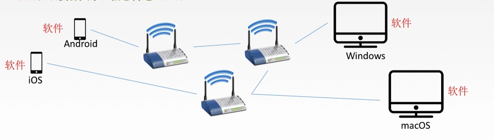

# 计算机网络

## 概念

计算机网络:是一个将分散的丶具有独立功能的计算机系统，通过通信设备与线路连接起来，**由功能完善的软件实现资源共享和信息传递的系统**

计算机网络是**互联的丶自治的**计算机集合

 互联-互联互通 通信链路  

自治-无主从关系

## 功能

1.**数据通信**(连通性)

2.**资源共享**

3.分布式处理

4.提高可靠性

5.负载均衡

### 计算机网络的组成

硬件+软件+协议

功能组成 = 通信子网+资源子网

### 计算机网络的分类

局域网 lan

广域网一般是网状型 一般是跨国 城域网跨城市 局域网一般用于学校 学校一般是多个局域网互相连通 个人局域网一般为利用无线技术与硬件项链 如手环等待

### 脑图

## 速率

在网络上亦比特的形式传输

发送到向接收端1秒中发送10个bit 称为10b/s

是形容速率的

已10的三次方为倍数

一个是速率 一个是数据的容量

大写的KB B是字节 Byte

kb/s 的b是bit是位

1us为1微秒 10的负6次方

带宽的大小只会影响主机或者端系统向链路发送的数据 而不会影响数据在链路中传输 因为数据在链路中传输是电磁波在传输

吞吐量就是实际的数据单位时间内的总和

带宽是理想状态下的最高速率

服务器只能以20MB/S和10MB/s来返回数据

所以吞吐量为30MB/s 但是链路带宽不同 是指理想的最高速率

# 性能指标 时延 

指数据(报文/分组/比特流)从网络(或链路)的一端传送到另外一端所需要的时间,也叫延迟或者迟延 单位是s

时延又分为 发送时延(传输时延) 传播时延 排队时延 处理时延

发送时延是指从发送第一个比特算起,到该分组的最后一个比特发送完毕所需要的时间

 

传播时延是电磁波在信道上传播一定距离所花费的时间取决于电磁波传输速度和链路长度

排队时延发生于路由器

如地铁排队检票 排队的时间是排队时延 检查背包行李是处理时延

## 时延带宽积

**时延带宽积 = 带宽 b/s * 传播时延 s** 

bit

## 往返时延RTT

从发送方发送数据开始 发送第一个比特开始算起

到发送放收到接受放的确认 也就是接收方收到第一个比特所经历的时间叫往返时延RTT

## 利用率

## 分层结构丶协议丶服务丶接口

### 为什么要分层？

将大问题划为多个小问题

上层要求服务 下层提供服务

协议必须是对等实体

各层独立 自然清晰 互相使用的技术不影响

## 分层结构

每个pdu成为下层的sdu 也就是又含金量重要的数据

加上控制协议的信息、

第n层在向n+1层提供服务时,此服务不仅包含第N层本身的功能，还包含由下层服务提供的功能

## 计算机网络分层结构

大概可以分为两种 

7层OSI参考模型 法定标准

4层 TCP/IP参考模型

##  ISO/OSI参考模型--怎么来的？

把大问题规划为小问题

生不逢时

层次划分不是很合理 

不太适合市场的需求

## 七层

**物链网淑慧试用**

上四层不和中间系统交互 所以是端到端

下面下层是点到点 只关心下一个点 又或者说下一个中间系统 因为可能有多个中间系统	

OSI参考模型必须经历的步骤(中间系统省略先)

### 应用层

应用层：**所有能和用户交互产生网络流量的程序**

典型应用层服务

文件传输FTP 电子邮件SMTP 万维网 HTTP

软件有 qq 电子邮箱等等、

### 表示层

用于处理在两个通信系统中交换信息的表示方式（语法和语义）

功能：数据格式变化() 

### 会话层

向表示层实体/用户进程提供建立连接并在连接上有序地输出数据

这是会话，也是建立同步

功能一: **建立丶管理丶终止会话**通信失效后通过校验点继续恢复通信，实现数据同步

### 传输层

负责主机中两个进程的通信，即端到端的通信。传输数据报

功能一：**可靠**传输丶不可靠传输

功能二：**差**错控制

功能三：**流**量控用

功能四：复**用**分用

复用：多个应用层进程可同时使用下面运输层的服务

分用：运输层把收到的信息分别交付给上面应用层中相应的进程

主要协议：***TCP和UDP***

### 网络层

主要任务使把**分组**从源端传到目的端，为分组交换网上的不同主机提供通信服务

网络层传输单位时数据报

分组：当数据报过大时,就会把数据截断 变成一组一组的数据 便是分组

功能一：路由选择 **最佳路径**

功能二：流量控制

功能三：差错控制

功能四：拥塞控制

若所有结点都来不及接受分组，而要丢弃大量分组的话网络就处于拥塞状态

因此一定要采取某种措施缓解这种拥塞

### 数据链路层

主要任务是把网络层传下来的数据报**组装成帧**

数据链路层/链路层的传输单位是**帧**	

功能一：成帧(定义帧的开始和结束)

功能二：差错控制 **帧错+位错**

功能三：流量控制

功能四：访问(接入) 控制 控制对信道的访问

   比如四台机器同时访问一个信道 如果该信道只允许同时一台机器访问

此使就有作用了

 

### 物理层( 傻瓜层 )

主要任务是在**物理媒体**上的实现比特流的**透明传输**

物理层的传输单位是比特

透明传输：指不管所传的数据是什么样的比特组合，都应当能够在链路上传送

功能一：定义接口特性

功能二：定义传输模式 **单工丶半双工丶双工**

功能三：定义传输速率

功能四：比特同步

功能五：比特编码

单工：就是规定只能一端向另一端发送数据 另一端只能接受数据 需要一条信道

半双工：需要两条信道，但是同一时间不能同时发送数据 只能等一端发送完数据 另一端才可以发送数据 不能同时进行 需要两条信道

双工：需要两条信道，两端可以同时发送数据

### 脑图时刻

## TCP/IP模型&5层参考模型

三种图形对比

OSI法定标准 TCP/IP事实标准

### OSI和TCP/IP参考模型的相同点

1.都分层

2.都基于独立的协议栈的概念

3.可以实现异构网络互联

### 不同点

网络层的 OSI 是  面向连接+无连接                 TCP/IP是   无连接

传输层的 OSI是   面向连接                               TCP/IP是  无连接+面向连接

### 5层参考模型

## 物理层详情

### 物理层基本概念

 

### 典型的数据通信模型

把数字信号通过调制解调器从数字信号转换为模拟信号

从信源到信宿再通过调制解调器的接收器转换为数字信号

	### 数据通信相关术语

通信的目的是**发送消息**（消息：语音丶文字丶图像丶视频等）

数据data：传送信息的实体，通常的是有意义的序列符号

信号：数据的电气/电磁的表现，是数据在传输过程中的存在形式

 **数字信号/离散信号**：代表消息的参数的取值是离散的

 **模拟信号/连续信号**：代表消息的参数的取值是连续的

信道可以按传输信号分为**模拟信道**和**数字信道**

按传输介质分可以分为**无线信道**和**有线信道**

### 设计数据通信系统要考虑的三个问题

1.采用单工通信/半双工通信/全双工通信？

2.采用串行通信/并行通信方式

3.采用同步通信/异步通信方式？

### 三种通信方式

串行一条线 无并发

**同步传输**

需要先送出一个或者多个同步字符 再送出整批的数据

数据的传送是以一个数据区块为单位

**异步传输**

异步传输将比特分成小组进行传送

有字符起始位和一个字符终止位

### 脑图时刻

### 码元	

码元是一个**固定时常**的**信号波形**(数字脉冲)，代表不同的离散数值的基本波形，是数字通信中数字信号的计量单位。码元就是网络上传输的一个个信号段，码元的不同进制就是用来表示不同熟知的

### 数据通信系统数据传输速率的两种表示方式

速率也叫数据率  是指数据的传输速率，表示单位时间内传输的数据量。可以用码元传输速率和信息传输速率表示。

1）**码元传输速率**：别名 码元速率 就是单位时间内数字通信系统所传输的码元的个数 也就是信号变化的次数。单位是波特

2）**信息传输速率**：单位时间内二进制的比特数 单位比特/s

### 带宽

表示在单位时间内从网络中的某一点到另外一点所能通过的**最高数据率**，常用来表示网络的通信线路所能传输数据的能力 ，单位是b/s

### 奈氏准则

失真

是在理想的状态下得到的结论

奈氏准则给出了码元传输速率的限制，提出了在假定的条件下，为了避免码间串扰，码元的传输速率的上限值，因为频率太高和太低都会出现问题，太低可能衰减到消息，太高则不能区分，界限不清，相当于粘包

### 香浓定理、

在带宽受限且有噪声的信道中，为了不产生误差，信息的数据传输速率有上限值

相当于是解决了信息的极限理论数据传输速率

### 编码与调制

基本知识

基带信号：基带信号可分为数字基带信号和模拟基带信号

宽带信号：该信号的定义是传输速度达到200kbps以上，不管是模拟信号还是数字信号满足就可作为宽带信号

基带信号：直接表达了要传输信息的信号，比如数字信号0和1，我们说话的声波

宽带信号: 可以理解为将基带信号包装，经过调制形成模拟信号放到信道中传输。适合远距离传输，

数据无论是数字的，还是模拟的，为了传输的目的都必须转变为信号。

**将数据转换为模拟信号称为调制，将数据转换为数字信号称为编码**

#### 四种编码与调制方式

无纠错功能

信号在一个码元之内都要恢复到零的一种编码方式

码元可以理解为信号波形，数据的不同，0和1就是两种状态

将一个码元分为两个相等的间隔，前一个间隔为高电平后一个间接为低电平代表码元1，码元0则正好相反前低后高。以太网就是该编码方式

若为1代表当前码元的前半个码元和上一个码元的后半段相同，否则相反

### 传输接指

### 中继器

中继器的作用就是对信号的再生和还原

对信号进行再生放大转发

## 数据链路

链路就是物理通道，数据链路就是将传输协议的硬件和软件加到链路上就称为数据链路，逻辑通道

链路层的协议数据单元，封装网络层数据

为网络层提供服务。无确认无连接服务，有确定无连接服务，该层的作用是加强物理层。将物理层提供的可能出现的改为逻辑上无差错的数据链路

物理层什么都不知道，只管传输，所以数据链路层需要对网络层到来的数据进行封装和组帧，防止数据出错

### 封装成帧丶帧定界丶帧同步

显然可以看出，该字符技术如果技术字段出错，那么问题很大

### 差错控制

检错编码- 奇偶校验码，循环冗余码

纠错编码-海明码

物理错针对的是单个比特发送，转换信号等，不对整组的数据就行判断纠错，只管发送

而数据链路层有脑子，传输的是一组比特，并且还要在传输过程中判断是否发生了错误

因为偶数个错可能会出现1变为0，0变为1，那么检查的时候就会发现没有错误，导致错误判断

### 流量控制(停止-等待协议丶滑动窗口丶后退N帧协议GBN丶选择重传协议)

流量控制是为了让传输过程中的发送速度和接受速度匹配，减少传输出错与资源浪费

可靠传输是客服端发送什么，接收端就要受到什么

#### 停止等待协议

停止等待协议的**无差错**情况
注释：因为一次就一个，所以用0和1标记ack就行

每次发送一个然后等待接收方回复

有差错的情况下，如果帧丢失发送端没有收到接收端的响应，则重新发送

如果是回复帧的时候丢失，发送端重新发送的时候接收端会判断重复发送所以丢弃它

发送端接受到的确认帧很迟，如果重复收到相同的ACK回复，则只保留一个

####  后退N帧协议(GBN)

因为停止等待协议太浪费时间了，所以尝试采用GBN，发送连续多个数据帧，以增大信道利用率

累计确认：就是收到一个确认帧，那么它和它之前的所有帧都默认已经收到，反之如果某个帧没有收到，那么它和它之后的所有帧都默认丢失

发送窗口不能无限大，与使用的编号的比特数有关
很简单，就是1比特编号0和1,同理2比特编号0-3，如果用1比特编号，却要4个窗口长度，那么窗口内数据编号都编不过来，直接乱套了
GBN的优缺点也显而易见，优点是提高了信道利用率，缺点是因为重传机制的原因导致已经收到数据却需要强行丢弃而造成浪费

#### 选择重传协议(SR)

为了解决GBN的缺点，我们打算尝试只重传错误的帧，这样的话就不用浪费资源吧已经收到的帧再重传一次了。
和GBN相比，两者都有窗口了，和GBN的区别其实就是做了一个数据缓存，已经收到的帧不用扔了，等待之前因意外丢失的帧收到的时候确认即可，但是只能缓存窗口尺寸内的包含的帧（PS，缓存咋可能无限大）
SR运行过程
注释：2帧丢失之后仍然在发送，但是2帧丢失之后只是缓存，并没有移动窗口，直至最后2帧收到后一次性确认2-5帧

同样的，因为编号的问题，发送窗口不能无限大
发送窗口最后和接受窗口**大小相同**，这样利用率比较高

### 信道划分介质访问控制

#### 传输数据使用的两种链路

#### 介质访问控制

介质访问控制的内容就是采取一定的措施，使得两结点之间的通信不会发生互相干扰的情况

可以分为静态划和动态分配，又有其他的控制操作

隔离，多路复用，多条信道变为一条

##### 频分多路复用FDM

##### 时分多路复用TDM

并发相当于，轮流执行

##### 统计时分复用STDM

##### 波分多路复用WDM

和频分多路复用很像，相当于就是光的频分多路复用

##### 码分多路复用

合并线程相加，分离是合并的数据与源站规格化内积，也就是相乘然后除以位数

相互正交其实就是相乘然后相加除位位数，并且结果等于0

##### ALOHA协议

夏威夷通信技术

时隙和纯

时隙ALOHA协议只有在时间片段的开始时才能发

##### CMSA协议

载波监听多路访问协议

CS:载波监听，每次发送数据之前要检查一下总线上是否有其他站点发送数据

MA：多点接入

p-坚持 上面图片解释错误

第一次发送数据的时候，如果忙就持续监听；如果空闲，1-p的概率等待下一个时间槽发送的时候，如果此时信道变忙，就下一个时隙再重新监听，总结为第一次是持续监听，后面每次都等一个时隙

##### CMSA-CD协议

重传时机，非常不错

##### CSMA/CA协议

##### 轮询访问介质访问控制

### 局域网

适合范围小，主要要素为：网络拓扑，传输介质与介质访问控制方法

4种拓扑结构，总线型最好，其他拓扑结构都会有单点故障造成影响较大的问题

#### 局域网的传输介质

#### 局域网的分类

IEEE 802标准又将数据链路层划分为逻辑链路层LLC子层喝介质访问控制MAC子层

LLC子层负责识别网络层协议，然后对他们进行封装，并且为网络层提供服务：无确认连接丶面向连接丶带确认无连接丶高速传送

MAC子层的主要功能在于数据帧的封装/卸装，帧的寻址和识别，帧的接受和发送，链路的管理，帧的差错控制等

##### 以太网

10BASE-T以太网，传送的是基带信号，T是双绞线，传输速率是10MB/S

适配器和MAC地址

全球唯一，ROM上的，网卡现在都嵌入到主板上，又称硬件地址

###### 广域网

PPP协议

应该满足的要求

不需要满足的要求

	

##### 

HDLC协议

### 链路层设备

冲突域变大，虽然可以实现更远距离的通信，但是更容易产生冲突

也就是指不同主机同时发送消息

网桥扩大通信，减小冲突域

####  透明网桥

透明网桥，自学习，慢慢完善转发表

#### 源路由网桥

类似于走迷宫，找最短路径/时间最短

#### 多接口网桥--以太网交换机

两种方式

#### 冲突域和广播域

### 总结

## 网络层

### 网络层功能

功能一：路由选择与分组转发 寻找最佳路径

功能二：异构网络互联 比如wifi,移动网,互联网 一起互相通信

功能三：拥塞控制

拥塞控制是指网络负载过大，所有结点都处于忙碌，可能会来不及收集许多分组，那么就会处于拥塞状态

解决方案

- WAY1：开环控制  静态
- WAY2 :  闭环控制  动态调整

### 数据交换方式

为什么要数据交换？ 

因为如果要每台主机都与其他主机互联，那显然是不合理的，所以出现了交换设备，都发送到交换设备，由交换设备去发送到对应的主机，但是当机器特别多的时候显然也是不行的，所以出现了交换网络，交换网络里面有大量的交换设备。

主要有

- 电路交换
- 报文交换
- 分组交换
  - 数据报方式
  - 虚电路方式

#### 电路交换

#### 报文交换

#### 分组交换

讲数据分为一组一组的，

### 数据传输单元名词解析

当传输层的数据到达网络层的时候，网络层需要向报文数据进行封装，比如说加入目的地址和源地址IP， 封装为IP数据报。如果数据报再次过大的话，会进行将IP数据报进行分组。数据链路层将网络层传输的数据加头和加尾变为帧，加头加上mac地址，物理地址，加尾就是加帧检验序列。帧到物理层将比特流变为信号的方式在链路上进行数据发送。

### 数据报和虚电路

无连接：无连接服务，不事先为分组的传输确定传输路径，每个分组独立确定传输路径，不同分组的传输路径可能不同。

### TCP/IP协议栈

ARP为IP提供服务，IP为ICMP和IGMP提供服务

**IP数据报格式**

 

版本，首部长度，区分服务，总长度，标识，标志，片便宜，生存时间指的是IP分组的保质期，协议代表是那种协议，TCP对应的值为6，UDP对应的值为17，首部检验和的功能是达到路由器后需要检查数据包的分组是否发生错误，如果错误则会丢弃。

### IP数据包分片

最大传送单元MTU：链路层数据帧可封装数据的上限

### IPV4地址

一个主机可能会有多个IP地址，所以IP地址代表的是路由器主机的接口，路由器可能会有许多接口，每一个接口分配一个IP地址，全球唯一性，为了便于观看改为10进制表示

	

第二条有问题，应该是可以作为源地址，而不可以作为目的地址。

第四条 比如 196.128.1.0 //该代表一个局域网络，而不是某一个路由器接口或者一台主机。

 第五条 比如 196.128.1.1//代表直接对196.128.1.0的局域网进行广播发送。

**00000000 后面的都是主机位 00000000 00000000 00000000** 
**0.0.0.0 ----- 127.255.255.255  A类的范围**  又因为127.0.0.1是环回地址,回到本机，所以会去掉，还有0.0.0.0属于本网络也要去掉 所以是2的7次方-2，网络中的最大主机数为什么要减2呢？因为主机号全0代表一个网络不可以，全1代表广播也不可以，不可以使用广播地址来分配路由器接口或者IP地址，所以减去2。

**10000000 00000000  10111111 11111111** 特定值
**128.0.0.0---- 191.255.255.255 B类的范围**   不可以指派128.0  128.0.0.0开始是B类网络，128.0是网络号，b类网络第一个网络号是128.0，但是我们不指拍，我们用它来表示B类网络本身。但是实际上已经被用了

192.0.0同理，代表一个C类网络，不指派

**11000000 00000000 00000000---- 11011111 11111111 11111111** 不可以指派192.0.0 
**192.0.0.0-----223.255.255.255**

### 网络地址转换NAT

通过NAT路由器的转换表来实现局域网和外网的通信，局域网都要向外网发送都需要先发送到NAT路由器进行网络的转换，然后发送给目的主机

### 子网划分

### 子网掩码

网络号二进制全填1，主机号全填0

如果分配了子网的话，子网也是1，反正网络就是1

然后使用子网掩码和三级IP地址与操作，就可以得出真正想要发送的目的子网。因为外网请求局域网的时候不知道对方是不是有子网还是没有，所以需要判断一下真正的目的主机，每次进来和该区域的子网掩码进行与操作。

直接全部相与。

该题是向子网的广播发送，主机号应该全为1

先检测是否直接相连的网络是否有目的子网，目的IP与连接的所有子网&操作，如果有则交付

否则，再去看有没有特定路由，有，交付

否则，再去路由表查询该路由器上保存的所有子网，如果有则交付

否则，发送默认路由0.0.0.0，会转发到其他的路由继续重复上述步骤，

如果超过了IP数据包的生存时间TTL，则会丢弃，报告转发分组出错。

### 无分类编制CIDR

#### 构成超网

将多个子网聚合成一个较大的子网，叫做构成超过或者路由聚合。

要遵守最长匹配前缀。尽量选最长的最符合的

### ARP协议

首先来解释下什么是mac地址：MAC地址用于在网络中唯一标示一个网卡,用来确定网络设备位置。

首先应用层发送文件,传输层根据文件大小进行分为多个数据块,然后到网络层对每个数据块进行添加IP目的地址和IP源地址，目的IP地址根据传输层获得。形成IP数据包,再到数据链路层封装源mac地址和目的mac地址

目的mac地址怎么知道呢? 这就是ARP协议的作用了 

**每台主机都有属于自己的ARP高速缓存** 如果没找到，则会发送一个广播，然后对应IP地址收到请求后会响应一个单播ARP响应分组

里面存的是该主机局域网内部的IP地址与MAC地址的映射

集线器的作用就是共享网络，就是多人上网，比如你家里牵进来一根网线，但是你想多台电脑上网，就需要集线器。可以简单理解为将一些机器连接起来组成一个局域网。集线器是共享宽带。交换机是独占宽带。

路由器插着许多来自四面八方的网线，通过不同IP地址的电脑，会将收到的数据发送给正确的目的计算机。

路由器也有自己的IP地址和MAC地址。

局域网弄只能看懂MAC地址。所以必须使用ARP来获取对应的MAC地址.

网关就是从一个网络到另外一个网络的关口。

网络层协议，为IP协议提供服务。

### DHCP协议

主机如何获取IP地址的呢？

- 静态配置：管理员静态分配了IP地址。会分配IP地址，子网掩码，默认网关。
  - 默认网关其实对于局域网来说就是与互联网交互的接口，路口。通常指的是路由器的一个端口的IP地址。才能和外界进行通信
- 动态配置：DHCP服务器动态的向移动设备分配IP地址，移动网络动态被分配IP地址。

动态主机配置协议**DHCP是应用层协议**，使用**客户端/服务端**方式，客户端和服务端通过**广播**方式通信，基于UDP

都发送的是广播报文，移动网络广播DHCP发现报文。

### ICMP协议

处于IP数据报的数据部分，处于网络层协议。 

**无法交付，拥塞丢数据，TTL=0IP数据包超时，首部字段问题，值得更好的路由路径。**

在IP通信中，经常有数据包到达不了对方的情况。原因是，在通信途中的某处一个路由器不能接受所有到来的数据包，会将某个数据包丢弃，或者说指定了错误端口等等不可达。为了将数据丢弃的原因，错误等等信息发送给发送方，就出现了ICMP协议。 

ICMP报文被封装在IP数据报的数据部分中。

### IPV6

#### IPV4和IPV6的区别

IPV6

- 地址扩大到128位
- 可选字段移除首部，变成了扩展首部。
- 即插即用，不需要DHCP协议
- 首部长度必须是8B的整数倍
- 只能在主机分片，不可以在路由处分片。

#### IPV6的表示形式

### 路由算法与路由协议

#### 概述

选取最佳路由，路由器里面会有许多路由算法。

#### 路由算法的分类

#### 分层次的路由选择协议

### RIP协议

最大经过15个路由器，路由表中维护从它自己到其他每一个目的网络的唯一最佳距离记录。 

但是路由表是建立起来的呢？通过各个路由器之间的信息交换建立起来的。 

更新R6的路由表，相等网络相等下一条路由替换。

RIP是应用层协议，封装到UDP数据报的数据体部分

### OSPF协议

### BGP协议

### 三种路由协议比较

### IP组播

### 路由器

## 传输层

### 传输层概述

功能：

- 传输层提供进程与进程之间的逻辑通信，网络层提供主机与主机之间的逻辑通信。
- 复用和分用
- 传输层对收到的报文进行差错检测
- 传输层的两种协议。

大致分为服务端使用的端口号和客户端使用的端口号

FTP 21端口 DNS 53都那口

SMTP 23端口

### UDP

无连接，不保证可靠交付，无拥塞控制，面向报文适合少量传输。

为什么结果全未1表示无差错？因为一开始填入的是结果的反码，然后再将之前的值和该反码加起来，如果数据没造成错误，结果会全为1。

### TCP

TCP面向连接，点对点，可靠有序，不重不丢，无结构的字节流，提供双工通信。

设置发送缓存和接受缓存。

#### TCP控制位

URG紧急位优先发送，ACK确认位

PSH,RST。

SYN 请求/连接接受报文

FIN 终止位FIN ：当FIN = 1，代表此报文段发送方数据已经发送完，要求释放连接。

#### TCP连接管理

指的是发生在OSI第四层，利用TCP的特性也就是三次握手。

攻击者发送 TCP SYN =1序号，服务端返回ACK后，这个时候攻击者不再发送第三次握手，此时服务端就会将该请求挂起，称为半连接状态， 然后攻击者频繁发送SYN = 1的第一次握手，导致发送大量的TCP连接，造成消耗CPU和内存，服务器可能就会宕机。

**解决办法是 SYN cookie**

#### TCP可靠传输

	

快速重传

冗余ACK+3次，认为数据丢失。

#### TCP流量控制

通过滑动窗口机制，只要是通过接收方返回的TCP头部	来设置TCP发送方的缓存大小，来达到流量控制。

因为可能发送rwnd = 0之后，再次发送rwnd > 0表示发送方可以继续发送数据了，但是发送 rwnd > 0的时候数据丢失了，导致问题。

解决办法就是为TCP每一个练级色湖之一个持续计时器。

#### TCP拥塞控制

一个是数据迟迟不能到达，一个是发送方发送数据过快，接收方来不及接受。

并且拥塞控制是全局性的，流量控制是点对点的。

慢开始和拥塞避免控制过程。

首先发送一个报文段，然后收到回复，后进行指数级增长，1，2，4，8，16，当达到慢开始阈值变为线性增长。17，18，19，20，当出现网络拥塞的时候再直接降到发送一个报文段，但是此时阈值已经变了变为24/2,那么也就是12.

快恢复，不用降到1，直接降到第二次新阈值处

## 应用层

### 应用层的概述

### DNS

DNS实现域名到IP地址的转换

.com 公司企业通用顶级域名

.net 提供信息的通用顶级域名

.org 非盈利组织的通用顶级域名

将IP地址解析为域名的 arpa基础结构域名/反向域名

递归和迭代

因为 查询一次是比较慢的，所以设置了一个高速缓存。会将之前查过的IP地址缓存到自己的本地域名服务器中，然后第二次查询可以直接返回。高速缓存为每一项都设置了一个计时器。定时清理和更新。

其实本质上首先最应该看的是本机的高速缓存有没有对应的IP地址，如果没有再递归的去本地域名服务器中查询。

### 文件传输协议FTP

### 电子邮件系统概述

 

MIME支持多种传输类型的传输。使得传输内容丰富多彩。

POP3读取邮件协议。

基于万维网，用户代理与邮件服务器之间不适用SMTP。而是使用HTTP

### 万维网和HTTP协议

	

上图是非流水线的

