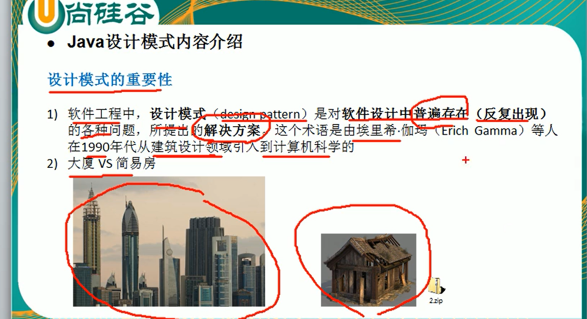
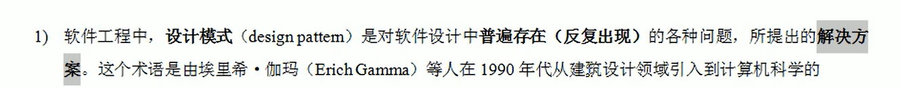

# 设计模式

## 设计模式的重要性

设计模式在软件中哪里？面向对象(oo)==>功能模块(设计模式+算法)==>(框架)[使用到多种设计模式]==>架构 [服务器集群]

设计模式是软件设计中普遍存在(反复出现)的各种问题,所提出的解决方案。

## 设计模式目的

代码可读性提高

高内聚,低耦合

可维护性,可扩展性提高

可靠性(当我们新增功能的时候对原有的功能不影响)

设计模式包含了面向对象的精髓,“懂了设计模式,你就懂了面向对象分析和设计 OOA/D的精髓”

## 监听器

监听

 ServletRequest 请求对象

ServletContext 代表整个Web应用

HttpSession session对象

8个监听器 

三大类

​      